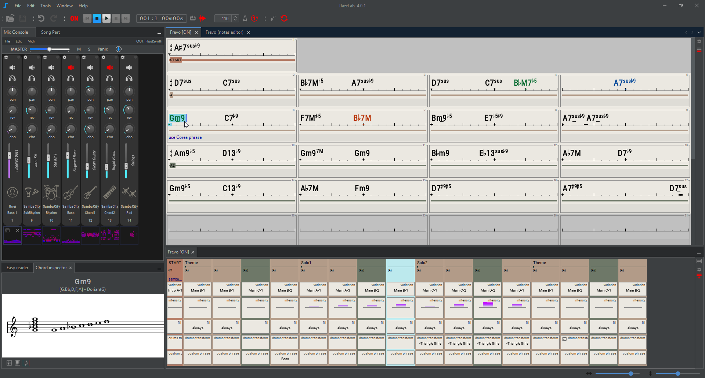

# JJazzLab 4


Want to add or fix documentation? Yes you can!😀 Visit the [Improve documentation](contribute/improve-doc.md) page.



In JJazzLab "**rhythm**" usually means a **music style**, like pop or bossa-nova.


## What is JJazzLab?

🎵 With JJazzLab you quickly create backing tracks for any song, even complex ones. It’s a jam buddy to have fun practicing at home or learn new stuff. It’s also a great tool for teaching or early-stage composing.

🎷 JJazzLab is designed to make non-boring backing tracks, backing tracks with variety, rhythmic accents and dynamics. You can start a solo slowly and gradually build up the atmosphere!

💻 JJazzLab is open-source with an open architecture:  developers can easily add new features and new music generation capabilities.

## Getting started

[Install ](installation.md)and run JJazzLab, then :

1. Load an example song file : **menu File/Open Songs...** and select **ExampleFiles/BluesMinor.sng**
2. Press the **Play** button : you should hear the backing track -if not, check the Midi Out device in **menu Tools/Options (Preferences on Mac)**
3. Start editing the song using the [**editors** ](/broken/pages/YEW9jmd1iUG7OEU4PzlR)and hear how it impacts the generated backing track.

If you prefer to quickly create a new backing track from scratch, check out this video:



## Key features

* Hundreds of ready-to-use music styles ([rhythms](/broken/pages/-MQSAmkHM-L--DNHfX7M)) available
* **Introduce dynamics and variety in just a few clicks, for example:**&#x20;
  * mute the guitar in the intro
  * add a break at the end of the 2nd verse and congas in the 3rd verse
  * boost intensity and slightly increase tempo at the end&#x20;
  * add anticipated (pushed) chords
  * simplify the piano on the first verse
* Add [user tracks](editors/mix-console.md#user-tracks) to customize your backing track
* Attach [annotations/lyrics](editors/chord-lead-sheet.md#bar-annotations-lyrics) to bars
* Play [transposed ](playback-control/playback-key-transposition.md)(for sax, etc.)
* Use Midi [remote commands](playback-control/midi-remote-commands.md) to control playback
* [Import](songs/importing-songs.md) and [export](songs/exporting-songs.md) song or individual instrument tracks

## **Side tools**

* [Easy Reader window](tools/easy-reader.md): shows the playing chords (and annotations/lyrics) with a large font
* [Chord inspector](tools/notes-viewer.md): shows selected chord symbol notes and scales (piano, guitar diagrams, score)
* [Arranger keyboard mode](tools/arranger-keyboard-mode.md): control backing track in (pseudo) real-time via a Midi input device
* [Improvisation help](tools/improvisation-help.md): generate improvisation guides on your chord leadsheet

