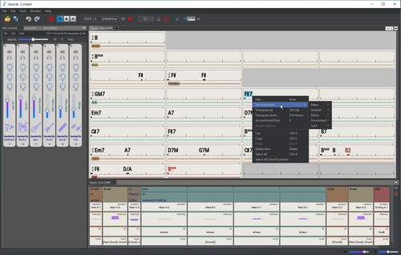

# Documentation


Want to add or fix documentation?  Good!😀 Visit the [Contribute to docs](how-to-contribute.md) page.


## What is JJazzLab? 

🎵 JJazzLab is a desktop application which automatically generates backing tracks for any song, even complex ones. It’s a jam buddy to have fun improvising at home, learn new stuff or just practice your instrument. It’s also a great tool for teachers.  

🎷 JJazzLab is designed to make non-boring backing tracks, backing tracks with variety, rhythmic accents and dynamics. You can start a solo slowly and gradually build up the atmosphere! 

💻 Thanks to the JJazzLab-X open-source platform,  JJazzLab can easily be extended to add new features and new music generation capabilities.   

