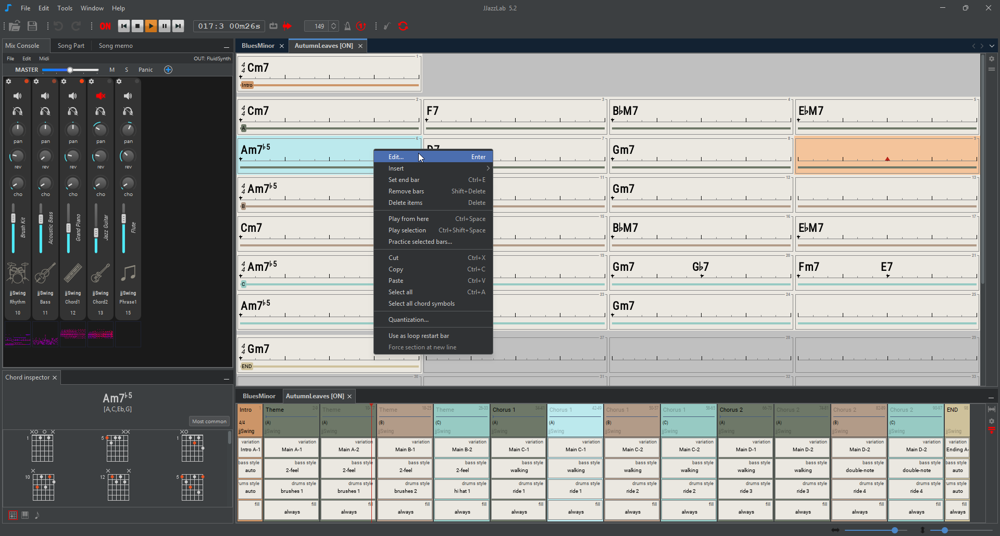

# JJazzLab 5


Vous souhaitez ajouter ou améliorer la documentation ? C'est possible !😀 Visitez la page [Améliorer la documentation](contribuer/improve-doc.md).



Dans JJazzLab, le terme "**rhythm**" désigne habituellement un **style musical**, comme pop ou bossa-nova.


## Qu'est-ce que JJazzLab ?

🎵 JJazzLab vous permet de créer des backing tracks pour n'importe quel song, même les plus complexes, en quelques minutes. C'est un compagnon de jam pour s'amuser à pratiquer chez soi ou apprendre de nouvelles choses. C'est aussi un excellent outil pour l'enseignement ou la composition en phase initiale.

🎷 Ajoutez de la variété, des accents rythmiques et une dynamique naturelle qui maintiennent vos sessions de pratique inspirantes. Vous pouvez commencer un solo lentement et construire progressivement l'atmosphère !

💻 JJazzLab est gratuit et open-source, avec une architecture ouverte : tout le monde peut facilement ajouter de nouvelles fonctionnalités et de nouvelles capacités de génération musicale.

## Premiers pas

[Installez](installation.md) et lancez JJazzLab, puis :

1. Chargez un exemple de fichier song : **menu File/Open Songs...** et sélectionnez **ExampleFiles/BluesMinor.sng**
2. Appuyez sur le bouton **Play** : vous devriez entendre le backing track - si ce n'est pas le cas, vérifiez le périphérique Midi Out dans **menu Tools/Options (Preferences sur Mac)**
3. Commencez à éditer le song avec les [**éditeurs**](editeurs/apercu.md) et écoutez comment cela affecte le backing track généré.

Si vous préférez créer rapidement un nouveau backing track de zéro, regardez cette vidéo :



## Fonctionnalités clés

* Nouveau [**style jjSwing**](moteurs-rythmiques/jjswing-rhythm-engine.md) (rhythm), pratiquez les standards de jazz avec la meilleure walking bass et batterie
* Des centaines de styles musicaux prêts à l'emploi ([rhythms](rythmes/rhythm-files.md)) disponibles
* Introduisez **dynamique** et **variété** en quelques clics, par exemple :
  * couper la guitare dans l'intro
  * ajouter un break à la fin du 2ème couplet et des congas dans le 3ème
  * augmenter l'intensité et accélérer légèrement le tempo à la fin
  * ajouter des accords anticipés (poussés)
  * simplifier le piano sur le premier couplet
* Ajoutez des [user tracks](editeurs/mix-console.md#user-tracks) pour personnaliser votre backing track
* Attachez des [annotations ou paroles](editeurs/chord-lead-sheet.md#bar-annotations-lyrics) aux mesures
* Contrôlez la [lecture via Midi](controle-de-lecture/midi-remote-commands.md)
* [Importez](morceaux/importing-songs.md) et [exportez](morceaux/exporting-songs.md) des morceaux ou des pistes d'instruments individuels

## **Outils complémentaires**

* [Inspecteur d'accords](outils/notes-viewer.md) : comprendre les notes et gammes d'un chord symbol (piano, diagrammes guitare, partition)
* [Boucle de pratique avec augmentation automatique du tempo](outils/practice-loop-with-tempo-increase.md) : s'entraîner efficacement sur des exercices ou des passages difficiles
* [Mode clavier arrangeur](outils/arranger-keyboard-mode.md) : contrôler les accords du backing track via un clavier midi
* [Aide à l'improvisation](outils/improvisation-help.md) : obtenir des guides d'improvisation pour votre lead sheet
* [Transposition des chord symbols](outils/chord-symbols-transposition.md) : pour les instruments transpositeurs (ex. joueurs de saxophone)
* [Fenêtre Easy Reader](outils/easy-reader.md) : se concentrer sur l'accord actuel et le suivant
* [Song memo](outils/song-memo.md) : notes textuelles sur votre song pouvant inclure des liens vers des fichiers ou des pages web
