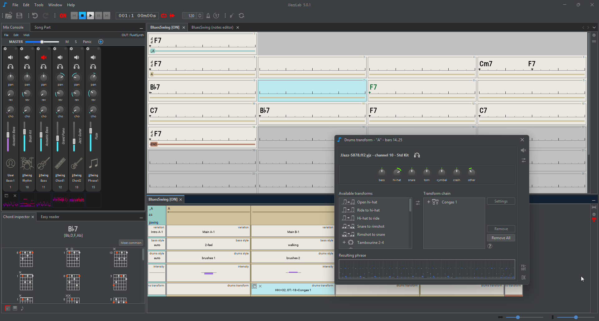

---
説明:伴奏を生成する、完全かつオープンなアプリケーション。
---

# JJazzLab 5


文章に追加や修正をしたいですか？ できますよ！:grinning: どうぞ [ドキュメント校正](contribute/improve-doc.md) ページへ。


 JJazzLabでは、 「rhythm」は通常、ポップスとかボサノバのような音楽スタイルのことを意味しています。

## JJazzLabって、何?&#x20;

🎵 JJazzLabは、複雑なものでも、好きな曲の伴奏(バッキングトラック)を自動的に生成するデスクトップアプリケーションです。自宅での練習や新しいことを学んだりするジャムの相棒です。また、先生や作曲初心者にとっても素晴らしいツールです。&#x20;

:saxophone: JJazzLabは、飽きの来ない伴奏、様々なリズミカルなアクセントとダイナミクスを持つ伴奏を作るようにデザインされています。ゆったりとソロを始め、徐々に雰囲気を作り上げることもできます！

:computer: 基盤となるJJazzLabオープンソースプラットフォームの開発者のおかげで、新しい機能と新しい音楽生成機能を簡単に追加できます。 &#x20;

## 最初に

[インストール ](installation.md)して、JJazzLabを起動し、それから、:

1. ソングファイル例をロードするには : **メニュー ファイル/ソングを開く...** それから **ExampleFiles/BluesMinor.sng**を選択して開きます。
2. **プレイ**ボタンを押します。 : 伴奏トラックが聴こえるはずですが、そうでない場合は、**メニュー ツール/設定 (MacではPreferences)**で、MIDI出力デバイスを調べてください。
3. [**編集** ](/broken/pages/YEW9jmd1iUG7OEU4PzlR)を使用してソングの編集を開始し、生成された伴奏トラックにどのような影響を与えるかを確認してください。
手短に新しい伴奏トラックを一から創りたいなら、このビデオを見てください。



## 特徴
* すぐに使える音楽スタイル ([rhythms](/broken/pages/-MQSAmkHM-L--DNHfX7M)) が何百もあります。
* 新しい [**jjSwing style**](rhythm-engines/jjswing-rhythm-engine.md) (リズム) はリアルなウォーキングベースとドラムです。
* **たった数回クリックするだけでダイナミクスとバラエティさを導入できます。例としては、:**&#x20;
  * イントロではギターをミュートする
  * 2番の終わりでブレイクして、3番ではコンガを入れる。
  * 強弱を強調し、終わりではわずかにテンポを上げる&#x20;
  * コードをアンティシペイトして(喰って)入れる
  * 1番ではシンプルなピアノにする
* [ユーザートラック](editors/mix-console.md#user-tracks)を加えて、伴奏トラックをカスタマイズする
* 小節に[注釈/歌詞](editors/chord-lead-sheet.md#bar-annotations-lyrics)を入れる
* [移調](tools/chord-symbols-transposition.md)して演奏する(サックス等のため)
* MIDI[リモートコマンド](playback-control/midi-remote-commands.md)を使って再生をコントロールする
* ソングや個々の楽器トラックを、[インポート](songs/importing-songs.md) や [エクスポート](songs/exporting-songs.md) する

## **サイドツール**

* [イージーリーダー ウインドウ](tools/easy-reader.md): 現在演奏している箇所のコード(と注釈/歌詞)を大きなフォントで表示します
* [コードインスペクター](tools/notes-viewer.md): 選択したコード記号の音とスケールを表示します(ピアノ、ギタータブ、楽譜)
* [アレンジャーキーボードモード](tools/arranger-keyboard-mode.md): MIDI入力デバイスを通じて、伴奏トラックを(pseudoの)リアルタイムでコントロールします
* [アドリブのヒント](tools/improvisation-help.md): コード譜にアドリブのガイドを生成します
* [コード記号の移調](tools/chord-symbols-transposition.md): サックスのような移調楽器の演奏に便利です
* [テンポを上げていくループ練習](tools/practice-loop-with-tempo-increase.md): 難しいパッセージの練習に完璧！
