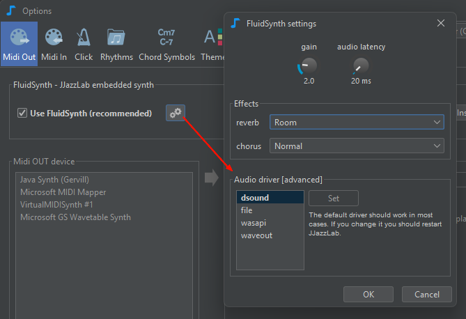

# Using FluidSynth

JJazzLab bundles a **ready-to-use** Fluidsynth instance **optimally configured**.&#x20;

FluidSynth should be enabled by default when you first launch JJazzLab on Windows.&#x20;

On Linux and MacOS, it requires that FluidSynth was previously installed on the system.&#x20;


If FluidSynth appears disabled, it means that a problem occured while trying to load FluidSynth. Check the [**installation instructions**](../installation.md)**.**


<figure><figcaption></figcaption></figure>

You can define FluidSynth **default instruments** to be used by JJazzLab when a new rhythm is used in a song.

### FluidSynth settings

<figure><figcaption></figcaption></figure>


Changing the default FluidSynth audio driver is **not** recommended. However on Linux, in some cases, it might be useful to solve an audio configuration issue.


### FluidSynth open-source project

More info at [https://www.fluidsynth.org](https://www.fluidsynth.org/).
