# JJazzLab SoundFont

The free JJazzLab SoundFont contains 128 high-quality GM sounds plus some extra sounds. It also contains 14 XG-compatible drum kits.


Many Yamaha styles use the XG drum map, which defines more drum sounds than the GM drum map. So if your [output synth]() has only GM drums you may hear weird drums/percussion sounds when playing a style. The JJazzLab SoundFont has been modified to use XG drum map, and this often makes a big difference in the musical rendering.


## Download <a id="high-quality-sounds"></a>

\*\*\*\*📂 Download [JJazzLab-SoundFont.sf2](https://musical-artifacts.com/artifacts/1036) \(from Musical Artefacts web site\).

## Setup


Setup has to be done only once.




VirtualMIDISynth is a free, lightweight \(~2MB!\) and efficient SoundFont player for Windows. It is implemented as a Windows multimedia user driver, so it is directly accessible as a standard MIDI Out device.

Note that VirtualMIDISynth can also convert Midi files to .mp3. This way you can easily get a JJazzLab backing track as an audio file. See the [FAQ](https://www.jjazzlab.com/en/doc/faq#generate-mp3) for more info.

### Instructions

1. Download **JJazzLab-SoundFont.sf2** from the [Musical Artefacts web site](https://musical-artifacts.com/artifacts/1036) 
2. Download and install **VirtualMIDISynth** from the [CoolSoft web site](https://coolsoft.altervista.org/virtualmidisynth) \(accept all installer default settings\) 
3. Load the Soundfont in **VirtualMIDISynth**  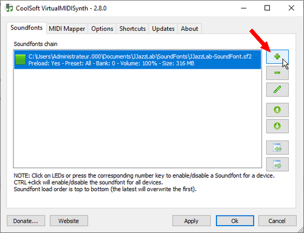  Click on the pen icon if you need to adjust the default volume \(0-500%\) of the SoundFont. 
4. Start JJazzLab and go to **Midi Options/Preferences**, set **VirtualMIDISynth** as the **Midi Out device**  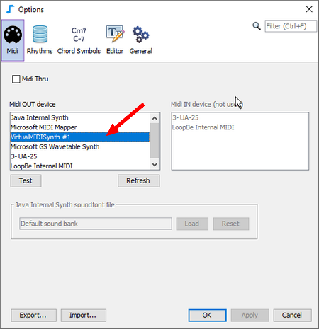  
5. Go to the **Output Synth Editor** and apply the preset **VirtualMIDISynth** 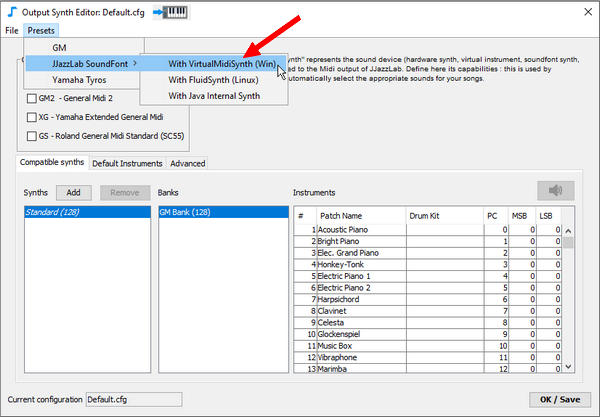 


The Midi Configuration Wizard will automatically perform steps 4 \(if VirtualMIDISynth is installed\) and 5 if you choose to use the JJazzLab SoundFont.




[FluidSynth ](https://www.fluidsynth.org/)is a free and efficient SoundFont player for Linux.

Note that FluidSynth can redirect its output as a .wav file. This can be used to get a JJazzLab backing track as an audio file. See the [FAQ](https://www.jjazzlab.com/en/doc/faq#generate-mp3) for more info.

### Instructions

1. Download **JJazzLab-SoundFont.sf2** from the [Musical Artefacts web site](https://musical-artifacts.com/artifacts/1036) 
2. Install a virtual midi port

   ```text
   $ sudo modprobe snd-virmidi midi_devs=1
   ```

   ⚠ Previous command will work for the current session only. If you want to permanently add the virtual midi device \(jack users on Debian/Ubuntu/Mint\), edit the **/etc/modules** file to add **snd-virmidi**, and create a file /etc/modprobe.d/snd-virmidi\_options.conf with the content `options snd-virmidi midi_devs=1`.  
  
    If you list the connected ports, you should see a new **Virtual Raw Midi** entry like below:

   ```text
   $ aconnect -lo  
   client 14: 'Midi Through' [type=kernel]  
       0 'Midi Through Port-0'  
   client 20: 'Virtual Raw MIDI 1-0' [type=kernel,card=1]  
       0 'VirMIDI 1-0' 
   ```

3. Install **FluidSynth** and **QSynth**, its graphical user interface

   ```text
   $ sudo apt-get update -y            # Get latest packages info
   $ sudo apt-get install fluidsynth
   $ sudo apt-get install qsynth
   ```

4. Start **QSynth**  

   ```text
   qsynth &
   ```

   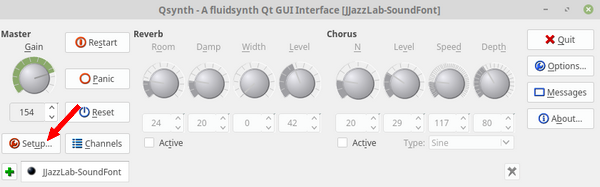   

5. Load the **JJazzLab SoundFont** and adjust **FluidSynth** settings    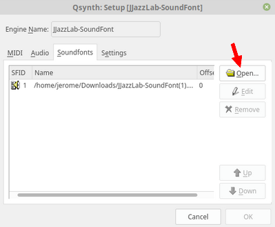 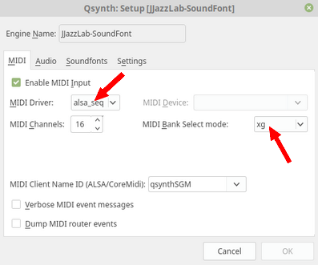  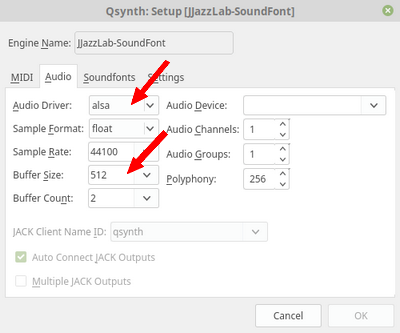   
6. Connect the virtual port to **FluidSynth**  
    You should see a new port, like in the example below:

   ```text
   $ aconnect -lo
   client 14: 'Midi Through' [type=kernel]
       0 'Midi Through Port-0'
   client 20: 'Virtual Raw MIDI 1-0' [type=kernel,card=1]
       0 'VirMIDI 1-0     '
   client 128: 'FLUID Synth (Qsynth1)' [type=user,pid=3099]
       0 'Synth input port (Qsynth1:0)'
   ```

    Connect the Virtual Port to the entry of the **FluidSynth**:

   ```text
   $ aconnect 20:0 128:0      # Values might be different on your system
   ```

   ⚠ This connection needs to be restored each time the **FluidSynth** engine is restarted.  

7. In JJazzLab go to the **Midi Options** and select the first **virMIDI** out device   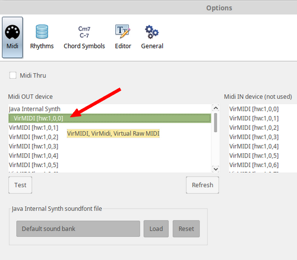  
8. Go to the **Output Synth Editor** and apply the preset **FluidSynth**  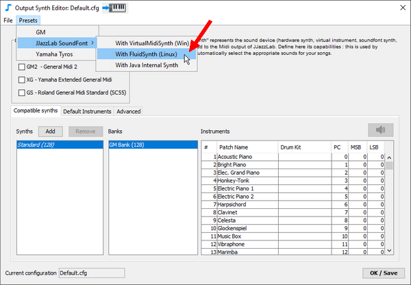 


The start of FluidSynth with the virtual Midi port can be automated via a shell script.

On Linux the Midi Configuration Wizard will automatically perform step 8 if you choose to use the JJazzLab SoundFont.




The Java runtime engine used by JJazzLab has a built-in Midi synth \(called Gervill\) which can load SoundFonts. 


The Java internal synth is not high-performance, you may hear some dropped notes when too many notes are played. If possible prefer an external SoundFont player such as VirtualMIDISynth on Windows, or FluidSynth on Linux/MacOS.


## Instructions <a id="setup-instructions"></a>

1. Download **JJazzLab-SoundFont.sf2** from the [Musical Artefacts web site](https://musical-artifacts.com/artifacts/1036) 
2. In the JJazzLab **Midi options**, select the **Java Internal Synth** and load the **JJazzLab-SoundFont.sf2**  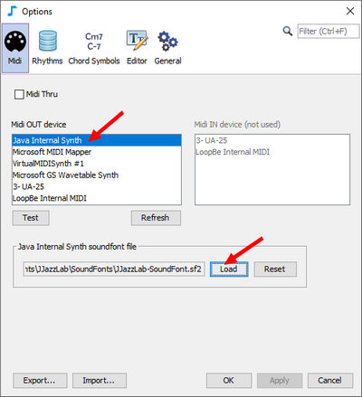  
3. Go to the **Output Synth Editor** and apply the preset **Java Internal Synth** 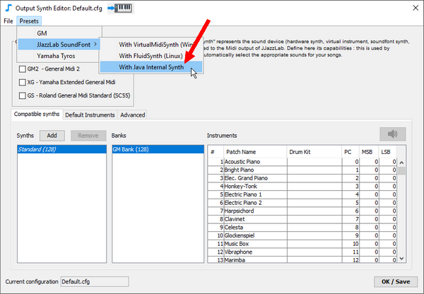 


If you’re on Mac OSX the Midi Configuration Wizard will automatically perform the same steps if you choose to use the JJazzLab SoundFont.




