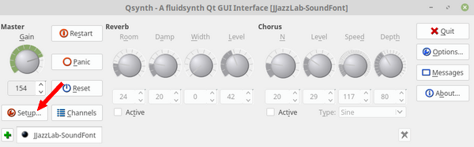
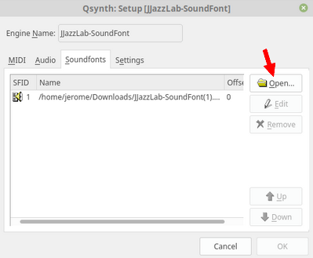
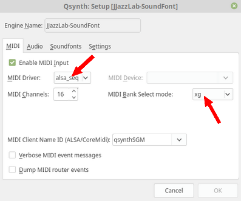
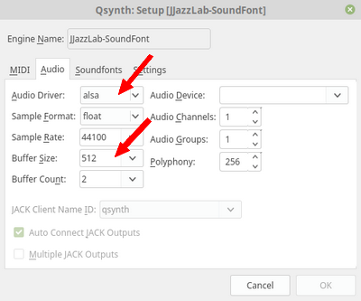
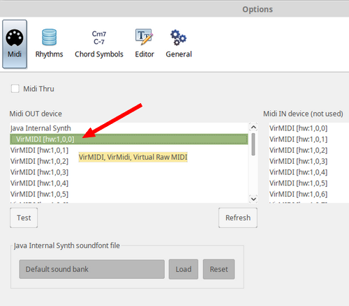
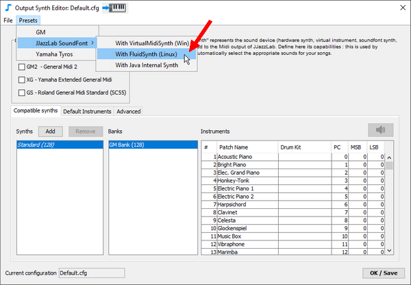

# FluidSynth (Linux/Mac)

[FluidSynth](https://www.fluidsynth.org)は、多くのプラットフォームに対応した、無料で効率的なサウンドフォントプレーヤーです。LinuxとMacOS用に推奨します。


FluidSynth は、リダイレクトして .wav ファイルとして出力することができます。これによりJJazzLabバッキングトラックをオーディオファイルとして取得するのに使うことができます。詳しい情報は、[FAQ](../../faq.md#generate-mp3)を参照してください。


## 初期設定

1. **JJazzLab-SoundFont.sf2**を[Musical Artefacts ウェブサイト](https://musical-artifacts.com/artifacts/1036)からダウンロードします。\

2.  仮想MIDIポートをインストールします。

    ```
    $ sudo modprobe snd-virmidi midi_devs=1
    ```

    :warning: 以前のコマンドは、現在のセッションでのみ動作します。仮想MIDIデバイスを恒久的に追加したい場合（Debian/Ubuntu/MintのJACKユーザー）は、**/etc/modules**ファイルを編集して**snd-virmidi**を追加し、内容を`options snd-virmidi midi_devs=1`とした/etc/modprobe.d/snd-virmidi\_options.confファイルを作成してください。\


    接続されているポートをリストアップすると、以下のような新しい**Virtual Raw Midi**のエントリが表示されます。

    ```
    $ aconnect -lo  
    client 14: 'Midi Through' [type=kernel]  
        0 'Midi Through Port-0'  
    client 20: 'Virtual Raw MIDI 1-0' [type=kernel,card=1]  
        0 'VirMIDI 1-0'
    ```
3.  **FluidSynth**と**QSynth**（そのグラフィカルユーザインターフェース）をインストールします。 (Linux Mintで試してOKでした。問題があれば、FluidSynth のドキュメントを参照してください)

    ```
    $ sudo apt-get update -y            # Get latest packages info
    $ sudo apt-get install fluidsynth
    $ sudo apt-get install qsynth
    ```
4.  **QSynth**を起動します。

    ```
    qsynth &
    ```

     \

5. **JJazzLab サウンドフォント**をロードし、**FluidSynth** 設定を調整します。\
   \
   \
   \
    \
   \
   \

6.  仮想ポートを**FluidSynth**に接続します。\
    ****\
    ****下の例のように、新しいポートが表示されるはずです。

    ```
    $ aconnect -lo
    client 14: 'Midi Through' [type=kernel]
        0 'Midi Through Port-0'
    client 20: 'Virtual Raw MIDI 1-0' [type=kernel,card=1]
        0 'VirMIDI 1-0     '
    client 128: 'FLUID Synth (Qsynth1)' [type=user,pid=3099]
        0 'Synth input port (Qsynth1:0)'
    ```

    仮想ポートを**FluidSynth**エントリーに接続します。

    ```
    $ aconnect 20:0 128:0      # Values might be different on your system
    ```

    :warning: この接続は、**FluidSynth**エンジンが再起動されるたびに復元する必要があります。\

7. In JJazzLabの**Options/Midi**に進み、最初の**virMIDI**出力デバイスを選択します。\
   \
   \

8. [シンセ出力](../output-synth.md)エディターに進み\[訳注：鍵盤アイコンをクリック]、プリセットの **FluidSynth**を適用します。\
   ****\
   ****


仮想MIDIポートを使うFluidSynthの起動は、シェルスクリプトで自動化できます。

Linuxで、JJazzLab サウンドフォントの使用を選択した場合、 [MIDI設定ウィザード](../midi-configuration.md#midi-configuration-wizard)は自動的にステップ8を実行します。

