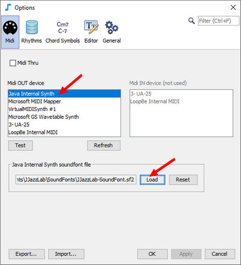
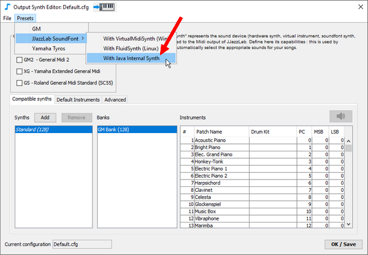

# Java内蔵シンセ

JJazzLabが使用しているJavaランタイムエンジンには、MIDI内蔵シンセがあります（Gervillと呼ばれることもあります）。

サウンドフォントファイルをロードしない場合、内蔵のGMサウンドを使用します。


内蔵GMサウンドは良質なものではありませんが、JJazzLabをテストするには十分でしょう。良い点は、セットアップが不要で、すぐに使えることです。


## JJazzLab サウンドフォントと初期設定 


Java内蔵シンセは高性能ではありません。JJazzLab サウンドフォントのような大きなサウンドフォントと一緒に使用すると、あまりにも多くの音が再生されたときに、音が落ちることがあります。&#x20;


1. **JJazzLab-SoundFont.sf2**を[Musical Artefacts ウェブサイト](https://musical-artifacts.com/artifacts/1036)からダウンロードします。\

2. JJazzLab **Midi options**で、**Java Internal Synth**を選択し、**JJazzLab-SoundFont.sf2**をロードします。\
   ****\
   ****   \

3. **Output Synth Editor** エディターに進み\[訳注：鍵盤アイコンをクリック]、プリセットの **Java Internal Synth**を適用します。\
   ****\
   ****


Mac OSXで、JJazzLab サウンドフォントの使用を選択した場合、[MIDI設定ウィザード](../midi-configuration.md#midi-configuration-wizard)は自動的に同じ手順を実行します。


