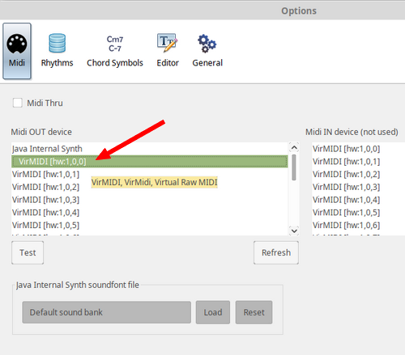
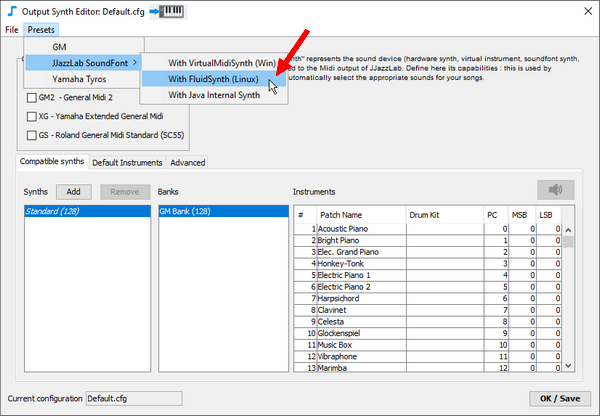

# FluidSynth \(Linux/Mac\)

[FluidSynth ](https://www.fluidsynth.org/)is a free and efficient SoundFont player for Linux.


FluidSynth can redirect its output as a .wav file. This can be used to get a JJazzLab backing track as an audio file. See the [FAQ](../../faq.md#generate-mp3) for more info.


## Initial setup

1. Download **JJazzLab-SoundFont.sf2** from the [Musical Artefacts web site](https://musical-artifacts.com/artifacts/1036)  
2. Install a virtual midi port

   ```text
   $ sudo modprobe snd-virmidi midi_devs=1
   ```

   ⚠ Previous command will work for the current session only. If you want to permanently add the virtual midi device \(jack users on Debian/Ubuntu/Mint\), edit the **/etc/modules** file to add **snd-virmidi**, and create a file /etc/modprobe.d/snd-virmidi\_options.conf with the content `options snd-virmidi midi_devs=1`.  


   If you list the connected ports, you should see a new **Virtual Raw Midi** entry like below:

   ```text
   $ aconnect -lo  
   client 14: 'Midi Through' [type=kernel]  
       0 'Midi Through Port-0'  
   client 20: 'Virtual Raw MIDI 1-0' [type=kernel,card=1]  
       0 'VirMIDI 1-0'
   ```

3. Install **FluidSynth** and **QSynth**, its graphical user interface

   ```text
   $ sudo apt-get update -y            # Get latest packages info
   $ sudo apt-get install fluidsynth
   $ sudo apt-get install qsynth
   ```

4. Start **QSynth**

   ```text
   qsynth &
   ```

      

5. Load the **JJazzLab SoundFont** and adjust **FluidSynth** settings        
6. Connect the virtual port to **FluidSynth**  
  
   You should see a new port, like in the example below:

   ```text
   $ aconnect -lo
   client 14: 'Midi Through' [type=kernel]
       0 'Midi Through Port-0'
   client 20: 'Virtual Raw MIDI 1-0' [type=kernel,card=1]
       0 'VirMIDI 1-0     '
   client 128: 'FLUID Synth (Qsynth1)' [type=user,pid=3099]
       0 'Synth input port (Qsynth1:0)'
   ```

   Connect the Virtual Port to the entry of the **FluidSynth**:

   ```text
   $ aconnect 20:0 128:0      # Values might be different on your system
   ```

   ⚠ This connection needs to be restored each time the **FluidSynth** engine is restarted.  

7. In JJazzLab go to **Options/Midi** and select the first **virMIDI** out device   
8. Go to the [output synth](../output-synth.md) editor and apply the preset **FluidSynth**  


The start of FluidSynth with the virtual Midi port can be automated via a shell script.

On Linux the [Midi configuration wizard](../midi-configuration.md#midi-configuration-wizard) will automatically perform step 8 if you choose to use the JJazzLab SoundFont.


