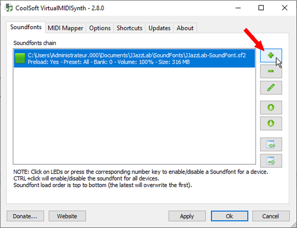
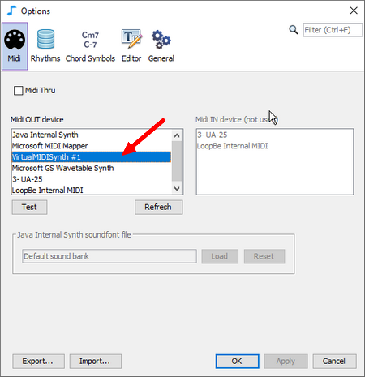
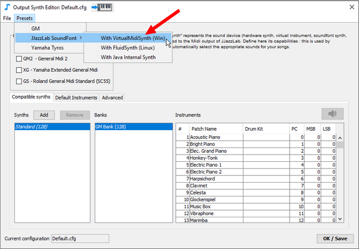

# VirtualMIDISynth (Win)

**VirtualMIDISynth**は、Windows用のフリーで軽量かつ効率的なサウンドフォントプレーヤーです。

Windowsのマルチメディアユーザードライバとして実装されていますので、標準的なMIDI出力デバイスとして直接アクセスすることができます（Virtual MIDI ポートは必要ありません）。


VirtualMIDISynthは、Midiファイルを.mp3に変換することもできます。これにより、JJazzLabのバッキング・トラックを簡単にオーディオ・ファイルとして入手することができます。詳しくは[FAQ](../../faq.md#generate-mp3)をご覧下さい。


## 初期設定

1. **JJazzLab-SoundFont.sf2**を[Musical Artefacts ウェブサイト](https://musical-artifacts.com/artifacts/1036)からダウンロードします。\

2. 次に**VirtualMIDISynth**を、[CoolSoft ウェブサイト](https://coolsoft.altervista.org/virtualmidisynth)からダウンロードしてインストールします。\
   インストーラーのデフォルト設定をすべて受け入れます。\

3. **VirtualMIDISynth**にサウンドフォントをロードします。\
   **** \
   ****サウンドフォントのデフォルトボリューム（0～500％）を調整する必要がある場合は、ペンのアイコンをクリックしてください。\

4. JJazzLabを起動して、**Tools→Options→Midi**と進み、**VirtualMIDISynth**を**Midi OUT device** として設定します。\
   &#x20; \

5. [シンセ出力](../output-synth.md) エディターに進み\[訳注：鍵盤アイコンをクリック]、プリセットの**VirtualMIDISynth**を適用します。\
   ****** **


Windowsの場合、JazzLab サウンドフォントを使用することを選択すると、 [MIDI設定ウィザード](../midi-configuration.md#midi-configuration-wizard)がステップ4（VirtualMIDISynthがインストールされている場合）と5を自動的に実行します。

