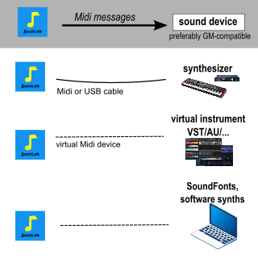

# Midi configuration


If you don't want to mess with Midi, just use the [JJazzLab SoundFont](jjazzlab-soundfont/). 


## Overview

JJazzLab is a Midi application. It does not directly generate audio output, rather it generates Midi messages \(eg “play a D on the bass”\) which are sent via the **Midi out device** to your [**output synth**](output-synth.md). 

The **Midi out device** can be selected in the menu **Tools/Options/Midi**.

The **output synth** produces the sounds. If JJazzLab knows the capabilities of your **output synth**, JJazzLab can directly control it from the [**mix console**](../songs/song-editors/mix-console.md)**.** And most importantly when you select a rhythm JJazzLab can automatically select the relevant sounds, using drum map conversion when necessary. 

## Midi Configuration Wizard 

This wizard will help you select the best Midi configuration.  It is launched automatically the first time you run JJazzLab. You can also run it manually from menu **Tools/Midi Configuration Wizard**.

