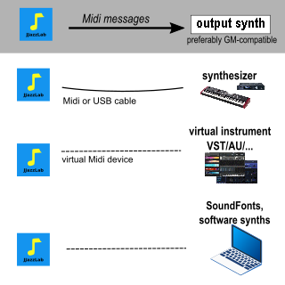
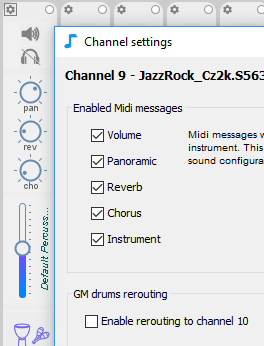

# MIDI設定


MIDIを触りたくない場合は、 [JJazzLab サウンドフォント](jjazzlab-1.md)を使ってください。JJazzLabおよびヤマハスタイル向けに最適化されており、音質と設定の容易さのバランスが最も取れています。


## 概要

JJazzLabはMIDIアプリケーションです。JJazzLabはオーディオ出力を直接生成するのではなく、MIDIメッセージ（例：「ベースでDを弾いて」）を生成し、 **Midi out device(MIDI出力デバイス)** を通して [**output synth(シンセ出力)**]に送信します。

**Midi out device**は、メニューの**ツール/設定/Midi**で選択できます。

**output synth**が音を生成します。JJazzLabが**output synth**を検知したら、JJazzLabは**ミックスコンソール**から直接それを制御できます。そして最も重要なのは、リズムを選択すると、JJazzLabが必要に応じてドラムマップ変換を使用して、関連するサウンドを自動的に選択することです。 

詳細は[output synth](output-synth-editor.md)のページを見てください。

## Midi Configuration Wizard 

このウィザードは、最適なMIDIコンフィギュレーションを選択するのに便利です。 このウィザードは、JJazzLab を初めて起動したときに自動的に起動します。メニューの**Tools→Midi Configuration Wizard**から手動で起動することもできます。

## Usual configurations

### GM/GM2/GS/XG synths

お使いのシンセサイザーがこれらの規格のいずれかと互換性があるなら、それは良いことです。ヤマハスタイルにはXGが最適です。

### SoundFont players

Windows には **VirtualMidiSynth** を、Linux/MacOS には **FluidSynth** を、JJazzLabサウンドフォントと併せて強く推奨します。 [セットアップ方法](jjazzlab-1.md#initial-setup)をご覧ください。

異なるサウンドフォントプレイヤーやサウンドフォントを使用する場合は、それが以下の条件を満たしていることを確認してください：

| Output synth | Sound quality | Ease of setup | Comment |
| :--- | :--- | :--- | :--- |
| VirtualMidiSynth + JJazzLab Sound Font | +++ | +++ | The recommended way on Windows. |
| FluidSynth + JJazzLab SoundFont | +++ | ++ | The recommended way on Linux and MacOS |
| Other SoundFont players with other SoundFonts | variable | + | Connection via a Midi cable.  |
| VST, virtual instruments | +++ | + | Need a virtual Midi port |
| Java internal synth | + | +++ | Everything is embedded |

一般的には、[JJazzLabサウンドフォントの使用](https://www.jjazzlab.com/en/doc/jjazzlab-soundfont)を推奨します。

MIDIに精通しており、ハードウェアシンセサイザーやVST/AUインストゥルメントを使用しているなら、[Output Synth Editor](https://www.jjazzlab.com/en/doc/output-synth-editor)について調べてください。

3 事項

* 特定のリズムに適したサウンドの自動選択
* JJazzLab内またはJJazzLab外からのコントロールミックス

## Drums issues with GM-only compatible sound devices 

GM専用互換出力シンセは通常、ドラム／パーカッションデータをチャンネル10で_のみ_受け付けます。JJazzLabの楽曲で複数のドラムチャンネルが必要な場合はどうすればよいでしょうか？

これは通常、チャンネル10にドラムトラック、別のパーカッショントラック（例えばチャンネル9）があるリズムで発生します。また、1曲で2つの異なるリズムを使用する場合にも発生します。なお、[JJazzLabサウンドフォントの使用](https://www.jjazzlab.com/en/doc/jjazzlab-soundfont)時には、これは決して発生しないはずです。

その結果、曲を再生すると奇妙な繰り返しの音が聞こえます。例えば、JJazzLabがチャンネル9でパーカッションデータを送信している一方で、サウンドエンジンがチャンネル9にピアノ音源を割り当てているためです。

では、何ができるでしょうか？

* シンセが複数のドラムチャンネルに対応している場合、[Output Synth Editor](https://www.jjazzlab.com/en/doc/output-synth-editor) を使用して、この機能の使い方をJJazzLabに指示してください。 
* ドラム再ルーティングオプションを有効にするJJazzLabは、チャンネル10以外のドラム/パーカッショントラックをチャンネル10に再ルーティングできます。JJazzLabは、潜在的な問題を検出した場合、再生時にこのオプションの有効化を自動的に提案します。また、以下の通り、ミックスコンソールの各ドラムタイプチャンネルの設定ダイアログで手動で有効化することも可能です。     

