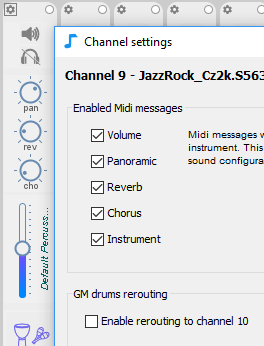

# Midi configuration


If you don't want to mess with Midi, use the [JJazzLab SoundFont](jjazzlab-1.md): it's optimized for JJazzLab and Yamaha styles, with the best compromise Sound quality Vs Ease of set up.


## Overview

JJazzLab is a Midi application. It does not directly generate audio output, rather it generates Midi messages \(eg “play a D on the bass”\) which are sent via the **Midi out device** to your **output synth**. 

The **Midi out device** can be selected in the menu **Tools/Options/Midi**.

The **output synth** produces the sounds. If JJazzLab knows the capabilities of your **output synth**, JJazzLab can directly control it from the **mix console.** And most importantly when you select a rhythm JJazzLab can automatically select the relevant sounds, using drum map conversion when necessary. 

Visit the [output synth](output-synth-editor.md) page for more information.

## Midi Configuration Wizard 

This wizard will help you select the best Midi configuration.  It is launched automatically the first time you run JJazzLab. You can also run it manually from the menu **Tools/Midi Configuration Wizard**.

## Usual configurations

### GM/GM2/GS/XG synths

If your synth is compatible with one or more of these standards, it's a good thing. Best is XG for Yamaha styles.

### SoundFont players

We strongly recommend **VirtualMidiSynth** for Windows, or **FluidSynth** for Linux/MacOs, together with the JJazzLab SoundFont. See the [setup instructions](jjazzlab-1.md#initial-setup).

If you use different SoundFont players or SoundFont, make sure it has s

| Output synth | Sound quality | Ease of setup | Comment |
| :--- | :--- | :--- | :--- |
| VirtualMidiSynth + JJazzLab Sound Font | +++ | +++ | The recommended way on Windows. |
| FluidSynth + JJazzLab SoundFont | +++ | ++ | The recommended way on Linux and MacOS |
| Other SoundFont players with other SoundFonts | variable | + | Connection via a Midi cable.  |
| VST, virtual instruments | +++ | + | Need a virtual Midi port |
| Java internal synth | + | +++ | Everything is embedded |

In general we recommend to [use the JJazzLab SoundFont](https://www.jjazzlab.com/en/doc/jjazzlab-soundfont).

If you’re familiar with Midi and use a hardware synthesizer or VST/AU instruments, then learn about the [Output Synth Editor](https://www.jjazzlab.com/en/doc/output-synth-editor).

3 things

* automatic selection of appropriate sounds for a given rhythm
* control mix from JJazzLab or outside of JJazzLab

## Drums issues with GM-only compatible sound devices 

A GM-only compatible output synth normally accepts drums/percussion data _only_ on channel 10. What if the JJazzLab song needs more than one drums channel ?

This typically happens for rhythms which have a drum track on channel 10 and another percussion track \(say channel 9\). This also happens if a song uses 2 different rhythms. Note that this should never happen if you [use the JJazzLab SoundFont](https://www.jjazzlab.com/en/doc/jjazzlab-soundfont).

The consequence is that when you play the song you hear strange repetitive sounds. For example because JJazzLab sends percussion data on channel 9 while the sound engine has a piano sound on channel 9.

So what can be done ?

* If your synth can handle several drum channels, use the [Output Synth Editor](https://www.jjazzlab.com/en/doc/output-synth-editor) to tell JJazzLab how to use this capability 
* Enable the Drums rerouting option JJazzLab can reroute non channel-10 drums/percussion tracks to channel 10. JJazzLab will automatically propose to activate this option upon playback if it detects a potential problem. The option can also be manually activated in the settings dialog of each drums-type channel in the Mix Console, as shown below.     

