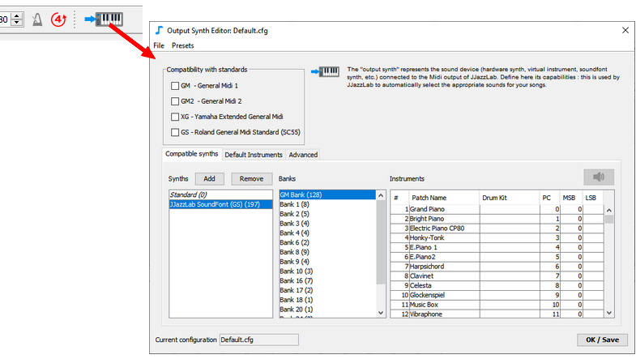
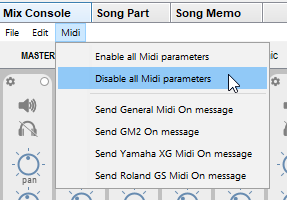
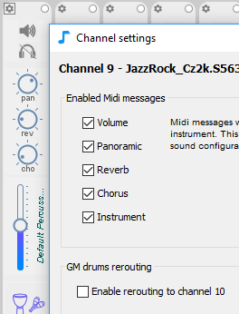
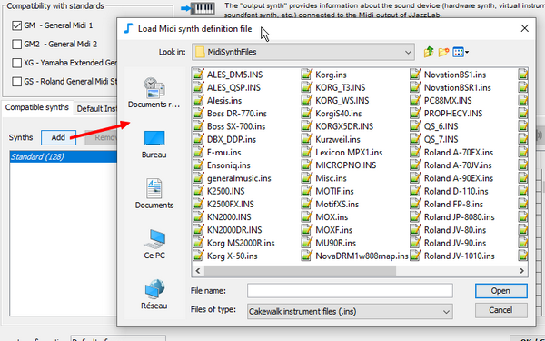
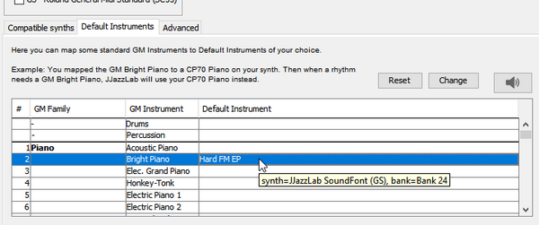

# Output synth


If you use the JJazzLab SoundFont you may skip this page and directly go to the [JJazzLab SoundFont](jjazzlab-soundfont/) page. 


## Output synth concept <a id="output-synth-concept"></a>

The output synth represents the Midi synth you have connected to the output of JJazzLab:


The output synth information enables JJazzLab to directly control your synth. This is why you can select instruments directly from the [mix console](../songs/song-editors/mix-console.md), and why the song mix can be automatically restored when you load a song.

The output synth information is also used by JJazzLab for 2 important tasks:

1. Automatically select the most relevant instruments for a new rhythm
2. Automatically remap drum sounds when needed \(e.g from [XG drum map ](https://www.jjazzlab.com/images/doc/XG-DrumMap.png)to [GM drum map](https://en.wikipedia.org/wiki/File:GMStandardDrumMap.gif)\)


If the output synth configuration in JJazzLab is not inline with the actual output synth \(e.g. you use a non-GM VST instrument but JJazzLab thinks it's GM-compatible\), you'll have problems selecting instruments and the backing tracks may sound very weird.


## Output synth editor

The **output synth** capabilities can be edited in the **output synth editor**. 



The output synth configurations can be loaded/saved from/to files. By default JJazzLab uses **Default.cfg**.

## Example

You have connected your old GM-compatible Roland synthesizer to JJazzLab. So in the **output synth editor** you have checked **GM compatible**.

Your song uses the rhythm SimpleFolk.sty, a Yamaha style which defines 3 instruments:

* Bass, preferred instrument is GM ‘Acoustic Bass’
* Guitar, preferred instrument is XG ‘12 String Guitar’
* Drums, preferred drum kit is ‘Brush’ type with the XG drums key map

Using the output synth information \(“my synth is only GM compatible”\), JJazzLab will do the following before playing the song:

* Send a Midi message **Switch GM mode ON** to the Roland synth
* Bass: select the GM ‘Acoustic Bass’ via standard GM messages
* Guitar: select the GM ‘Steel Guitar’, which is the closest instrument from the XG ‘12 String Guitar’
* Drum: select the GM standard drums \(GM only has a single drum kit\), and remap all XG-specific drum notes to GM drum notes


In conclusion, JJazzLab uses the output synth information to make the rhythm sound as close as possible as the original rhythm \(as programmed by the rhythm designer\).


## Usual configurations

### Presets

If your output synth corresponds to one of the configurations below, just apply the corresponding preset from the output synth editor menu bar.

* **GM**: a GM-compatible synth
* **JJazzLab SoundFont**: a soundfont player with the JazzLab SoundFont loaded
* **Yamaha Tyros**: a Yamaha arranger keyboard of the Tyros or PSR family

### GM2/GS/XG compatible synths

**Reset** the configuration and select the corresponding checkbox. You can uncheck GM as these 3 standards encompass GM.

For Yamaha styles best is XG, but GM2 or GS are better than GM.

Many synths are compatible with a standard and also have additional sounds. In this case select the compatibility checkbox and do like for the "Other synths" below.

### Other synths \(VST, hardware synths, etc.\)

You need to add one or more [Midi synth definition files](output-synth.md#midi-synth-definition-files-cakewalk-ins-format) for your synth.

### Controlling the mix outside of JJazzLab

You may want to prevent JJazzLab from controlling your synth via Midi, because you control it directly \(e.g. you set instruments, volumes, etc. directly on the synth\).

To achieve this you need to disable the **Midi parameters** in the **mix console**, so that JJazzLab only send Midi notes but no program/controller change Midi messages.

You can do it globally for all channels via the **Midi menu**: 



Or do it channel by channel, and parameter by parameter, via the **channel settings**:



## Midi synth definition files \(.ins\) <a id="midi-synth-definition-files-cakewalk-ins-format"></a>

JJazzLab can read Cakewalk instrument definition files \(.ins\). An instrument definition file defines a **Midi synth** with its list of instruments and how to select them via Midi \(Bank Select/Program Change values\).

JJazzLab ships with .ins files for a few existing hardware synthesizers \(e.g. Yamaha Motif, Korg X-50, …\). If you don’t find an .ins file for your sound device, you can search the web or create your own \(google “Cakewalk Instrument Definition File” for help\).

Use the **Add** \(Synths\) button to add one or more .ins files to the current output synth configuration: 




Once a **Midi synth** has been added, its instruments become available in the instrument selection dialog in the **mix console**.


See the [JJazzLab .ins format extensions](output-synth.md#jjazzlab-ins-format-extensions) paragraph below if you want your .ins to be optimized for JJazzLab.

## Default instruments <a id="default-instruments"></a>

The **output synth editor** lets you map standard GM Instruments to **default instruments** of your choice. You can also set a **default instrument** for an instrument **family**, e.g. all the organs.



## JJazzLab .ins format extensions <a id="jjazzlab-ins-format-extensions"></a>


These .ins format extensions are not mandatory to use for JJazzLab to work. But they are required if you have a custom .ins file and want to fully benefit from the JJazzLab features in order to get better sounding backing tracks.


The standard .ins file format lacks some information for JJazzLab to fully optimize instrument selection and **drum key map** conversion.

For an optimum use JJazzLab needs:

1. For melodic instruments: its **GM substitute** instrument  Example: the **GM substitute** for the XG instrument ‘12 String Guitar’ is the GM instrument ‘Steel Guitar’
2. For percussion instruments/drum kits: its **type** and its **drum key map**

Therefore some \(optional\) extensions have been introduced, as show in the examples below.

```text
;
; {{ SubGM1= }}
;
[PRE1]
0=Pn:Full Concert Grand {{ SubGM1=0 }}       ; substitute = GM Acoustic Piano
1=Pn:Rock Grand Piano   {{ SubGM1=1 }}       ; substitute = GM Bright Piano 
2=Pn:Mellow Grand Piano {{ SubGM1=0 }}       ; substitute = GM Acoustic Piano
5=Pn:Aggressive Grand   {{ SubGM1=1 }}       ; substitute = GM Bright Piano
...
18=Pn:CP 1979           {{ SubGM1=3 }}       ; substitute = GM Electric Grand Piano
19=Pn:CP70 Chorus       {{ SubGM1=3 }}       ; substitute = GM Piano
...
```

```text
;
; {{ DrumKit=,  }}
;          : STANDARD, POWER, ROOM, ELECTRONIC, ANALOG, JAZZ, BRUSH, ORCHESTRA, SFX
;  : GM, GS_GM2, XG
;
[DR:PRE]
0=Dr:Power Standard Kit 1   {{DrumKit=POWER, XG}} 
1=Dr:Power Standard Kit 2   {{DrumKit=POWER, XG}} 
2=Dr:Hyper Standard Kit     {{DrumKit=STANDARD, XG}} 
3=Dr:Dry Standard Kit       {{DrumKit=ROOM, XG}} 
...
```

```text
;
; {{ UseGsInstruments }}       => For melodic instrument selection a GS Sysex message will be sent to make sure channel is in melodic mode
; {{ UseGsDrumsInstruments }}  => For drums instrument selection a GS Sysex message will be sent to make sure channel is in percussion mode
;
[JJazzLab SoundFont (GS)]
BankSelMethod=1                                ; Use Bank Select MSB only
Patch[0]=GM Bank  {{ UseGsInstruments }}       ; This bank stores GS melodic instruments
Patch[128]=Bank 1 {{ UseGsInstruments }}       ; This bank stores GS melodic instruments 
Patch[256]=Bank 2 {{ UseGsInstruments }}       ; This bank stores GS melodic instruments
...
Patch[*]=Drums    {{ UseGsDrumsInstruments }}  ; This bank stores GS drums instruments
...
```

