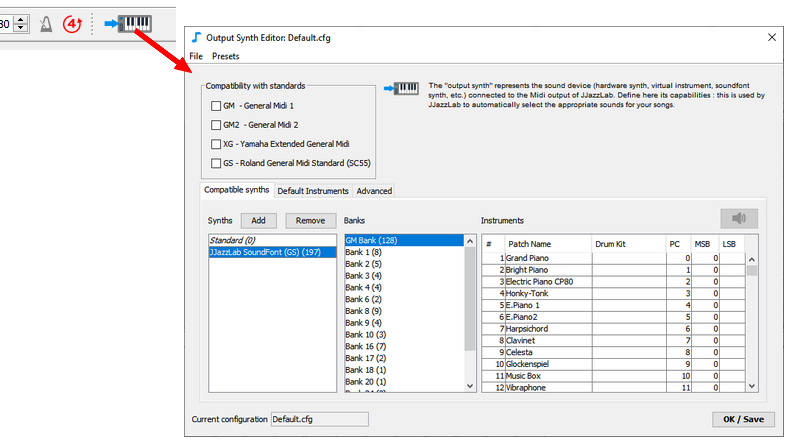
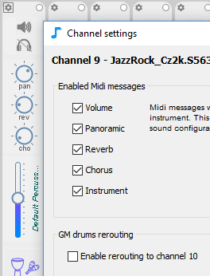
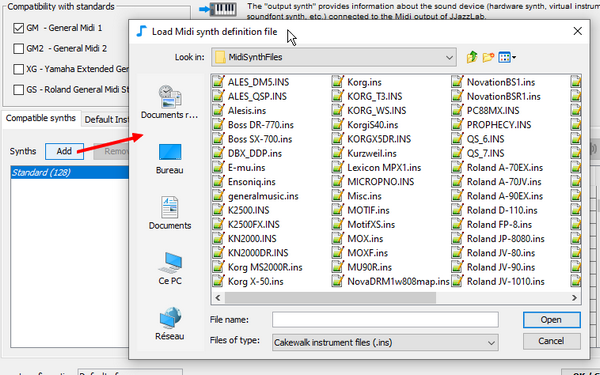
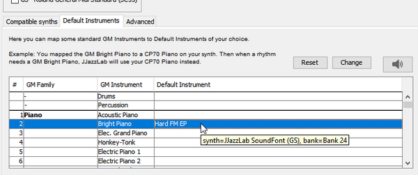

# シンセ出力



JJazzLab サウンドフォントをお使いの方は、このページを飛ばして [JJazzLab サウンドフォント](jjazzlab-soundfont/) のページに直接に進んでください。&#x20;


## シンセ出力の概念 <a href="#output-synth-concept" id="output-synth-concept"></a>

シンセ出力とは、JJazzLabの出力に接続されているMIDIシンセを表しています：

.png>)

シンセ出力の情報によって、JJazzLabはシンセを直接コントロールすることが可能となります。[ミックスコンソール](../songs/song-editors/mix-console.md)から直接楽器を選択したり、曲をロードしたときにソングミックスを自動的に復元したりできるのはこのためです。

シンセ出力の情報は、JJazzLabでも2つの重要な作業に使われています：

1. 自動的に新しいリズムに最適な楽器を選択
2. 自動的に必要に応じてドラムサウンドをリマップする（例：[XGドラムマップ](https://www.jjazzlab.com/images/doc/XG-DrumMap.png)から[GMドラムマップ](https://en.wikipedia.org/wiki/File:GMStandardDrumMap.gif)に変更）


JJazzLabでのシンセ出力のコンフィギュレーションが実際のシンセ出力と一致していない場合（例えば、GM以外のVSTインストゥルメントを使用しているのに、JJazzLabではGMに対応していると思い込んでいる場合）、楽器の選択に問題が生じ、バッキングトラックがかなり変な音になってしまうことがあります。


## シンセ出力エディター

**シンセ出力**機能は**シンセ出力エディター**で編集できます。&#x20;



シンセ出力の設定は、ファイルの読み込み／ファイルに保存ができます。デフォルトでは、JJazzLabは **Default.cfg**を使用します。

## 例

GM互換の古いローランドのシンセサイザーをJJazzLabに接続しました。そのため、**シンセ出力エディター**で**GM compatible**にチェックを入れています。

曲でSimpleFolk.styというリズムを使っています。これはヤマハスタイルで、3つの楽器を定義しています：

* ベース、適切な楽器は、GM ‘Acoustic Bass’です。
* ギター、適切な楽器は、XG ‘12 String Guitar’です。
* ドラム、適切なドラムキットは、XG drumsのキーマップを使用した「Brush」タイプのドラムキットです。

シンセ出力の情報（「このシンセはGMにしか対応していない」）を使って、JJazzLabは曲を演奏する前に次のようなことを行います：

* ローランドのシンセに、**GMモードONに切り替え** というMIDIメッセージを送信
* ベース：標準GMメッセージを通してGM ‘Acoustic Bass’を選択
* ギター：XG ‘12 String Guitar’に最も近い楽器であるGM ‘Steel Guitar’を選択
* ドラム：GM standard drumsを選択（GMはドラムキットを1つしか持っていない）し、XG固有のドラム音をすべてGMのドラム音にリマップ


結論として、JJazzLabはシンセ出力の情報を使って、（リズムデザイナーがプログラムした）オリジナルのリズムに近い音を出すことができます。


## 一般的な設定

### プリセット

シンセ出力が以下の構成のいずれかに該当する場合、シンセ出力エディターのメニューバーから対応するプリセットを適用するだけでかまいません。

* **GM**: GM互換シンセ
* **JJazzLab SoundFont**: JazzLabサウンドフォントをロードしたサウンドフォントプレイヤー
* **Yamaha Tyros**: TyrosまたはPSRシリーズのヤマハアレンジャーキーボード

### GM2/GS/XG 互換シンセ

設定を**リセット**し、該当するチェックボックスを選択してください。この3つの規格はGMを包括しているので、GMのチェックを外すことができます。

ヤマハスタイルではXGがベスト、GM2やGSはGMより良いでしょう。

シンセの中には、規格に互換性があり、さらに追加のサウンドを持つものが多くあります。この場合は、互換性のチェックボックスを選択し、以下の「その他のシンセ」と同様の操作を行います。

### その他のシンセ（VST、ハードウェアシンセ、他）

シンセに1つまたは複数の[MIDIシンセ定義ファイル](output-synth.md#midi-synth-definition-files-cakewalk-ins-format) を追加する必要があります。

### JJazzLab外のミックスコントロール

シンセを直接操作（例えば、シンセ上で楽器や音量などを直接設定）するために、JJazzLabがMIDI経由でシンセを制御するのを防ぎたいこともあるでしょう。

そのためには、**ミックスコンソール**の**MIDIパラメータ**を無効にする必要があります。そうするとJJazzLabはMIDIノートのみを送信し、プログラム/コントローラ変更のMIDIメッセージを送信しません。

この設定は**MIDIメニュー**からすべてのチャンネルに対してグローバルに行うことができます。&#x20;


あるいは、**チャンネル設定**でチャンネルごとに、またパラメータごとに行うこともできます。



なお、すべてのMIDIパラメータを無効にすると、JJazzLabは楽器を変更するためのMIDIメッセージ（バンクセレクト/プログラムMIDIメッセージ）を送信しないため、シンセ出力の設定は無意味になります。

## MIDIシンセ定義ファイル(.ins) <a href="#midi-synth-definition-files-cakewalk-ins-format" id="midi-synth-definition-files-cakewalk-ins-format"></a>

JJazzLabはCakewalkのインストゥルメント定義ファイル(.ins)を読み込むことができます。インストゥルメント定義ファイルとは、**MIDIシンセ**のインストゥルメント（楽器）リストと MIDIでの選択方法（バンクセレクト/プログラムチェンジの値）を定義したものです。

JJazzLabには、いくつかの既存のハードウェアシンセサイザー（ヤマハ Motif、Korg X-50など）用の.insファイルが同梱されています。お使いのサウンドデバイス用の .ins ファイルが見つからない場合は、ウェブで検索するか、自分で作成することができます（"Cakewalk Instrument Definition File"で検索してください）。

**Add** (Synths) ボタンを使って、現在の出力シンセの設定に１つまたは複数の .ins ファイルを追加します。




**MIDIシンセ**を追加すると、その楽器は**ミックスコンソール**のインストゥルメント選択ダイアログで利用できるようになります。


JJazzLab用に最適化された.insを作成したい場合は、以下の[JJazzLab .ins 拡張フォーマット](output-synth.md#jjazzlab-ins-format-extensions)の項を参照してください。

## デフォルト楽器（Default instruments） <a href="#default-instruments" id="default-instruments"></a>

**シンセ出力エディター**では、標準GM楽器をお好みの**デフォルト楽器**にマッピングできます。また、すべてのオルガンのように、**楽器系統（familiy）**に**デフォルト楽器**を設定することもできます。



## JJazzLab .ins拡張フォーマット <a href="#jjazzlab-ins-format-extensions" id="jjazzlab-ins-format-extensions"></a>


これらの.ins 拡張フォーマットは、JJazzLabを動作させるために必須というわけではありません。しかし、カスタムの.ins ファイルがあって、バッキングトラックのサウンドを向上させるためにJJazzLabの機能を十分に活用したい場合には必要となります。


.insファイル標準フォーマットには、JJazzLabが楽器選択と**ドラムマップ**変換を最適化するための情報がいくつか欠けています。

JJazzLabを最適に使用するためには以下が必要です。

1. メロディ楽器：その**GM代替**楽器\
   &#x20;例：XG楽器「12 String Guitar」用の**GM代替**楽器はGM楽器「Steel Guitar」です。
2. 打楽器/ドラムキットの場合： その**タイプ**と**ドラムキーマップ**

そのため、以下の例のように、いくつかの（オプション）拡張機能が導入されています。

```
;
; {{ SubGM1= }}
;
[PRE1]
0=Pn:Full Concert Grand {{ SubGM1=0 }}       ; substitute = GM Acoustic Piano
1=Pn:Rock Grand Piano   {{ SubGM1=1 }}       ; substitute = GM Bright Piano 
2=Pn:Mellow Grand Piano {{ SubGM1=0 }}       ; substitute = GM Acoustic Piano
5=Pn:Aggressive Grand   {{ SubGM1=1 }}       ; substitute = GM Bright Piano
...
18=Pn:CP 1979           {{ SubGM1=3 }}       ; substitute = GM Electric Grand Piano
19=Pn:CP70 Chorus       {{ SubGM1=3 }}       ; substitute = GM Piano
...
```

```
;
; {{ DrumKit=,  }}
;          : STANDARD, POWER, ROOM, ELECTRONIC, ANALOG, JAZZ, BRUSH, ORCHESTRA, SFX
;  : GM, GS_GM2, XG
;
[DR:PRE]
0=Dr:Power Standard Kit 1   {{DrumKit=POWER, XG}} 
1=Dr:Power Standard Kit 2   {{DrumKit=POWER, XG}} 
2=Dr:Hyper Standard Kit     {{DrumKit=STANDARD, XG}} 
3=Dr:Dry Standard Kit       {{DrumKit=ROOM, XG}} 
...
```

```
;
; {{ UseGsInstruments }}       => For melodic instrument selection a GS Sysex message will be sent to make sure channel is in melodic mode
; {{ UseGsDrumsInstruments }}  => For drums instrument selection a GS Sysex message will be sent to make sure channel is in percussion mode
;
[JJazzLab SoundFont (GS)]
BankSelMethod=1                                ; Use Bank Select MSB only
Patch[0]=GM Bank  {{ UseGsInstruments }}       ; This bank stores GS melodic instruments
Patch[128]=Bank 1 {{ UseGsInstruments }}       ; This bank stores GS melodic instruments 
Patch[256]=Bank 2 {{ UseGsInstruments }}       ; This bank stores GS melodic instruments
...
Patch[*]=Drums    {{ UseGsDrumsInstruments }}  ; This bank stores GS drums instruments
...
```

また、GS対応のシンセであれば、特別なキーワード拡張が2つあります。

```
; For GS-compatible synths only
; {{ UseGsInstruments }}       => For melodic instrument selection a GS Sysex message will be sent to make sure channel is in melodic mode
; {{ UseGsDrumsInstruments }}  => For drums instrument selection a GS Sysex message will be sent to make sure channel is in percussion mode
;
[JJazzLab SoundFont (GS)]
BankSelMethod=1                                ; Use Bank Select MSB only
Patch[0]=GM Bank  {{ UseGsInstruments }}       ; This bank stores GS melodic instruments
Patch[128]=Bank 1 {{ UseGsInstruments }}       ; This bank stores GS melodic instruments 
Patch[256]=Bank 2 {{ UseGsInstruments }}       ; This bank stores GS melodic instruments
...
Patch[*]=Drums    {{ UseGsDrumsInstruments }}  ; This bank stores GS drums instruments
...
```
