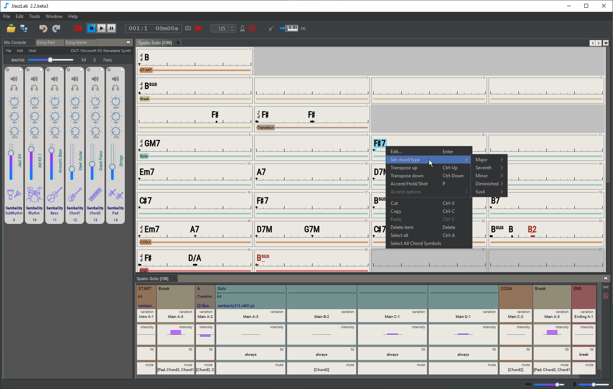

# JJazzLab

JJazzLab is a desktop application which automatically generates backing tracks for any song, even complex ones. It’s a jam buddy to have fun improvising at home, learn new stuff or just practice your instrument. It’s also a great tool for teachers.  

JJazzLab is designed to make non-boring backing tracks, backing tracks with variety, rhythmic accents and dynamics. You can start a solo slowly and gradually build up the atmosphere with the band !

Thanks to the JJazzLab-X open-source platform,  JJazzLab can easily be extended to add new features and new music generation capabilities.

## What makes JJazzLab unique? 

JJazzLab is designed to make non-boring backing tracks, backing tracks with variety, rythmic accents and dynamics. You can start a solo slowly and gradually build up the atmosphere with the band !

## Features 

BACKING TRACKS

* Instant generation of a Midi backing track with drums, percussion, bass, piano, guitar, pad, horn section, …
* Fine tuning of the backing track per song part: rhythm variation, intensity, muted instruments, drum fills, tempo factor, …
* Play from start, from selected bar, or loop selected bars
* Play transposed \(e.g. for sax or trumpet players\)
* Any song structure: intro, chorus, 1st coda, etc.
* Adjust tempo, transposition, choose and solo/mute instruments
* Support for multi-rhythm backing tracks, possibly with different time signatures
* Export to Midi file, enabling easy Midi-to-MP3 conversion
* Customizable click and precount

EDITORS

* Chord leadsheet editor, song structure editor, chord symbol editor, mix console, song memo editor
* Multi-file editor with dockable windows
* Intuitive user interface with unlimited undo/redo, copy/paste between songs
* Free placement of the chord symbols, off-beat chord symbols anticipation
* Support all pop-rock and jazz chord symbols, plus user-defined chord symbols
* Edit chord symbol rendering: underlying harmony, accent type, harmony variation during solos, …
* Force section to start on a new line
* Customizable song template
* Customizable UI colors and fonts with themes
* Print chord lead sheet and song structure

RHYTHMS

* Support for Yamaha style files \(SFF1 & SFF2 format\), access to thousands of free styles on the web
* Hundreds of embedded rhythms in the installer
* Support for “YamJJazz Extended” Yamaha style files for even more variations per style
* Open architecture: new rhythm generation engines can be easily added via plugins

MIDI

* Connect to any audio engine via Midi: SoundFont player \(recommended with the JJazzLab SoundFont\), Java internal synth, external synth, VST host via virtual Midi port such as ‘LoopBe1’
* Compatible with GM/GM2/XG/GS instruments
* Compatible with any Midi instrument via Cakewalk instrument definition files \(.ins\)
* Automatic drums/percussion key map remapping from Yamaha XG key map to GM/GM2/GS key maps
* Optimized JJazzLab SoundFont for a high-quality rendering and automatic instrument selection
* Ready-to-use presets for VirtualMidiSynth \(Windows\) and FluidSynth \(Linux\)
* User-defined default mix per rhythm
* User-defined default instruments

IMPORT

* Band-In-A-Box files
* musicXML files
* Impro-Visor files

MISC

* Autoupdate notifications
* Based on the open-source Netbeans application framework

