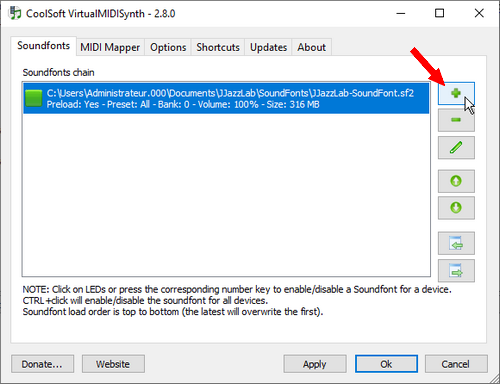

# VirtualMidiSynth \(Win\)

VirtualMIDISynth is a free, lightweight \(~2MB!\) and efficient SoundFont player for Windows.

It is implemented as a Windows multimedia user driver, so it is directly accessible as a standard MIDI Out device.

Note that VirtualMIDISynth can also convert Midi files to .mp3. This way you can easily get a JJazzLab backing track as an audio file. See the [FAQ](https://www.jjazzlab.com/en/doc/faq#generate-mp3) for more info.

## Setup instructions

1. Download **JJazzLab-SoundFont.sf2** from the [Musical Artefacts web site](https://musical-artifacts.com/artifacts/1036)
2. Download and install **VirtualMIDISynth** from the [CoolSoft web site](https://coolsoft.altervista.org/virtualmidisynth) \(accept all installer default settings\)
3. Load the Soundfont in VirtualMIDISynth     Click on the pen icon if you need to adjust the default volume \(0-500%\) of the SoundFont.
4. Start JJazzLab and go to **Midi Options/Preferences**, set **VirtualMIDISynth** as the **Midi Out device**    
5. Go to the **Output Synth Editor** and apply the preset **VirtualMIDISynth**  

This setup has to be done _only once_, settings are automatically restored when you restart JJazzLab.

The Midi Configuration Wizard will automatically perform steps 4 \(if VirtualMIDISynth is installed\) and 5 if you choose to use the JJazzLab SoundFont.

