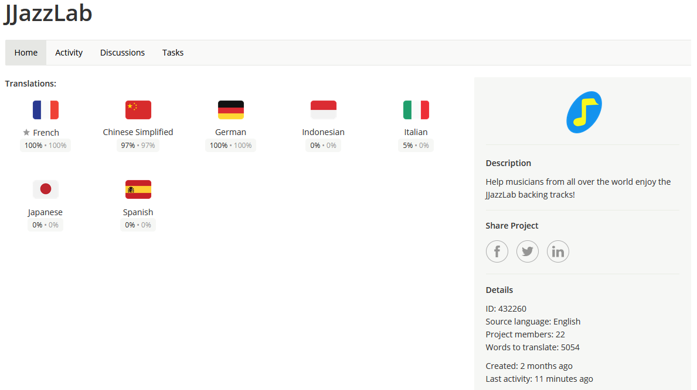
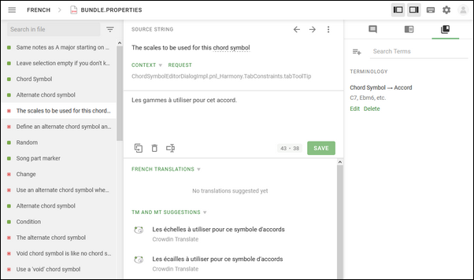

# JJazzLabの翻訳

## 主要翻訳貢献者の皆様に感謝します！

JJazzLabは7言語に対応し、今や35億人が利用可能になりました！ :smile:

* **Chinese**: Yafei
* **German**: Hans Hahn, Torsten-Peh, helmutguitar, Ole Jenning, Samuel Buch
* **French**: Daniel Patin, Hans Hahn
* **Japanese**: H. Sakuda (GItBook online help)
* **Portuguese/Brazilian**: Danilson Ramos De Oliveira
* **Spanish:** Lucho

そして、他のすべての協力者の皆様にも感謝申し上げます。どんな小さなことでも、大変助かります！

## 簡単です

JJazzLabは[crowdin.com](https://app.gitbook.com/s/-MQE7B7yjVY3xzlsorS4-887967055/contribute/crowdin.com)プラットフォームを利用しており、ブラウザから直接フレーズを翻訳するのが非常に簡単です。

## 誰ができますか？

対象言語のネイティブスピーカーであり、かつ音楽ソフトウェアの用語に精通している方であれば、どなたでも。

## どうやって始めればいいですか？

* [**https://crwd.in/jjazzlab**](https://crwd.in/jjazzlab)  で登録を（無料です）
* 対象言語を選択してください
* 翻訳ファイルを選択してください（フレーズは機能またはUIコンポーネントごとにグループ化されています）
* 英語の語句を選んで翻訳してください

別のファイルを開くには、**Ctrl+O**（または**左上のメニューの「開く」**）を使用してください。以上です！

Crowdinは自動翻訳提案、追加情報の要求機能、検証プロセスなど、その他多くの翻訳機能を提供しています。

## おすすめとコツ

* **短いほど良し**\
  語句がJJazzLabのユーザーインターフェースの一部となることをお忘れなく。 &#x20;
* **翻訳全体での一貫性を保全**\
  「リードシート」があなたの言語で「xyz」である場合、可能な限り「xyz」を再利用してください。用語が頻繁に再利用される場合は用語集を使用してください。
* **用語集を最初に翻訳してください**\
  最下部の最後の翻訳ファイルです。JJazzLabで最も頻繁に使用される用語が含まれており、翻訳間の一貫性を保つのに役立ちます。
* **校正者の役割**\
  校正者は翻訳文の一貫性を確認し、翻訳フレーズを検証します。この役割を担う準備が整っていると感じられた方は、お気軽に[ご連絡ください](https://www.jjazzlab.com/en/contact/)。
* **言語がありませんか？**\
  Crowdinに掲載されていない言語を追加したい場合は、お気軽に[私までご連絡ください](https://www.jjazzlab.com/en/contact/)。
* **最新の翻訳ファイルでJJazzLabを試してみませんか？**\
  [このページ](/broken/pages/-MQJTzoizf8YB6jpI3rT)をご覧ください。
