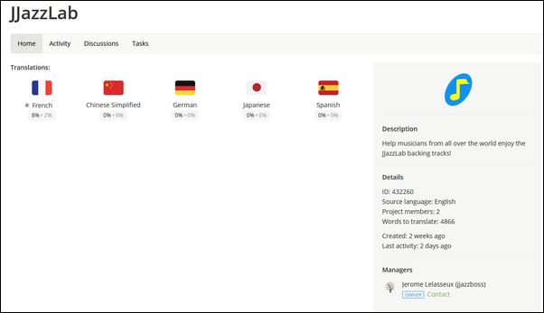

# Translate JJazzLab

## It's easy

JJazzLab uses the [crowdin.com](crowdin.com) platform, which makes it super easy to translate phrases, directly from your browser.

## Who can do it?

Everyone, provided that you're a native speaker of the target language and you're familiar with music software terms.

## How to start?

* [**https://crwd.in/jjazzlab**](https://crwd.in/jjazzlab)  and register \(it's free\)
* Choose a target language
* Select a translation file \(phrases are grouped per feature or UI component\)
* Pick an English phrase and translate it

Use **ctrl-O** \(or **upper-left menu Open**\) to open a different file. Done!

Crowdin provides many other translation facilities, like automatic translation proposals, possibility to request more info, a validation process, etc.

## Recommendations & tips

* **The shorter the better** Don't forget that your phrases will be part of the JJazzLab user interface.  
* **Be consistent across translations** If "leadsheet" is "xyz" in your language, try to reuse "xyz" whenever possible. Use the Glossary if a term is often reused.
* **Translate the Glossary first** It's the last translation file at the bottom. It contains the most used terms found in JJazzLab, and helps maintain consistency across translations.
* **Proofreader role** A proofreader validates maintains consistency and validate translation phrases. If you feel ready for this role, feel free to [contact me](https://www.jjazzlab.com/en/contact/).
* **Language missing?** If you want to add a language not listed in Crowdin, feel free to [contact me](https://www.jjazzlab.com/en/contact/).
* **Want to try JJazzLab with the latest translation files?** See [this page](testing-translations.md).

