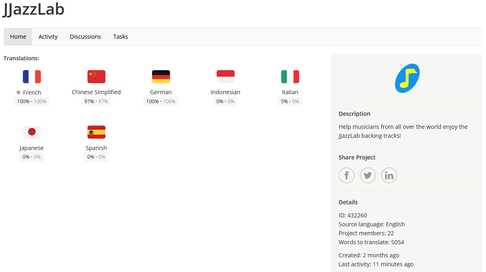
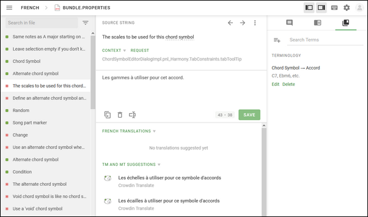

# JJazzLabの翻訳

## 主な翻訳協力者への謝意！

* **中国語**: Yafei
* **ドイツ語**: Hans Hahn, Torsten-Peh, helmutguitar, Ole Jenning, Samuel Buch
* **フランス語**: Daniel Patin, Hans Hahn

\(主要翻訳協力者は、完全言語パックの場合のみ掲載しています。\)

## 簡単ですよ

JJazzLabは、[crowdin.com](crowdin.com)のプラットフォームを使用しており、とても簡単にブラウザから文章を直接翻訳できます。

## 誰でもやれるの？

対象言語を母国語とし、音楽ソフトの用語に精通している方であれば、どなたでもできます。

## どうやって始めるの？

* [**https://crwd.in/jjazzlab**](https://crwd.in/jjazzlab)  にアクセスして登録 （無料です）してください。
* 対象言語を選択します。
* 翻訳ファイル（文章は機能やユーザーインターフェイスコンポーネントごとにグループ分けされています）を選択してください。
* 英語の文章を選んで翻訳してください。

**Ctrl+O** （または **左上のメニューを開く**\)で違うファイルを開いてください。これで終了です！

Crowdin は、自動翻訳提案、詳細情報のリクエスト、検証プロセスなど、様々な翻訳機能を提供しています。

## お薦めとヒント

* **短いほど良し** 文章はJJazzLabユーザーインターフェイスの部分であることを忘れずに。
* **翻訳に一貫性を** 母国語で「リードシート」が「xyz」であれば、できるだけ「xyz」を再利用するようにしてください。再利用が多い用語については、用語集\(Glossary\)をご利用ください。
* **用語集の翻訳を最初に** 一番下にある最新の翻訳ファイルです。JJazzLabで最も使用されている用語が含まれており、翻訳の一貫性を保つのに役立ちます。
* **校正係** 校正者は、一貫性の維持や翻訳フレーズの妥当性を検証します。この役割ができると思われる方は、お気軽に[ご連絡](https://www.jjazzlab.com/en/contact/)ください。
* **言語が無い？** Crowdinに載っていない言語を追加したいなら、お気軽に[お問合せ](https://www.jjazzlab.com/en/contact/)ください。
* **最新の翻訳ファイルがあるJJazzLabを試したい？** [このページ](testing-translations.md)を見てね。

