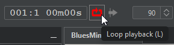

# Commandes

Vous pouvez contrôler la lecture du song à l'aide des boutons de la barre d'outils (image ci-dessous), des [raccourcis clavier](midi-remote-commands.md), du [menu contextuel](commands.md#popup-menu-controls) d'une mesure ou d'un song part, ou des [commandes à distance Midi](midi-remote-commands.md).

## Raccourcis clavier


Les raccourcis sont donnés pour Windows et Linux. Certains d'entre eux devront peut-être être adaptés pour Mac.


|                                                               |                                                                         |
| ------------------------------------------------------------- | ----------------------------------------------------------------------- |
| <mark style="background-color:blue;">Touche du clavier</mark> | <mark style="background-color:blue;">Commande</mark>                    |
| espace                                                        | Démarrer / Pause / Reprendre                                            |
| shift-espace                                                  | Stop                                                                    |
| ctrl-espace                                                   | Commencer à partir de la mesure ou du song part sélectionné             |
| ctrl-shift-espace                                             | Lire uniquement les mesures ou song parts sélectionnés                  |
| F1                                                            | Passer au song part précédent                                           |
| F2                                                            | Passer au song part suivant                                             |
| F3                                                            | Revenir au début du song (redémarrer)                                   |
| J or -                                                        | Diminuer le tempo                                                       |
| K or +                                                        | Augmenter le tempo                                                      |
| L                                                             | Basculer en mode boucle                                                 |

## Popup menu controls

Ceci permet de démarrer la lecture **à partir de la mesure du lead sheet ou du song part sélectionné** (ctrl-espace).

Vous pouvez également lire uniquement les **mesures ou song parts sélectionnés** (ctrl-shift-espace), éventuellement en boucle si le [mode boucle](commands.md#loop-mode) est actif.

<figure><figcaption>
Play from selected bar
</figcaption></figure>

<figure><figcaption>
Play from selected song part
</figcaption></figure>

## Loop mode

Lorsque le mode boucle est activé, la lecture redémarre quand elle atteint la fin (la fin du song, ou la fin de la sélection si **Play selection** a été utilisé).

<figure><figcaption></figcaption></figure>

### Loop restart bar

Vous pouvez définir une **loop restart bar** différente de la première mesure. Elle est représentée par 2 barres à gauche, comme indiqué ci-dessous.

<figure><figcaption></figcaption></figure>


La loop restart bar est ignorée lors de l'utilisation de **Play selection**.


## Click settings

Le **métronome** et le **mode precount** peuvent être configurés via le panneau **Click** dans le menu **Options**.

<figure><figcaption></figcaption></figure>

Le **mode precount** peut également être modifié directement depuis le bouton de la barre d'outils en utilisant **shift-clic**.

<figure><figcaption></figcaption></figure>
