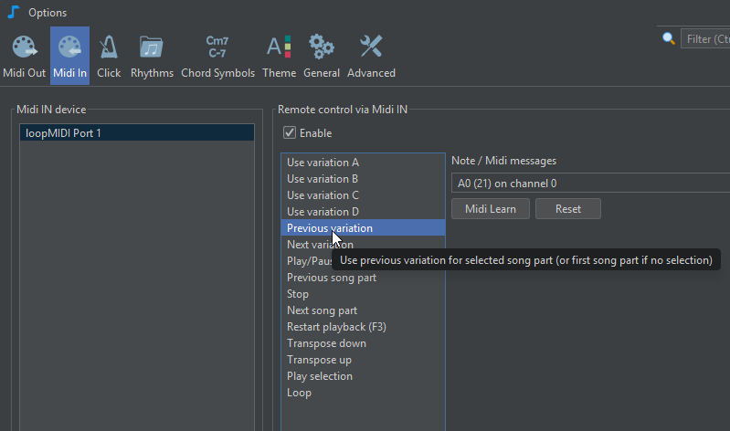

# Commandes à distance Midi

Si vous avez un contrôleur Midi connecté à votre ordinateur, vous pouvez l'utiliser pour contrôler la lecture JJazzLab.

Par exemple, vous pouvez démarrer/mettre en pause la lecture ou passer au song part suivant, simplement en appuyant sur une note de votre clavier de piano.

Le contrôle à distance via Midi IN est configuré depuis le panneau **Midi IN** des **Options/Preferences**, comme indiqué ci-dessus.

Par défaut, chaque commande est configurée pour être déclenchée par une note entrante spécifique. Par exemple, recevoir une note C1 (Midi pitch=24) déclenchera la commande jouer/pause.

Pour configurer une commande avec une autre note ou avec différents messages Midi entrants, sélectionnez la commande et utilisez **Midi Learn**.

Appuyez sur le bouton **Midi learn** pour mettre JJazzLab en mode écoute pendant quelques secondes. Utilisez ce temps pour envoyer les messages Midi qui doivent déclencher la commande. Par exemple, si vous avez un clavier Midi et souhaitez changer la note, appuyez simplement sur la note. Si vous avez un contrôleur Midi avec des pads, activez simplement le pad que vous souhaitez utiliser.

JJazzLab affichera les messages Midi reçus qui sont désormais associés à la commande sélectionnée. Si les messages Midi correspondent à une seule note, la note est affichée.
