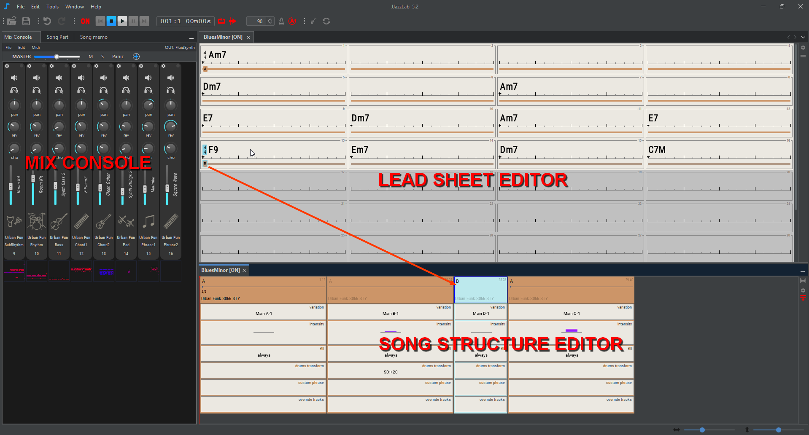

# Aperçu

<figure><figcaption>
Le song structure editor vous permet de définir comment les sections constituent le morceau final
</figcaption></figure>

### Utilisez le **Lead Sheet Editor** pour

* Ajouter des [chord symbols](chord-lead-sheet.md#chord-symbols), par ex. "Cm6", "Ab7"
* Ajouter des [sections](chord-lead-sheet.md#sections-input), par ex. "A", "B" en 3/4, "verse"
* Déplacer et modifier les chord symbols pour ajuster les accents rythmiques, l'[interprétation](chord-lead-sheet.md#interpretation) ou l'[harmonie](chord-lead-sheet.md#harmony)
* Ajouter des [bar annotations](chord-lead-sheet.md#bar-annotations-lyrics) ou des paroles (optionnel)

Consultez la page [lead sheet](chord-lead-sheet.md) pour plus d'informations.

### Utilisez le **Song Structure Editor** pour

* Définir l'ordre des sections à l'aide de [song parts](song-structure.md#song-parts), par ex. "AABA", "verse verse chorus verse", ...
* Sélectionner les [rhythms](song-structure.md#change-rhythm) (styles musicaux) à utiliser dans le morceau
* Introduire des dynamiques et des variations grâce aux [rhythm parameters](song-structure.md#rhythm-parameters) de chaque song part

Consultez la page [song structure](song-structure.md) pour plus d'informations.

### Utilisez la **Mix Console** pour

* Définir l'instrument de chaque piste
* Ajuster le volume, le panoramique, la réverbération, le chorus, le mute, la transposition, etc.
* Ajouter des [user tracks](mix-console.md#user-tracks)

Consultez la page [mix console](mix-console.md) pour plus d'informations.

### Utilisez le Notes Editor pour

* Éditer un [user track](mix-console.md#user-tracks)
* [Personnaliser](song-structure.md#custom-phrase) une phrase d'instrument d'un song part

Consultez la page [notes editor](notes-editor.md) pour plus d'informations.

<figure><figcaption>
Notes editor
</figcaption></figure>

### Désancrer / réancrer les éditeurs

Pour désancrer un éditeur, sélectionnez **Float** dans le menu contextuel de son onglet.

L'image ci-dessous montre le menu contextuel de l'onglet du [Song part editor](song-structure.md#song-part-editor).

<figure><figcaption>
Sur Windows ou Linux, le menu contextuel de l'onglet de l'éditeur s'affiche avec un clic droit
</figcaption></figure>

<figure><figcaption>
L'éditeur flottant peut être déplacé et redimensionné indépendamment de la fenêtre principale
</figcaption></figure>

Pour réancrer l'éditeur flottant, sélectionnez **Dock** dans le même menu contextuel d'onglet.

Utilisez **Reset Windows** dans le menu principal Window pour réancrer tous les éditeurs.


Le lead sheet et le song structure editor ne peuvent pas être désancrés/réancrés

