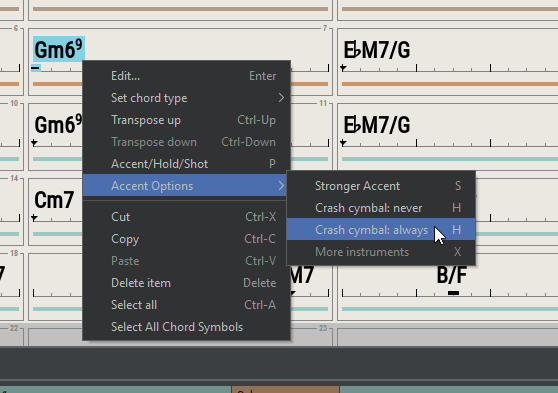
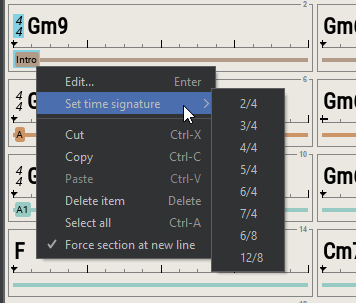
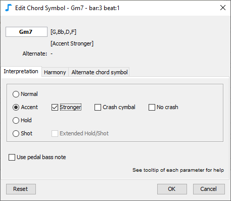
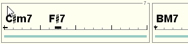
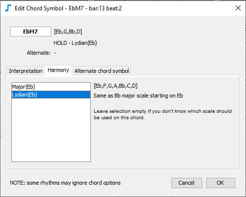
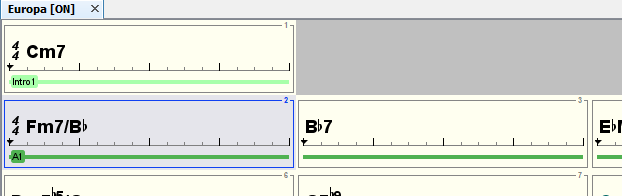

# Feuille d'accords

Utilisez l’**éditeur de feuille d’accords** pour:

* Ajouter des symboles d’accords, par exemple **Cm6, Ab7**
* Ajouter des sections, par exemple **A, B, couplet, refrain**, ...
* Déplacer et modifier les accords pour ajuster les accents rythmiques, l’interprétation ou l’harmonie

## Symboles d’accord

### Entrée

Sélectionnez une mesure ou un symbole d’accord puis:

* tapez la première lettre du symbole de l’accord ('A' à 'G'), ou
* appuyez sur ENTRÉE, ou
* double-cliquez ou
* Cli-droit menu contextuel, Modifier

Vous pouvez également sélectionner un symbole d’accord existant et le déplacer tout en appuyant sur le bouton de contrôle, il créera une nouvelle copie qui peut être modifiée.

Pour modifier la taille de la feuille d'accords, sélectionnez une mesure, puis cliquez avec le bouton droit de la souris sur le menu et sélectionnez **Définir la mesure de fin**. Utilisez la touche Ctrl enfoncée ou Maj enfoncée pour plusieurs sélections.


Pour saisir des accords à partir de zéro, le moyen le plus simple est de sélectionner la première mesure, de taper directement les symboles d’accord, d’appuyer sur ENTRÉE (ll sélectionnera automatiquement la mesure suivante), entrer les symboles d’accord pour la deuxième mesure, etc.


### Menus contextuels

Utilisez le menu contextuel (**clic droit** sur Windows/Linux, clic **ctrl-clic** sur Mac) pour voir les commandes disponibles pour la sélection en cours : mesures, symboles d’accords ou sections.

### Alias

JJazzLab reconnaît de nombreux alias pour chaque symbole d’accord. Par exemple C7M peut s’écrire Cmaj7, Cma7, CM7, CMAJ7 etc

Vous pouvez ajouter d’autres alias dans le menu **Options/Symboles d'accord**.

### Interpretation

Sélectionnez un symbole d’accord, modifiez-le (double-clic, appuyez sur Entrée ou menu clic-droit, puis sélectionnez l’onglet Interprétation.

L’**onglet Interprétation** vous permet de décider comment ce symbole d’accord doit être joué:

* **Normal**
* **Accent**:ajoutez un accent rythmique et aléatoirement une cymbale crash. Vous pouvez renforcer l’accent ou vous assurer qu’une cymbale crash est jouée ou non.
* **Tenu** : ajoutez un accent rythmique et maintenez les notes jusqu’au prochain symbole d’accord. En cas d’extension, d’autres instruments sont tenus.
* **Coup** : ajoutez un accent rythmique avec des notes d’accords jouées brièvement. Si étendu plus d’instruments sont joués.
* **Pédale basse** : la ligne de basse ne jouera que la note de basse (par ex. Fa pour Fm7 ou C pour Fm7/C). Ce paramètre est activé par défaut lorsque vous entrez un accord oblique.


Chaque moteur de génération de rythme peut rendre ces paramètres d’interprétation différemment.


\
&#x20;La forme du marqueur sous le symbole de l’accord dépend du mode d’interprétation:

&#x20;Par exemple, pour rendre:&#x20;

yVous pouvez utiliser les paramètres d’interprétation suivants:&#x20;


Voir ci-dessous les raccourcis clavier pour changer l’interprétation des accords sélectionnés.


### Harmonie

Sélectionnez un symbole d’accord, modifiez-le et sélectionnez l’onglet **Harmonie**.

L’onglet **Harmonie** vous permet de sélectionner la gamme à utiliser lors du rendu de la musique pour ce symbole d’accord.

**Exemple** Supposons que la ligne de basse de référence pour Eb7M contienne un Ab (4ème degré de la gamme majeure de Eb). Si vous sélectionnez le mode lydien (qui a un 11e degré aigu), la note de basse de référence Ab sera rendue en A pour ce symbole d’accord.

Par défaut, aucune gamme n’est sélectionnée : chaque moteur de génération de rythme décidera de la "meilleure" gamme à utiliser.

### Symbole d'accord de substitution

Sélectionnez un symbole d’accord, modifiez-le et sélectionnez l’onglet **Symbole d’accord de substitution**.

&#x20;.

Cet onglet vous permet de définir un symbole d’accord de **substitution** qui sera utilisé lorsque certaines conditions sont remplies.&#x20;

Les symboles d’accords de **substitution** sont utiles lorsque vous devez introduire une légère variation dans une partie d’un morceau.

Le symbole d’accord de **substitution** peut être n’importe quel symbole d’accord, avec n’importe quelle interprétation ou harmonie, ou aucun symbole d’accord du tout (accord nul). Les symboles d’accords qui ont un symbole d’accord de substitution défini sont affichés avec une couleur différente (voir image ci-dessous).

_Exemple:_

Dans le morceau "Europa" de Carlos Santana, la 1ère fin du thème est un Cm7, mais la 2ème est un do majeur. Pour implémenter cela dans JJazzLab, une solution pourrait être de dupliquer la section A1 pour créer la section A2 avec la fin différente, puis de mettre à jour la structure du morceau en conséquence. C’est parfaitement bien, mais lorsque les changements sont mineurs, le symbole de l’accord de substitution peut fournir une solution plus simple.

Vous pouvez voir ci-dessous (et dans l’instantané de la boîte de dialogue ci-dessus) qu’un accord de substitution C7M a été créé pour Cm7. C7M sera utilisé pour toutes les parties du morceau (voir l'[éditeur de structure du morceau](https://app.gitbook.com/o/-MPpDkwuYsgP-XBvRKRP/s/Ec5HKJ3MdnOjrFIODarT/~/changes/12/editeurs/song-structure)) où le marqueur est défini sur Theme2. Sur l’image ci-dessous, cela signifie que le C7M ne sera utilisé que pour la 2ème partie du morceau.

Il existe un autre exemple de symbole d’accord de substitution dans la 3ème mesure : A7. Si vous écoutez le morceau original, vous remarquerez qu’ils jouent un A7 sur le dernier temps de la 3ème mesure uniquement pendant les solos. Ainsi, le symbole d’accord A7 définit son symbole d’accord de **substitution** comme le " symbole d’accord vide " (identique à aucun symbole d’accord) lorsque le marqueur n’est _pas_ "Solo".

## Entrée des sections

Les sections typiques sont 'intro', 'couplet', 'refrain', etc

La section Morceau (song) est l’unité de base utilisée par JJazzLab pour définir la structure du morceau. Il y a toujours une section définie sur la première mesure.

Pour ajouter une section, sélectionnez une mesure qui ne soit pas après la fin, puis:

* appuyez sur ENTRÉE ou
* double-cliquez ou
* Clic-droit menu contextuel, Insérer une section... ou Modifier...

Le nom de la nouvelle section doit être différent de celui existant.

### Forcer une section sur une nouvelle ligne

Vous pouvez forcer une section qui ne se trouve pas sur la première mesure d’une ligne à commencer sur la ligne suivante. Cela peut être utile lorsque certaines sections ont un nombre impair de mesures.

Sélectionnez une mesure avec une section définie ou sélectionnez la section elle-même, cliquez avec le bouton droit de la souris sur le menu "Forcer la section à la nouvelle ligne".

&#x20; Cela se traduira par l’affichage ci-dessous.&#x20;

## Raccourcis de la souris

| <mark style="background-color:blue;">**Selection**</mark> | <mark style="background-color:blue;">**Souris**</mark> | <mark style="background-color:blue;">**Action**</mark>   |
| --------------------------------------------------------- | ------------------------------------------------------ | -------------------------------------------------------- |
| mesure, symbole d’accord, section                         | clic                                                   | choisir                                                  |
| Symbole d’accord                                          | double clic                                            | Modification à l’aide de l’éditeur de symboles d’accords |
| mesure, section                                           | double clic                                            | Modifier à l’aide de l’éditeur de mesures                |
| mesure, symbole d’accord, section                         | clic-droit                                             | menu contextuel                                          |
| symbole d’accord                                          | molette de la sourisl                                  | transposer                                               |
| editeur                                                   | ctrl molette de la souris                              | changer le facteur X de zoom                             |

## Raccourcis clavier


De nombreuses actions sont également disponibles via le menu contextuel (clic droit sur Windows/Linux, clic ctrl sur Mac), et lorsqu’il est disponible, le clavier associé s’affiche.


| Selection                         | Touche clavier    | Action                                                            |
| --------------------------------- | ----------------- | ----------------------------------------------------------------- |
| symbole d’accord                  | entrée            | Modifier avec l’éditeur de symbole d’accords                      |
| mesure, section                   | entrée            | Boîte de dialogue Modifier avec l’éditeur de mesures              |
| mesure                            | ctrl-E            | Définir la mesure de fin                                          |
| mesure                            | I                 | Insérer des mesures                                               |
| mesure                            | suppr             | Effacer le contenu de la mesure                                   |
| symbole d’accord, section         | suppr             | retirer                                                           |
| symbole d’accord, section         | ctrl-gauche/droit | Déplacer l’élément d’une mesure vers la gauche/droite             |
| mesure                            | shift-suppr       | retirer                                                           |
| symbole d’accord                  | ctrl-haut/bas     | transposer                                                        |
| symbole d’accord                  | P                 | Interprétation des changements                                    |
| symbole d’accord                  | S                 | accent plus fort                                                  |
| symbole d’accord                  | H                 | crash cymbale/pas de crash                                        |
| symbole d’accord                  | X                 | tenu/coup plus d'instruments                                      |
| symbole d’accord, section         | ctrl-A            | Sélectionnez tout dans la section, puis dans la feuille d'accords |
| mesure, symbole d’accord, section | ctrl-C/X/V        | copier/couper/coller des éléments                                 |
| editeur                           | ctrl-Z/Y          | Annuler/Rétablir                                                  |
| editeur                           | ctrl-W            | Fermer la morceau                                                 |
