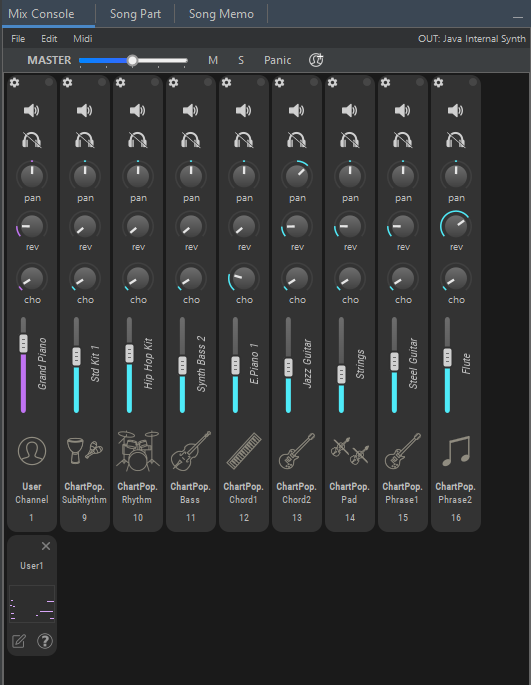
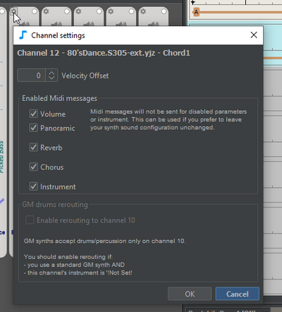
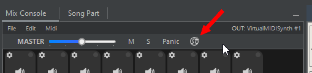
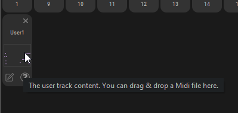
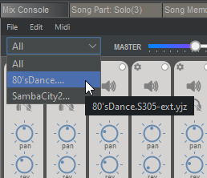

# Console de Mixage

Utilisez la **console de mixage** pour:

* Changer les instruments
* Ajuster les paramètres des canaux : volume, réverbération, chorus, panoramique, transposition, vélocité
* Canaux muets ou solo
* Ajouter des pistes utilisateur
* Charger/enregistrer le fichier. mix
* Et plus encore : changer de canal Midi, utiliser des commandes Midi spéciales, exporter vers un fichier Midi, etc...

JJazzLab utilise les informations de la console de mixage pour envoyer les messages Midi pertinents au [synthétiseur de sortie](/broken/pages/-MQNBJUwiJ9pkXF9j5Ey). Cela se fait chaque fois que vous apportez une modification à la console de mixage ou lorsque vous démarrez la lecture.


Le Midi n’a que 16 canaux Midi. C’est pourquoi généralement un morceau ne peut pas avoir plus de 2 rythmes.


## Barre d’outils de la console de Mixage

* **Volume master** : cela augmente ou diminue les messages de volume Midi
* **M**: Couper ou Activer le son de toutes les pistes
* **S**: Désactiver toutes les pistes solo
* **Panique**: Envoyer un message de panique Midi, en désactivant toutes les notes
* **Ajouter une piste Utilisateur** : voir [Pistes Utilisateur](mix-console.md#user-tracks) ci-dessous.

## Barre de menus de la console de Mixage

### Menu Fichier

*   **Charger/enregistrer le mixage rythmique par défaut** &#x20;

    Modifiez la combinaison actuelle à partir d’un fichier. Consultez [cette page](../morceaux/song-and-mix-files.md) pour plus d’informations sur les fichiers .mix.
*   **Importation de mixage...** &#x20;

    Notez que cela importera les paramètres uniquement pour les instruments qui sont communs entre le mixage actuel et le mixage importé.

### Menu Edition

*   **Réinitialiser les canaux** &#x20;

    Restaurez les paramètres d’origine à partir du rythme associé.

### Menu Midi

*   **Activer/Désactiver tous les paramètres Midi** &#x20;

    Utilisez Désactiver tous les paramètres Midi si vous contrôlez vous-même le mixage directement sur le synthé de sortie.
*   **Envoyer un message GM/GM2/XG/GM en mode ON** &#x20;

    Cela vous permet d’envoyer des messages d’initialisation Midi spéciaux pour transformer votre synthé de sortie dans le mode souhaité.

## Changer d'instrument

Cliquez sur le nom de l’instrument dans le canal. Notez que c’est également là que la transposition de l’instrument peut être ajustée.

## Paramètres de canal

Utilisez les paramètres de canal pour:

*   **Ajouter un décalage de vélocité Midi à toutes les notes jouées sur ce canal**

    Notez que cela est légèrement différent du réglage du volume. 
*   **Désactiver l’envoi de messages Midi spécifiques** &#x20;

    Probablement parce que vous contrôlez vous-même le paramètre directement sur le [synthé de sortie](/broken/pages/-MQNBJUwiJ9pkXF9j5Ey). 
*   **Activer un canal de batterie avec un canal Midi différent de 10**

    Si vous utilisez un synthétiseur de sortie GM de base, il ne peut jouer la batterie que sur le canal 10. Si la batterie/percussion est utilisée sur d’autres canaux de votre mixage, vous devez activer le réacheminement de la batterie sur ces canaux. Notez que JJazzLab peut activer cette option pour vous s’il détecte, en fonction des informations de [synthé de sortie](/broken/pages/-MQNBJUwiJ9pkXF9j5Ey) actuelles, des problèmes potentiels. \
     

## Canal Midi

Chaque canal Midi peut être modifié manuellement, il suffit de cliquer sur le numéro du canal.

.png>)

## Pistes utilisateur

Une piste utilisateur vous permet d’ajouter votre propre contenu Midi à votre morceau : une mélodie, des riffs de cuivres, des percussions, etc.

#### Ajouter une piste Utilisateur

Ajoutez une ou plusieurs pistes utilisateur à l’aide du bouton Ajouter une piste utilisateur.

<figure><figcaption></figcaption></figure>

Une piste utilisateur a une extension graphique spécifique comme indiqué ci-dessous, qui est utilisée pour renommer ou supprimer la piste utilisateur, mais surtout est utilisée pour mettre à jour son contenu Midi.

Lorsque la piste est créée, vous pouvez sélectionner un instrument comme pour n’importe quelle piste.


Si vous sélectionnez une batterie ou un instrument de percussion et que votre [synthé de sortie](/broken/pages/-MQNBJUwiJ9pkXF9j5Ey) est un synthétiseur basique compatible GM: [réglez le canal de piste utilisateur](mix-console.md#midi-channel) sur 10, _et_ si le Canal 10 est déjà utilisé par une autre piste, activez le _Réacheminement Batterie_ _vers_ canal _10_ (voir [Paramètres du canal](mix-console.md#channel-settings)) dans votre piste utilisateur.


#### Edition du contenu Midi

Pour ajouter des notes Midi à une piste utilisateur, vous pouvez soit **glisser-déposer** un fichier Midi dans la zone rectangulaire, soit utiliser le bouton **Modifiez via le bouton externe** de l’éditeur Midi dans le coin inférieur gauche.&#x20;

Lors de l’utilisation de l’**édition via l'éditeur Midi externe**, JJazzLab exportera d’abord la piste d'accompagnement complète en tant que fichier Midi temporaire, puis l’ouvrira avec votre éditeur Midi externe, afin que vous puissiez ajouter des notes pour votre piste utilisateur.


JJazzLab n’importe que les notes qui correspondent au canal Midi de la piste utilisateur. **Les notes provenant d’autres canaux Midi sont ignorées.**

Par exemple, dans l’image ci-dessus, le canal de piste utilisateur est 1, donc lorsque vous utilisez votre éditeur Midi / DAW pour ajouter des notes sur la piste utilisateur, assurez-vous qu’elles sont bien sur le canal 1.


&#x4C;**’édition via un éditeur Midi externe** nécessite que vous ayez défini un éditeur Midi externe dans le panneau **Général des Options / Préférences**. Si vous n’en avez pas, nous vous recommandons **MidiEditor** pour Windows, c’est gratuit, open-source et léger. &#x20;

## Exporter vers un fichier Midi avec le glisser-déposer de la souris

Vous pouvez exporter la piste d’accompagnement complète vers un fichier Midi en faisant glisser la souris depuis la zone vide de la console de mixage. Notez que c’est la même chose que le menu Fichier/Exporter vers un fichier Midi, sauf que c’est plus pratique lorsque vous travaillez avec un autre logiciel tel qu’un DAW.

Pour exporter une seule piste, glisser-déposer avec la souris à partir d’une icône de piste.

## Morceaux multi-rythmes

Lorsqu’un morceau utilise 2 rythmes ou plus, une fenêtre contextuelle s’affiche dans le coin supérieur gauche de la console de mixage pour sélectionner le rythme que vous souhaitez afficher.

Notez que certaines commandes telles que le menu Modifier/Réinitialiser les canaux ne seront pas appliquées au(x) rythme(s) caché(s).

## Raccourcis de la souris

| Sélection                           | Souris                       | Action                                |
| ----------------------------------- | ---------------------------- | ------------------------------------- |
| curseur de volume de canal, potards | double-clic                  | Valeur d’entrée avec le clavier       |
| Curseur de volume de canal          | Maj+ glissement de la souris | Modifier le volume de tous les canaux |
