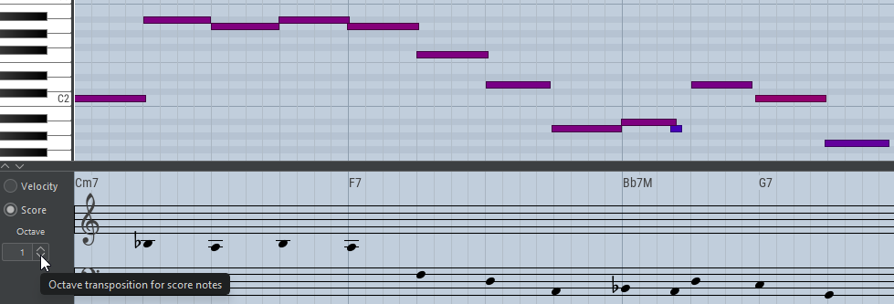

# Notes editor

JJazzLab intègre un notes editor Midi utilisé pour [**éditer des user tracks**](notes-editor.md#edit-a-user-track) ou des [**custom phrases de song part**](notes-editor.md#edit-a-custom-phrase-for-a-song-part)**.**

<figure><figcaption>
Piste mélodique. En dessous se trouve le panneau de vélocité.
</figcaption></figure>

<figure><figcaption>
Piste de batterie
</figcaption></figure>

<figure><figcaption>
En dessous se trouve le panneau de partition simplifié (non modifiable)
</figcaption></figure>

## Ouvrir le notes editor

### Éditer un user track

Le notes editor s'ouvre automatiquement lorsque vous [ajoutez un user track](mix-console.md#adding-user-tracks). Pour les user tracks existants, cliquez sur le bouton d'édition dans le composant de vue d'ensemble de la piste, comme indiqué ci-dessous.&#x20;

<figure><figcaption></figcaption></figure>

Les pistes de rhythm peuvent également être éditées avec le notes editor en les clonant d'abord comme user track :

<figure><figcaption></figcaption></figure>

### Éditer une Custom phrase pour un song part

Dans le song structure editor, cliquez sur le bouton en haut à gauche d'un rhythm parameter Custom phrase :

<figure><figcaption></figcaption></figure>

Sélectionnez ensuite les phrases que vous souhaitez personnaliser et appuyez sur Edit pour ouvrir le notes editor.

<figure><figcaption></figcaption></figure>

## Déplacement et zoom

Vous pouvez déplacer l'éditeur en appuyant sur **ctrl + glisser** dans la règle supérieure, comme indiqué ci-dessous :

<figure><figcaption></figcaption></figure>

Vous pouvez utiliser les curseurs de zoom de l'application principale dans le coin inférieur droit, ou utiliser **ctrl+molette de la souris** pour le zoom horizontal, **ctrl+shift+molette de la souris** pour le zoom vertical.&#x20;

Utilisez **ctrl-F** pour zoomer sur toute la largeur.

<figure><figcaption></figcaption></figure>

## Contrôles de lecture

Utilisez le bouton de la barre d'outils indiqué dans l'image ci-dessous, ou appuyez sur **ctrl-shift-ESPACE**, pour jouer **en mode boucle** la phrase éditée, ou la [zone de boucle de lecture](notes-editor.md#playback-loop-zone) si elle est définie.

<figure><figcaption>
Bouton Démarrer la lecture
</figcaption></figure>

Appuyez sur **ctrl-ESPACE** pour démarrer la lecture :

* depuis la [zone de boucle de lecture](notes-editor.md#playback-loop-zone) si elle est définie
* depuis la mesure de la première note sélectionnée
* si aucune note n'est sélectionnée, depuis la première mesure visible

Autres contrôles :

<figure><figcaption></figcaption></figure> <figure><figcaption></figcaption></figure> <figure><figcaption></figcaption></figure>

### Zone de boucle de lecture

Une zone de boucle de lecture peut être définie en **faisant glisser la souris** dans la **règle** supérieure. Utilisez **shift+clic** dans la règle pour étendre la zone de boucle. **Cliquez** dans la règle pour supprimer la zone de boucle.

<figure><figcaption></figcaption></figure>

Utilisez le bouton de la barre d'outils (voir ci-dessus) ou appuyez sur **ctrl-shift-espace** pour démarrer la lecture de la zone de boucle.

## Magnétisme sur la grille

Utilisez le bouton **Snap to grid** (ou appuyez sur **G**) pour aimanter les notes sur la grille lorsque vous les dessinez, déplacez ou redimensionnez. La taille de la grille peut être définie à l'aide de la liste déroulante (1/4=noire, 1/8=croche, ...) :

<figure><figcaption></figcaption></figure>


Lorsque vous déplacez ou redimensionnez des notes avec l'**outil de sélection**, vous pouvez inverser temporairement le paramètre "snap to grid" en appuyant sur **alt**.


Pour modifier la position des notes existantes, utilisez [Quantize](notes-editor.md#quantize-notes).

## Outils d'édition

Vous pouvez utiliser 3 outils pour modifier les notes : **outil de sélection**, **outil de dessin**, **outil d'effacement**. Les 2 premiers outils d'édition sont sensibles aux paramètres de [magnétisme sur la grille](notes-editor.md#snap-to-grid).

Les outils peuvent être sélectionnés à l'aide des boutons de la barre d'outils supérieure du notes editor, ou par un clic droit dans l'éditeur :

<figure><figcaption></figcaption></figure>

Utilisez l'**outil de sélection** pour sélectionner, déplacer, redimensionner, copier/couper (**ctrl-C/X**) et supprimer des notes (appuyez sur **Suppr**).&#x20;

Utilisez **ctrl-V** pour coller des notes.


Comment contrôler à quelle position les notes sont collées ?

* Si une note est sélectionnée, la première note collée est alignée avec cette note sélectionnée
* Si aucune note n'est sélectionnée, la première note collée est alignée sur le bord gauche du notes editor

Les nouvelles notes collées sont automatiquement sélectionnées, vous pouvez donc les déplacer vers la position appropriée si nécessaire.


**Faites glisser** pour sélectionner plusieurs notes. Utilisez **ctrl + glisser** pour dupliquer des notes. **ctrl-shift-I** inverse la sélection des notes.

<figure><figcaption></figcaption></figure>

Utilisez l'**outil de dessin** pour dessiner des notes, et l'**outil d'effacement** pour effacer des notes.

<figure><figcaption></figcaption></figure>

## Modifier la vélocité des notes

La couleur des notes varie en fonction de leur vélocité. Il existe plusieurs façons de modifier la vélocité des notes, comme indiqué ci-dessous.

#### Depuis le panneau principal de l'éditeur

Sélectionnez d'abord les notes à modifier. Utilisez ensuite le champ de saisie de vélocité dans la barre d'outils, ou utilisez **alt + molette de la souris** ou **alt + page haut/bas**.

<figure><figcaption></figcaption></figure>

#### Depuis le panneau de vélocité

**Cliquez** ou **faites glisser la souris** sur les notes pour ajuster leur vélocité.

<figure><figcaption></figcaption></figure>

## Quantifier et humaniser les notes

Utilisez le bouton **Quantize** ou appuyez sur **Q** pour déplacer la position de début des notes sélectionnées sur la grille courante. Si aucune note n'est sélectionnée, toutes les notes sont quantifiées.

Cochez la case **Iterative** pour effectuer une quantification itérative : les notes sont progressivement déplacées vers la grille. Cela est généralement recommandé pour éviter un son trop mécanique.

<figure><figcaption></figcaption></figure>

Vous pouvez également **humaniser** toutes les notes ou les notes sélectionnées. L'humanisation introduit de légères variations aléatoires dans la position de début et la vélocité des notes. Utilisez le bouton **Humanize** à gauche, ou appuyez sur **ctrl-H** pour afficher la boîte de dialogue Humanize.

<figure><figcaption></figcaption></figure>

Une fois que vous avez cliqué sur le bouton Humanize, vous pouvez ajuster les paramètres d'humanisation et observer les différents résultats.

#### Exemple

Cette ligne de basse est très uniforme : toutes les notes ont la même vélocité et sont quantifiées. Cela sonne trop « robotique ».

<figure><figcaption></figcaption></figure>

Nous pouvons utiliser la boîte de dialogue Humanize pour améliorer cela, comme indiqué ci-dessous.

<figure><figcaption></figcaption></figure>

## Panneau de partition simplifié

Ce panneau affiche une **notation musicale simplifiée :** les positions des notes sont simplement alignées avec les notes de l'éditeur, sans embellissement.&#x20;

Le panneau de partition n'est **PAS** modifiable.&#x20;

<figure><figcaption>
Panneau de partition simplifié sous le piano roll
</figcaption></figure>

Utilisez la transposition d'affichage **Octave** si les notes sont trop basses ou trop hautes pour être visibles dans le panneau de partition. Cela n'affecte que l'affichage dans le panneau, les notes ne sont pas réellement transposées.&#x20;

## Importer des notes

Vous pouvez importer des notes en faisant glisser un fichier Midi externe dans l'éditeur. Vous pouvez également faire glisser depuis une piste individuelle dans la mix console.

<figure><figcaption>
Importation d'un fichier Midi dans l'éditeur
</figcaption></figure>


Si le fichier Midi importé contient des notes de plusieurs canaux Midi, alors JJazzLab **n'importe que les notes correspondant au canal Midi de l'éditeur.**&#x20;

Si le fichier Midi importé ne contient des notes que d'un seul canal, alors JJazzLab importe les notes avec le canal mis à jour selon le canal Midi de l'éditeur.


## Raccourcis souris

<table data-header-hidden><thead><tr><th width="253.33333333333331">Sélection</th><th>Souris</th><th>Action</th></tr></thead><tbody><tr><td>Notes</td><td>ctrl-clic</td><td>sélectionner plusieurs notes</td></tr><tr><td>Éditeur</td><td>glisser</td><td>sélectionner plusieurs notes</td></tr><tr><td>Notes</td><td>glisser</td><td>déplacer/redimensionner</td></tr><tr><td>Notes</td><td>ctrl + glisser</td><td>dupliquer des notes</td></tr><tr><td>Notes</td><td>alt + glisser</td><td>déplacer/redimensionner avec le magnétisme inversé</td></tr><tr><td>Notes</td><td>alt + molette</td><td>modifier la vélocité</td></tr><tr><td>Éditeur</td><td>molette</td><td>déplacer l'éditeur vers le haut/bas</td></tr><tr><td>Éditeur</td><td>shift + molette de la souris</td><td>déplacer l'éditeur vers la gauche/droite</td></tr><tr><td>Éditeur</td><td>ctrl + molette de la souris</td><td>zoom horizontal</td></tr><tr><td>Éditeur</td><td>ctrl-shift + molette de la souris</td><td>zoom vertical</td></tr><tr><td>Éditeur</td><td>ctrl + glisser</td><td>déplacer l'éditeur</td></tr><tr><td>Règle</td><td>glisser</td><td>définir la zone de boucle de lecture</td></tr><tr><td>Règle</td><td>shift-clic</td><td>étendre la zone de boucle de lecture</td></tr><tr><td>Règle</td><td>clic</td><td>supprimer la zone de boucle de lecture</td></tr></tbody></table>

## Raccourcis clavier

| Sélection | Touche           | Action                                                              |
| --------- | ---------------- | ------------------------------------------------------------------- |
| Notes     | alt-haut/bas     | modifier la vélocité                                                |
| Notes     | ctrl-C/X/V       | copier/couper/coller des notes                                      |
| Notes     | suppr            | supprimer des notes                                                 |
| Notes     | ctrl-shift-I     | inverser la sélection de notes                                      |
| Notes     | ctrl-H           | ouvrir la boîte de dialogue Humanize                                |
| Notes     | Q                | quantifier les notes sélectionnées (ou toutes si aucune sélection)  |
| Éditeur   | ctrl-F           | zoom pour ajuster les notes                                         |
| Éditeur   | G                | magnétisme sur la grille                                            |
| Éditeur   | A                | défilement automatique pendant la lecture                           |
| Éditeur   | S                | solo de la phrase éditée                                            |
| Éditeur   | H                | écouter les notes sélectionnées                                     |
| Éditeur   | Début/Fin        | déplacer l'éditeur au début/à la fin                                |
| Éditeur   | ctrl-shift-espace | jouer la zone de boucle (si définie) ou toute la phrase            |
| Éditeur   | ctrl-espace      | jouer depuis la zone de boucle (si définie) ou depuis la première note sélectionnée |
| Éditeur   | ctrl-Z/Y         | annuler/rétablir                                                    |
