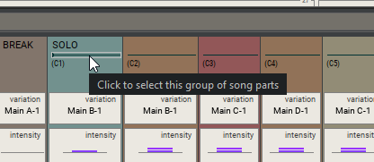
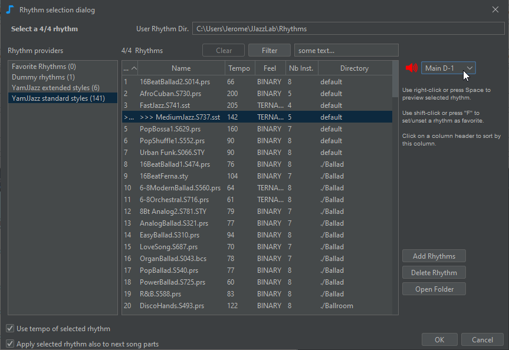
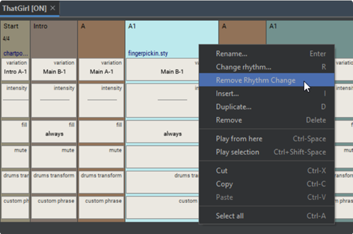
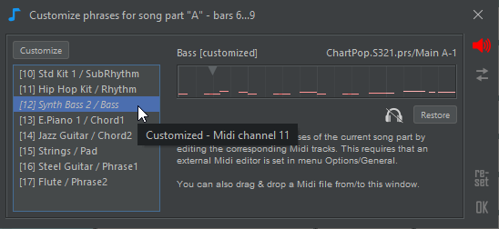

# Structure du morceau

Utilisez **l’éditeur de structure** de morceau:

* Définir l’ordre des sections, par exemple "AABA", "couplet couplet refrain", ...
* Sélectionner le(s) **rythme(s**) à utiliser&#x20;
* Ajuster les **paramètres rythmiques** pour introduire la dynamique, par exemple la variation, l’intensité, le fill, l’instrument en sourdine, ...

## Partie du morceau

Une partie de morceau est liée à une section parente de la [feuille d’accord](chord-lead-sheet.md).

Une partie de morceau a un nom, un rythme et une valeur pour chacun des **paramètres du rythme**. Pour ajouter une nouvelle partie de morceau :

* faites glisser une section de la feuille d’accords vers l’éditeur de structure du morceau, ou
* clic-droit sur le menu **Insérer**, ou&#x20;
* copier une partie de morceau existante : faites-la glisser tout en appuyant sur la touche CTRL, utilisez le copier-coller ou clic-droit sur le menu **Dupliquer**

Par défaut, le nom de la partie morceau est le nom de la section parente. Si la partie morceau est renommée, la section parent est affichée sous le nom.

Si certaines parties de morceau contiguës partagent le même nom, le nom n’est affiché que sur la première partie du morceau et une ligne est affichée sur les parties du morceau contiguës.

## Edition

Les parties du morceau peuvent être réorganisées en les faisant glisser à l’aide de la souris.

Vous pouvez modifier le nom de la partie du morceau, le **rythme** et les **valeurs des paramètres de rythme.**

L’édition se fait directement à partir de l’éditeur de structure de morceau à l’aide de la [souris](song-structure.md#mouse-shortcuts), ou à partir de l’éditeur de partie de morceau (voir l’image en haut de cette page). Les modifications s’appliquent aux parties du morceau ou aux paramètres rythmiques sélectionnés

Utilisez le menu contextuel (clic droit sur Windows/Linux,  **ctrl-clic** sur Mac) pour voir les commandes disponibles pour la sélection actuelle, comme indiqué dans les 2 images ci-dessous.

Lorsque vous sélectionnez plusieurs paramètres de rythme contigus, vous pouvez utiliser le sous-menu **Ajuster les valeurs** du menu contextuel des paramètres de rythme pour interpoler les valeurs entre la première et la dernière valeur sélectionnée. Dans l’exemple ci-dessous, nous l’avons utilisé pour augmenter progressivement le tempo de 100% à 108%.

## Changer de rhythme

Chaque partie du morceau peut avoir son propre rythme.&#x20;


Le midi ne peut accueillir que 16 canaux, et de nombreux rythmes utilisent 7 ou 8 instruments. C’est pourquoi il est difficile en pratique d’avoir une chanson avec plus de 2 rythmes.


Pour modifier le rythme, sélectionnez une partie du morceau et appuyez sur R, ou cliquez sur le nom du rythme pour ouvrir la **boîte de dialogue de sélection** du rythme.

Lors du changement de rythme, JJazzLab essaie d’adapter les valeurs des paramètres de rythmes précédents aux nouveaux paramètres de rythme.

&#x20;Si vous souhaitez supprimer un changement de rythme au milieu d’un morceau, sélectionnez la partie du morceau et utilisez **Supprimer le changement de rythme** dans le menu contextuel de celle-ci.

<figure><figcaption></figcaption></figure>

## &#x20;Paramètres Rhythmiques

### Types

En théorie, un rythme (ou un style) peut définir son propre ensemble de paramètres. Cependant, dans JJazzLab, la plupart des rythmes utilisent les mêmes paramètres:

* **Variation**: une variation rythmique. Les rythmes du [moteur YamJJazz](../moteurs-rythmiques/yamjjazz-rhythm-engine/) ont généralement 4 variations principales, plus quelques _Intros_, _fins_ et quelques _breaks (fills)_.
* **Intensité:**  la plupart des moteurs rythmiques utilisent ce paramètre pour augmenter / diminuer la vitesse Midi des notes de la piste d’accompagnement.
* **Break(fill) de Batterie** : JJazzLab ajoutera un break de batterie sur la dernière mesure de la partie morceau.
* **Muet**: : couper le son d’un ou plusieurs instruments pendant cette partie de morceau. Pour modifier ce paramètre, il est plus facile d’utiliser le bouton **Éditeur de parties de morceaux** (voir l’instantané en haut de cette page).
* **Marqueur**: ce paramètre n’est utile que si vous utilisez des symboles d’accord de substitution dans la feuille d’accord, comme expliqué [ici](chord-lead-sheet.md#substitute-chord-symbol).
* **facteur tempo** : ralentir ou accélérer le tempo de la partie du morceau.
* **Transformation de batterie** : changer certaines notes de batterie de la partie du morceau. Par exemple, vous pouvez rendre le charley plus fort, ou changer les notes de charley fermées en notes de cymbale ride.

*   **Phrase personnalisée** : remplacez une ou plusieurs phrases d’instrument de la partie morceau. Pour importer votre phrase personnalisée, vous pouvez glisser-déposer un fichier Midi dans l’éditeur de phrase personnalisée ci-dessous, ou utiliser votre éditeur Midi externe via le bouton Personnaliser.

    Lors de l’utilisation de l’édition via un éditeur Midi externe, JJazzLab exportera d’abord la piste d’accompagnement complète sous forme de fichier Midi temporaire, puis l’ouvrira avec votre éditeur Midi externe, afin que vous puissiez modifier les notes d’une ou plusieurs pistes.

### Modifier les valeurs

Vous pouvez ajuster la valeur des paramètres de chaque partie du morceau.

Pour les paramètres énumérables, le moyen le plus simple de modifier la valeur est de la sélectionner et d’utiliser la molette de la souris.

Mais vous pouvez également utiliser le menu contextuel des paramètres de rythme pour réinitialiser la valeur du paramètre, ou copier/coller des valeurs, ou utiliser **l’éditeur de morceau** (voir l’instantané en haut de cette page).

### **Vue compacte / vue complète**

Par défaut, seul un sous-ensemble des paramètres de rythme est affiché, il s’agit de la **vue compacte**. Cliquez sur le bouton ci-dessous ou appuyez sur "V" pour basculer entre la vue compacte et la vue complète.

Le bouton des **paramètres de la vue compacte**, juste au-dessus du bouton d’affichage compact, vous permet de choisir les paramètres de rythme visibles dans la vue compacte. Ces paramètres sont enregistrés avec le morceau.

## Raccourcis de la souris

| Sélection                                       | Souris                    | Action                                               |
| ----------------------------------------------- | ------------------------- | ---------------------------------------------------- |
| partie de morceau, paramètre rythmique          | clic                      | Choisir                                              |
| partie du morceau                               | double-clic               | Modifier le nom du morceau                           |
| Nom de la partie du morceau                     | clic                      | éditer                                               |
| rythme                                          | clic                      | sélectionner un rythme                               |
| éditeur, partie de morceau, paramètre rythmique | Clic droit                | Ouvrir le menu contextuel                            |
| paramètre rythme                                | double-clic               | éditer la valeur                                     |
| paramètre rythme                                | molette de la souris      | changer la valeur                                    |
| paramètres rythmiques                           | maj+molette de la souris  | Rendre les valeurs identiques puis changer la valeur |
| éditeur                                         | ctrl+molette de la souris | changer le facteur  X de zoom                        |

## Raccourcis clavier


De nombreuses actions sont également disponibles via le menu contextuel (clic droit sur Windows/Linux, ctrl-clic sur Mac), et lorsqu’il est disponible, le raccourci associé s’affiche.


| Sélection                              | Touche clavier | Action                                    |
| -------------------------------------- | -------------- | ----------------------------------------- |
| partie de morceau, paramètre rythmique | entrer         | modifier le nom du morceau                |
| partie de morceau, paramètre rythmique | R              | sélectionner le rythme                    |
| partie de morceau, paramètre rythmique | I              | insérer une partie de morceau             |
| partie de morceau, paramètre rythmique | ctrl-I         | ajouter une partie de morceau             |
| partie de morceau, paramètre rythmique | D              | dupliquer une ou des partie(s) du morceau |
| partie de morceau                      | supprimer      | supprimer une ou des parties du morceau   |
| paramètre rythmique                    | ctrl-haut/bas  | valeur suivante /précédente               |
| paramètre rythmique                    | Z              | réinitialiser param. valeur               |
| partie de morceau                      | ctrl-C/X/V     | Copier/Couper/Coller                      |
| éditeur                                | ctrl-Z/Y       | Annuler/Rétablir                          |
| éditeur                                | ctrl-F         | Zoom pour ajuster la largeur              |
| éditeur                                | V              | Affichage compact ou complet              |
