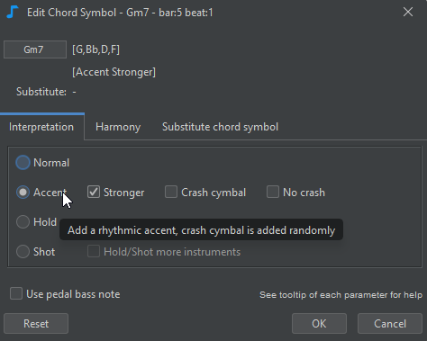
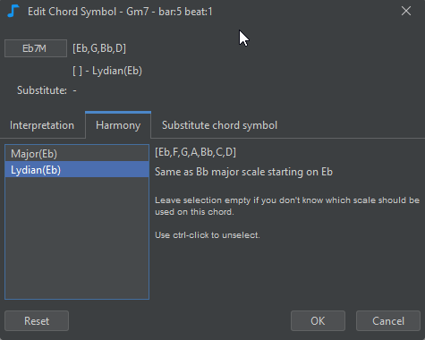
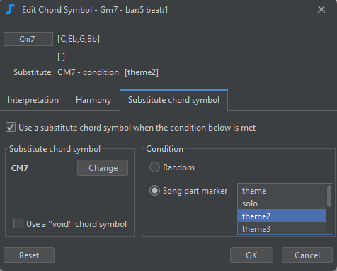
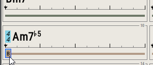
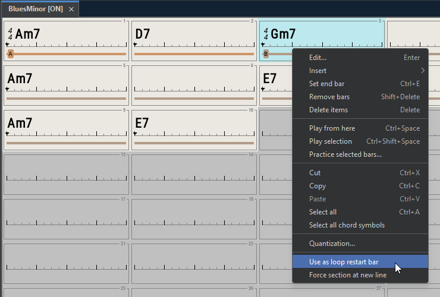
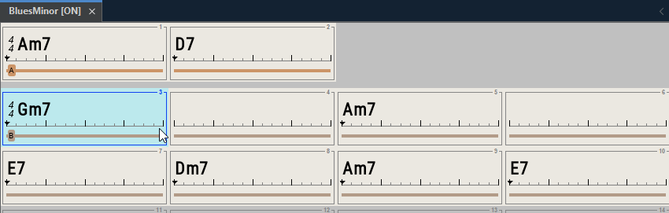

# Lead sheet

Utilisez le **lead sheet editor** pour :

* Ajouter des chord symbols, par ex. **Cm6, Ab7, F#9M#11, NC (no chord), ...**
* Ajouter des sections, par ex. **A, B, verse, chorus,** ...
* Déplacer et modifier les accords pour ajuster les accents rythmiques, l'interprétation ou l'harmonie
* Ajouter des bar annotations (pour les paroles, etc.)

## Menus contextuels

Utilisez le menu contextuel (**clic droit** sur Windows/Linux, **ctrl-clic** sur Mac) pour voir les commandes disponibles pour la sélection en cours : mesures, chord symbols ou sections.

.png>)

## Taille du lead sheet

Sélectionnez une mesure puis choisissez **Set end bar** dans le menu contextuel (clic droit).


La taille du song dépend à la fois du lead sheet _et_ du song structure.

Par exemple, si le lead sheet ne contient qu'une seule section de 12 mesures appelée A, et que le song structure est A-A-A, alors la taille du song est 3\*12=36 mesures.


## Sélectionner et déplacer des éléments (chord symbols ...)

Cliquez sur une mesure ou un chord symbol pour le sélectionner. Utilisez **ctrl-clic** pour sélectionner plusieurs mesures ou chord symbols.

Utilisez **shift-clic** pour étendre la sélection courante.

**Faites glisser** un chord symbol avec la souris pour le déplacer vers un nouvel emplacement. Si vous appuyez sur **ctrl** en faisant glisser, un signe **+** apparaît (voir image ci-dessous) indiquant que le chord symbol sera copié, et non déplacé.

<figure><figcaption></figcaption></figure>


Les **sections** et les **bar annotations** peuvent être sélectionnées, déplacées ou copiées de la même manière.


#### Quantification des chord symbols

Par défaut, la position d'un chord symbol est quantifiée à la double croche (4 positions par temps).

Cela peut être ajusté par section via le menu contextuel de la mesure ou de la section **Quantization...**, comme indiqué ci-dessous.

<figure><figcaption></figcaption></figure>

<figure><figcaption></figcaption></figure>

La valeur **auto** ajuste la quantification en fonction du rhythm (binaire ou ternaire) utilisé par le premier song part lié à cette section.

## Chord symbols

Sélectionnez une mesure ou un chord symbol, puis tapez la première lettre du chord symbol (par ex. 'C'), la **boîte de dialogue Bar edit** apparaîtra automatiquement :

<figure><figcaption>
Boîte de dialogue Bar edit
</figcaption></figure>

Lorsqu'une mesure est sélectionnée, la **boîte de dialogue Bar edit** peut également s'afficher en appuyant sur ENTRÉE, en double-cliquant sur une mesure, ou via le menu contextuel Edit.

Pour **copier** un chord symbol, il suffit de le **faire glisser** tout en maintenant la touche **ctrl**.


Pour **saisir un lead sheet de zéro**, le moyen le plus simple est de sélectionner la première mesure puis de taper directement les chord symbols (la boîte de dialogue Bar edit apparaît automatiquement dès que la première lettre est tapée), d'appuyer sur ENTRÉE une fois terminé (cela sélectionne automatiquement la mesure suivante), de taper les chord symbols pour la deuxième mesure, etc.


JJazzLab peut reconnaître différentes formes d'un chord symbol donné. Par exemple **C-7**, **Cm7**, **Cmi7**, **Cmin7** sont tous équivalents. Vous pouvez ajouter vos propres _alias d'accords_ dans l'onglet **Chord Symbols** des Options/Preferences, comme indiqué ci-dessous :

<figure><figcaption>
Définissez vos propres alias de chord symbols
</figcaption></figure>


Le chord symbol spécial **NC** peut être utilisé pour obtenir un silence jusqu'au prochain chord symbol. Si le silence complet est trop fort, vous pouvez essayer un chord symbol avec l'[interprétation](chord-lead-sheet.md#interpretation) **shot**.


### Interprétation des chord symbols

Sélectionnez un chord symbol, modifiez-le (double-clic, appuyez sur Entrée ou menu contextuel clic-droit), puis sélectionnez l'onglet **Interpretation**.

L'onglet **Interpretation** vous permet de décider comment ce chord symbol doit être joué :

* **Normal**
* **Accent** : ajoute un accent rythmique et aléatoirement une cymbale crash. Vous pouvez renforcer l'accent, ou vous assurer qu'une cymbale crash est jouée ou non.
* **Hold** : ajoute un accent rythmique et maintient les notes jusqu'au prochain chord symbol. Si étendu, davantage d'instruments sont tenus.
* **Shot** : ajoute un accent rythmique avec les notes d'accord jouées brièvement. Si étendu, davantage d'instruments sont joués.
* **Pedal bass** : la ligne de basse ne jouera que la note de basse (par ex. F pour Fm7 ou C pour Fm7/C). Ce paramètre est activé par défaut lorsque vous saisissez un accord oblique (slash chord).


Chaque rhythm engine peut rendre ces paramètres d'interprétation différemment.


La forme du marqueur sous le chord symbol dépend du mode d'interprétation :

Par exemple, pour obtenir :

vous pouvez utiliser les paramètres d'interprétation suivants :


Voir ci-dessous les raccourcis clavier pour changer l'interprétation des chord symbols sélectionnés.


#### Harmonie

Sélectionnez un chord symbol, modifiez-le et sélectionnez l'onglet **Harmony**.

L'onglet **Harmony** vous permet de sélectionner la gamme à utiliser lors du rendu de la musique pour ce chord symbol.

**Exemple** : supposons que la ligne de basse de référence pour Eb7M contienne un Ab (4e degré de la gamme majeure de Eb). Si vous sélectionnez le mode lydien (qui a un 11e degré élevé), la note de basse de référence Ab sera rendue en A pour ce chord symbol.

Par défaut, aucune gamme n'est sélectionnée : chaque rhythm engine décidera de la « meilleure » gamme à utiliser.

#### Substitute chord symbol

Sélectionnez un chord symbol, modifiez-le et sélectionnez l'onglet **substitute** chord symbol.

Cet onglet vous permet de définir un chord symbol de **substitution** qui sera utilisé lorsque certaines conditions sont remplies.

Les chord symbols de **substitution** sont utiles lorsque vous devez introduire une légère variation dans une partie d'un song.

Le chord symbol de **substitution** peut être n'importe quel chord symbol, avec n'importe quelle interprétation ou harmonie, ou aucun chord symbol du tout (accord vide). Les chord symbols qui ont un chord symbol de **substitution** défini sont affichés avec une couleur différente (voir image ci-dessous).

_Exemple :_

Dans le song "Europa" de Carlos Santana, la 1re fin du thème est un Cm7, mais la 2e est un do majeur. Pour implémenter cela dans JJazzLab, une solution pourrait être de dupliquer la section A1 pour créer la section A2 avec la fin différente, puis de mettre à jour le song structure en conséquence. C'est parfaitement valide, mais lorsque les modifications sont mineures, le chord symbol de **substitution** peut offrir une solution plus simple.

Vous pouvez voir ci-dessous (et dans la capture de la boîte de dialogue ci-dessus) qu'un accord de substitution C7M a été créé pour Cm7. C7M sera utilisé pour tous les song parts (voir le [song structure editor](song-structure.md)) où le marqueur est défini sur Theme2. Sur l'image ci-dessous, cela signifie que le C7M ne sera utilisé que pour le 2e song part.

Il existe un autre exemple de chord symbol de **substitution** dans la 3e mesure : A7. Si vous écoutez le song original, vous remarquerez qu'ils jouent un A7 sur le dernier temps de la 3e mesure uniquement pendant les solos. Ainsi, le chord symbol A7 définit son chord symbol de **substitution** comme le « chord symbol vide » (identique à aucun chord symbol) lorsque le marqueur n'est _pas_ "Solo".

### Progressions d'accords personnalisables

Sélectionnez une mesure et utilisez le menu contextuel **Insert/Chord progression** pour sélectionner une progression d'accords à insérer.

<figure><figcaption></figcaption></figure>

La progression d'accords est insérée **à la mesure sélectionnée**, en remplaçant les accords existants. Des mesures supplémentaires sont créées si nécessaire. Les accords insérés sont automatiquement sélectionnés, de sorte que vous pouvez facilement les transposer vers la tonalité souhaitée (utilisez la **molette de la souris** sur un accord, ou appuyez sur **ctrl-HAUT/BAS**).

Les progressions d'accords sont définies dans un simple fichier texte **`ChordProgression.txt`** situé dans votre répertoire utilisateur JJazzLab. Il est automatiquement créé par JJazzLab s'il n'existe pas.

Utilisez **Open configuration file...** dans le menu contextuel **Chord progression...** (voir image ci-dessus) pour le modifier. Cela vous permet de définir et d'organiser les progressions d'accords qui apparaissent dans le menu contextuel. Vous pouvez définir autant de catégories et sous-catégories que vous le souhaitez. Pour plus d'informations, consultez les commentaires au début du fichier.

## Sections

Une section possède un **nom** et une **signature rythmique**. Les sections typiques sont 'intro', 'verse', 'chorus', 'coda', 'A', 'B', etc.

<figure><figcaption></figcaption></figure>

Pour ajouter une section, **sélectionnez une mesure** puis :

* **Double-cliquez** pour modifier la mesure (ou appuyez sur ENTRÉE, ou utilisez le menu contextuel Edit...) et **changez le nom de la section**
* ou utilisez le menu contextuel de la mesure **Insert > Section...**


Les noms de section doivent être uniques. Il n'est pas possible de supprimer la section initiale de la première mesure.


Comme les chord symbols, les sections peuvent être déplacées ou copiées (maintenez la touche ctrl) avec la souris, ou via copier & coller.

### Forcer une section sur une nouvelle ligne

Vous pouvez forcer une section qui ne se trouve pas sur la première mesure d'une ligne à commencer sur la ligne suivante.

Cela peut être utile lorsque certaines sections ont un nombre impair de mesures.

Sélectionnez une mesure avec une section définie ou sélectionnez la section elle-même, puis utilisez le menu contextuel **Section at New Line**.

Cela produira l'affichage ci-dessous :

## Bar annotations / lyrics

Vous pouvez ajouter des **annotations** à n'importe quelle mesure.

<figure><figcaption></figcaption></figure>

Lorsque les annotations sont masquées, les mesures contenant des annotations sont signalées par un post-it (l'info-bulle affiche le texte de l'annotation).

<figure><figcaption></figcaption></figure>

#### Syntaxe spéciale # pour Easy Reader

Supposons que la même mesure soit utilisée dans différents song parts. Les paroles de cette mesure peuvent changer selon le song part. Vous pouvez faire précéder les lignes d'annotation d'un **#** pour que l'[Easy Reader](../tools/easy-reader.md) n'affiche que la ligne pertinente.

<figure><figcaption></figcaption></figure>

**Exemple** : pour l'annotation ci-dessus, Easy Reader affichera "with... you" la première fois, "and...you" la deuxième fois, et "take...you" chaque fois que le nom du song part courant est "chorus".

## Exporter/importer le lead sheet sous forme de texte

Sélectionnez des mesures ou des chord symbols et copiez-les (via le menu Copy ou ctrl-C/command-C). Passez ensuite dans n'importe quel éditeur de texte et collez : les mesures/accords sont exportés en texte comme ci-dessous :

`|4/4 Bb9 A7 | Dm7 G13 | Dm7 G13 | Dm7 G13 |`\
`| Gm7/Bb | C9/Bb | F7M | |`

L'import de texte fonctionne dans le sens inverse. Copiez un texte similaire dans le presse-papiers puis collez-le dans le lead sheet editor : les mesures/chord symbols correspondants sont importés dans le song JJazzLab.

## Raccourcis souris

| <mark style="background-color:blue;">**Sélection**</mark> | <mark style="background-color:blue;">**Souris**</mark> | <mark style="background-color:blue;">**Action**</mark> |
| --------------------------------------------------------- | ------------------------------------------------------ | ------------------------------------------------------ |
| mesure, chord symbol, section                             | clic                                                   | sélectionner                                           |
| chord symbol                                              | double-clic                                            | modifier avec l'éditeur de chord symbol                |
| chord symbol                                              | ctrl-shift-clic                                        | écouter l'accord                                       |
| mesure, section, annotation                               | double-clic                                            | modifier avec l'éditeur de mesure                      |
| mesure, chord symbol, section                             | clic droit                                             | menu contextuel                                        |
| chord symbol                                              | molette de la souris                                   | transposer                                             |
| éditeur                                                   | ctrl + molette de la souris                            | zoom horizontal                                        |
| éditeur                                                   | ctrl-shift + molette de la souris                      | zoom vertical                                          |

## Raccourcis clavier


De nombreuses actions sont également disponibles via le menu contextuel (clic droit sur Windows/Linux, ctrl-clic sur Mac), et lorsqu'il est disponible, le raccourci clavier associé s'affiche.


| Sélection                         | Touche          | Action                                                       |
| --------------------------------- | --------------- | ------------------------------------------------------------ |
| chord symbol                      | entrée          | modifier avec l'éditeur de chord symbol                      |
| mesure, section                   | entrée          | modifier avec la boîte de dialogue de l'éditeur de mesure    |
| mesure                            | ctrl-E          | définir la mesure de fin                                     |
| mesure                            | I               | insérer des mesures                                          |
| mesure                            | suppr           | effacer le contenu de la mesure                              |
| chord symbol, section             | suppr           | supprimer                                                    |
| chord symbol, section             | ctrl-gauche/droit | déplacer l'élément d'une mesure vers la gauche/droite      |
| mesure                            | shift-suppr     | supprimer                                                    |
| chord symbol                      | ctrl-haut/bas   | transposer                                                   |
| chord symbol                      | P               | changer l'interprétation                                     |
| chord symbol                      | S               | accent plus fort                                             |
| chord symbol                      | H               | cymbale crash / pas de crash                                 |
| chord symbol                      | X               | hold/shot plus d'instruments                                 |
| chord symbol                      | M               | écouter l'accord                                             |
| chord symbol, section             | ctrl-A          | sélectionner tout dans la section, puis dans le lead sheet   |
| mesure, chord symbol, section     | ctrl-C/X/V      | copier/couper/coller des éléments                            |
| éditeur                           | ctrl-Z/Y        | annuler/rétablir                                             |
| éditeur                           | ctrl-L          | afficher/masquer les bar annotations                         |
| éditeur                           | alt-L           | insérer une bar annotation                                   |
| éditeur                           | ctrl-W          | fermer le song                                               |
