# コード譜

**コード譜エディター**の使い方：

* コード記号を書く、例 **Cm6, Ab7, F#9M#11, NC (コード無し) ...**
* セクション記号を書く、例 **A, B, verse, chorus,**
* コード記号をずらしたり編集して、リズムのアクセントや、解釈(interpretation)や、ハーモニーに合わせる
* 小節に注意書きを書く(歌詞等のため)

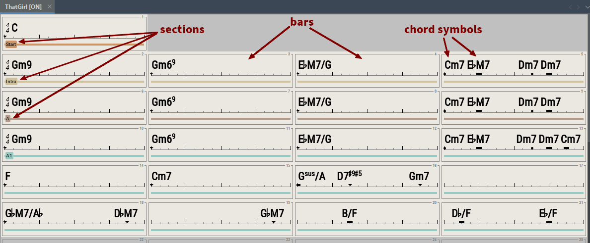

## ポップアップメニュー

現在の選択範囲（小節線、和音記号、またはセクション）に対して利用可能なコマンドを表示するには、ポップアップメニュー（Windows/Linuxでは**右クリック**、Macでは**Ctrlキーを押しながらクリック**）を使用してください。

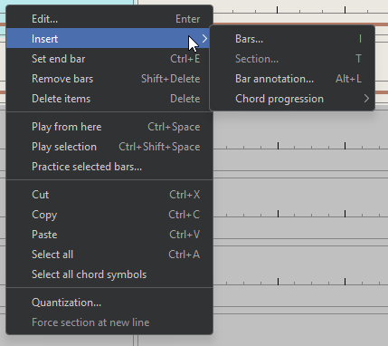

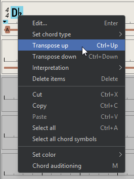

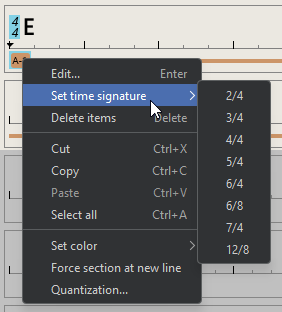

## コード記号の選択と移動

小節またはコード記号をクリックして選択します。**Ctrlキーを押しながらクリック**すると、複数の小節またはコード記号を選択できます。&#x20;

**Shiftキーを押しながらクリック**すると、現在の選択範囲を拡張します。

コード記号をマウスで**ドラッグ**すると、新しい位置に移動できます。ドラッグ中に**Ctrl**キーを押すと、 **＋** 記号が表示され（下図参照）、コード記号が移動ではなくコピーされることを示します。

<figure>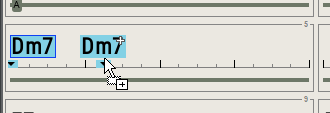<figcaption></figcaption></figure>

#### コード記号のクオンタイズ

デフォルトでは、コード記号の位置は16分音符単位（1拍あたり4つ）でクォンタイズされます。&#x20;

これは、以下の図に示すように、小節またはセクションのポップアップメニュー **Quantization...** からセクションごとに調整できます。

<figure>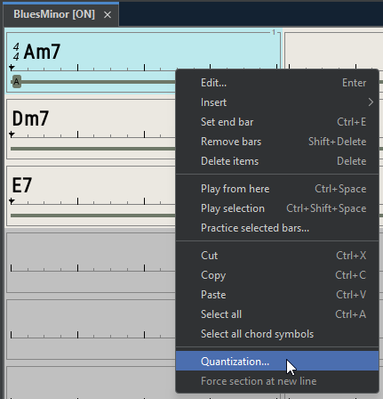<figcaption></figcaption></figure>

<figure>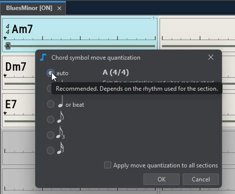<figcaption></figcaption></figure>

**auto**値は、このセクションにリンクしている最初のソングパートで使用するリズム（二拍子または三拍子）に基づいてクオンタイズを調整します。

## コード記号の入力

小節またはコード記号を選択し、コード記号の最初の文字（例：'C'）を入力すると、**小節編集ダイアログ**が自動的に表示されます：

<figure><figcaption>
Bar edit dialog
</figcaption></figure>

小節を選択した状態で、**小節編集ダイアログ**は、Enterキーを押す、小節をダブルクリックする、または右クリックメニューを使用することで表示できます。

コード記号を**コピー**するには、**ctrl**キーを押しながら**ドラッグ**してください。


**リードシートを一から入力する**には、最初の小節を選択し、コード記号を直接入力するのが最も簡単な方法です（最初の文字を入力すると小節編集ダイアログが自動的に表示されます）。入力完了後、Enterキーを押すと（自動的に次の小節が選択されます）、2小節目のコード記号を入力し、同様に続けます。


JJazzLabは、コード記号をいろいろな表記形式で認識できます。例えば、**C-7**、**Cm7**、**Cmi7**、**Cmin7**はすべて同じです。ツール/設定の**chord symbol**タブで、以下に示すように独自の_コード記号の別名_を追加できます：

<figure><figcaption>
独自のコード記号(aliases)を定義する
</figcaption></figure>


**NC**コード記号は特別で、これを使用すると次のコード記号まで無音にできます。完全な無音が長すぎる場合は、**shot**付きのコード記号を試してみてください。[表現解釈](chord-lead-sheet.md#interpretation).


## カスタマイズ可能なコード進行

小節を選択し、ポップアップメニューの **挿入/Chord progression** から挿入するコード進行を選択してください。

<figure>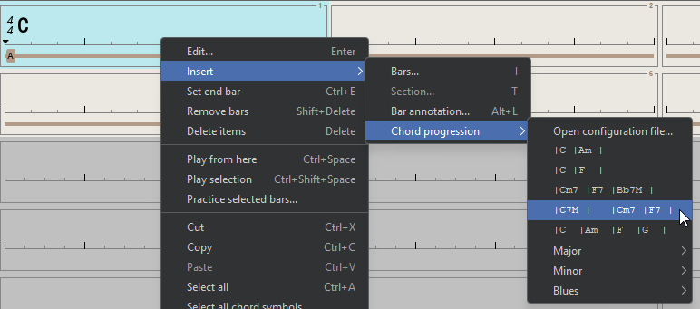<figcaption></figcaption></figure>

コード進行は選択した小節に挿入され、既存のコードを置き換えます。必要に応じて追加の小節が生成されます。挿入されたコードは自動的に選択されるため、目的の調へ簡単に移調できます（コード上でマウスホイールを使用するか、Ctrlキー＋上/下矢印キーを押してください）。

コード進行は、JJazzLabのユーザーディレクトリ内にあるシンプルなテキストファイル`ChordProgression.txt`で定義されます。このファイルは存在しない場合、JJazzLabによって自動的に作成されます。

**Chord progression...** からポップアップメニュー（上記画像参照）した **Open configuration file...** を選択すると編集できます。これにより、ポップアップメニューに表示されるコード進行を定義・整理できます。

## リードシートの長さ変更

小節を選択し、右クリックメニューで **終止線の設定** を選択します（下記参照）。


ソングの長さは、コード譜リードシートと楽曲構成(ソングストラクチャー)の両方によって決まります。&#x20;

例えば、コード譜リードシートにAという単一の12小節セクションだけがあって、楽曲構成がA-A-Aの場合、楽曲の長さは3×12=36小節となります。


## 表現解釈

コード記号を選択し、編集します（ダブルクリック、Enterキーを押す、または右クリックメニュー）。次に、**Interpretation**タブを選択します。

**Interpretation**タブは、このコード記号をどのように演奏すべきかを決めるためのものです：

* **Normal**
* **Accent**: リズムのアクセントを加え、ランダムにクラッシュシンバルを鳴らします。アクセントを強くしたり、クラッシュシンバルを確実に鳴らすか鳴らさないかを指定できます。
* **Hold**: リズムのアクセントを加え、次のコード記号まで音を持続します。拡張(extended)すると、より多くの楽器が持続します。
* **Shot**: リズムのアクセントを加え、コード音を短く演奏します。拡張(extended)すると、より多くの楽器が短い演奏に加わります。
* **Pedal bass**: ベースラインはベース音のみを演奏します（例：Fm7の場合はF、Fm7/Cの場合はC）。分数コードでは、この設定はデフォルトで有効になります。


各リズム生成エンジンは、これらの表現解釈パラメータを異なる方法で演奏することがあります。


\
&#x20;コード記号の下にあるマーカーの形状は、表現解釈モードによって異なります：

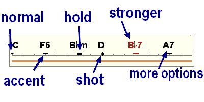

&#x20;例えば、これを演奏しようとする場合：&#x20;

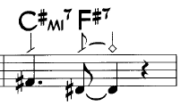

以下の表現解釈パラメータを使用できます：&#x20;


選択したコードの表現解釈を変更するキーボードショートカットは以下の通りです。


### Harmony

コード記号を選択し、編集して**Harmony**タブを選択します。

**Harmony**タブでは、このコード記号の音楽を演奏する際に使用するスケールを選択できます。

**例** 基準となるEb7MのベースラインにAb（Ebメジャースケールの4度）が含まれているとします。リディアンモード（11度がシャープ）を選択した場合、このコード記号では基準ではベース音Abですが、Aにして演奏します。

デフォルトではスケールは選択されていません：各リズム生成エンジンが使用する「最適な」スケールを決定します。

### Substitute chord symbol(代替コード記号)

コード記号を選択し、編集して、**substitute**コード記号タブを選択します。

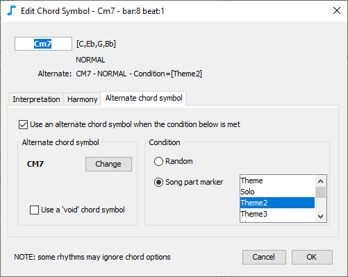

このタブでは、特定の条件を満たす際に使用される**substitute**コード記号を定義できます。&#x20;

**Substitute**コード記号は、楽曲の一部でわずかな変化を加えたい場合に有用です。

**substitute**コード記号は任意のコード記号、任意の解釈やハーモニー、あるいはコード記号なし（空コード）でも構いません。**substitute**コード記号が定義されているコード記号は、異なる色で表示されます（下図参照）。

_例：_

カルロス・サンタナの「ヨーロッパ」は、テーマの最初のエンディングはCm7ですが、2番目はCメジャーです。これをJJazzLabで実行する一つの方法としては、セクションA1を複製して異なるエンディングを持つセクションA2を作成し、それに応じて楽曲構成を更新することです。これで全く問題ありませんが、変更が軽微な場合には、**substitute**コード記号を使用することでより簡便な解決策となります。

下記（および上記のダイアログスナップショット）で確認できるように、Cm7の代わりにC7Mの**substitute**を生成します。マーカーがTheme2に設定されているすべてのソングパート（[ソングストラクチャーエディタ](song-structure.md)参照）ではC7Mを使用します。下図では、C7Mを2番目のソングパートでのみ使用することを意味します。

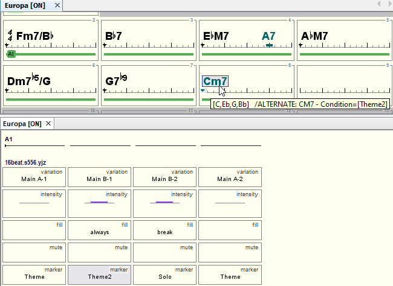

3小節目には別の**substitute**コード記号の例があります：A7です。原曲を聴くと、ソロ中のみ3小節目の最終拍でA7が演奏されていることに気づくでしょう。したがってA7のコード記号は、マーカーが「ソロ」でない場合には、その**substitute**コード記号を「void chord symbol」（コード記号なしと同等）と定義します。

## セクション入力

典型的なセクションは「イントロ」、「バース」、「コーラス」などです。

ソングセクションとは、JJazzLabが楽曲構成を定義する基本単位です。最初の小節には常にセクションが定義されています。

セクションを追加するには、終了位置の直後ではない小節を選択し、次に：

* Enterキーを押すか、
* ダブルクリック、または
* 右クリックメニュー、 Insert Section... または 編集...。


セクション名は重複してはいけません。


### 新しい行でセクションを強制する

行の最初の小節にないセクションを、次の行から開始させるように強制できます。これは、セクションの小節数が奇数の場合に有用です。

定義したセクションがある小節を選択するか、セクション自体を選択し、右クリックメニューで"新しい行でセクションを強制する"。

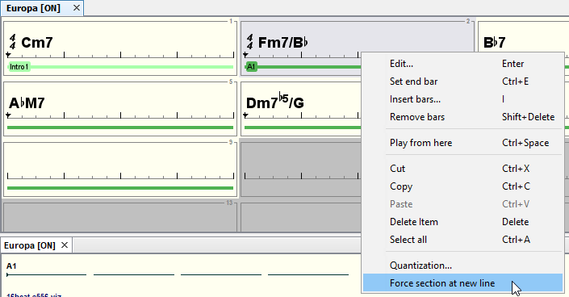

&#x20; これにより、以下の表示になります。&#x20;

## 小節での注釈 / 歌詞

どの小節でも注釈を追加できます。&#x20;

<figure><figcaption></figcaption></figure>

注釈が表示されない場合、注釈付きの小節には付箋マークが表示されます（ツールチップに注釈テキストが表示されます）。

<figure><figcaption></figcaption></figure>

#### イージーリーダー専用 # 構文

同じ小節が異なるソング部分で使用される場合を考えます。この小節の歌詞はソング部分によって変わる可能性があります。**#**を注釈行の先頭に付けることで、[イージーリーダー](../tools/easy-reader.md)が関連する行のみを表示するようにできます。

<figure><figcaption></figcaption></figure>

**例**:  上記の注釈について、イージーリーダーは最初の出現時に「with... you」、2回目の出現時に「and...you」、そして現在のソングパート名が「chorus」の時は常に「take...you」と表示します。

## Exporting/importing chord leadsheet as text

いくつかの小節またはコード記号を選択し、コピーします（メニューの「Copy」またはCtrl+C/Command+Cを使用）。その後、任意のテキストエディタに切り替えて貼り付けます：小節/コードは以下のようにテキストとしてエクスポートされます：

`|4/4 Bb9 A7 | Dm7 G13 | Dm7 G13 | Dm7 G13 |` \
`| Gm7/Bb     | C9/Bb  |  F7M    |          |`

テキストのインポートは逆方向にも機能します。クリップボードに類似したテキストをコピーし、コードリードシートエディタに貼り付けると、対応する小節/コード記号がJJazzLabのソングにインポートされます。

## マウスショートカット

| <mark style="background-color:blue;">**選択箇所**</mark>   | <mark style="background-color:blue;">**マウス**</mark> | <mark style="background-color:blue;">**動作**</mark>   |
| --------------------------------------------------------- | ----------------------------------------------------- | ------------------------------------------------------ |
| 小節、コード記号、セクション                                 | click                                                 | 選択                                                   |
| コード記号                                                 | double click                                          | コード記号エディターを使用して編集する                     |
| コード記号                                                 | ctrl-shift click                                      | コードを聴く                                             |
| 小節、セクション                                            | double click                                          | 小節エディターを使用して編集する                          |
| 小節、コード記号、セクション                                 | right-click                                           | ポップアップメニュー                                     |
| コード記号                                                 | mouse-wheel                                           | 移調                                                    |
| エディター                                                 | ctrl mouse-wheel                                      | 水平方向に拡大/縮小する                                   |
| エディター                                                 | ctrl-shift mouse-wheel                                | 縦方向に拡大/縮小する                                     |

## キーボードショートカット


多くの操作はコンテキストメニュー（Windows/Linuxでは右クリック、MacではCtrlキーを押しながらクリック）からも利用可能です。利用可能な場合、関連するキーボードショートカットが表示されます。


| 選択箇所                    | キー             | 動作                                     |
| -------------------------- | --------------- | ----------------------------------------- |
| コード記号                  | enter           | コード記号エディターを使用して編集する       |
| 小節、セクション             | enter           | 小節エディターを使用して編集する            |
| 小節                        | ctrl-E          | 終止線を書く                              |
| 小節                        | I               | 小節を挿入する                            |
| 小節                        | delete          | 小節内を消去する                           |
| コード記号、セクション       | delete          | 除去する                                   |
| コード記号、セクション       | ctrl-left/right | アイテムを1小節左/右に移動                  |
| 小節                        | shift-delete    | 除去する                                  |
| コード記号                  | ctrl-up/down    | 移調                                      |
| コード記号                  | P               | 表現解釈を変更する                         |
| コード記号                  | S               | アクセントを強化する                       |
| コード記号                  | H               | クラッシュシンバル/クラッシュなし           |
| コード記号                  | X               | より多くの楽器で持続/短め演奏する           |
| コード記号                  | M               | コードを聴く                              |
| コード記号、セクション       | ctrl-A          | セクション内のすべてを選択し、次にリードシート内のすべてを選択 |
| 小節、コード記号、セクション | ctrl-C/X/V      | コピー/切り取り/貼り付け                    |
| エディター                  | ctrl-Z/Y        | 元に戻す/やり直し                          |
| エディター                  | ctrl-L          | 小節注釈の表示/非表示                      |
| エディター                  | alt-L           | 小節注釈の挿入                             |
| エディター                  | ctrl-W          | ソングを閉じる                             |
