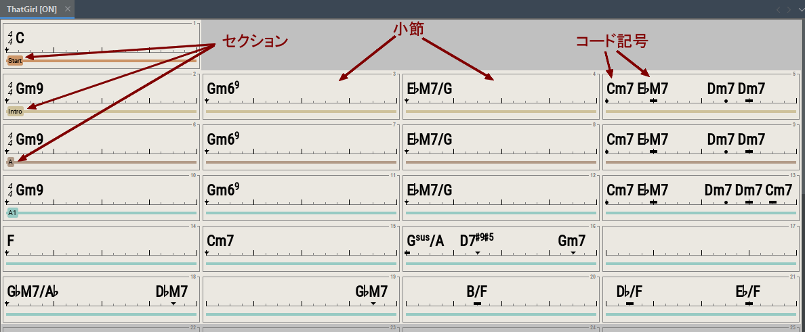
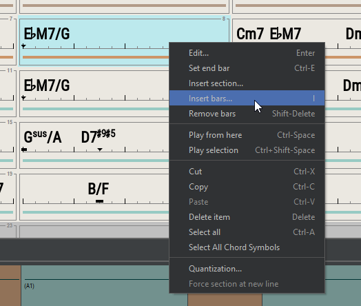
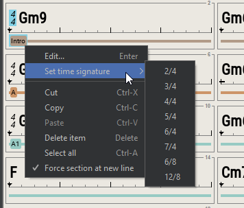
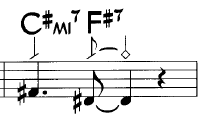
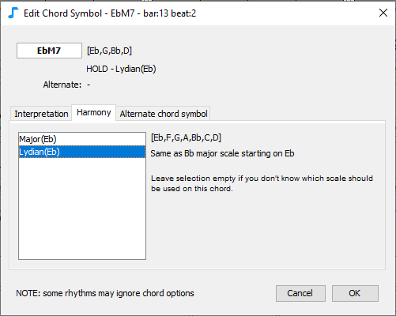
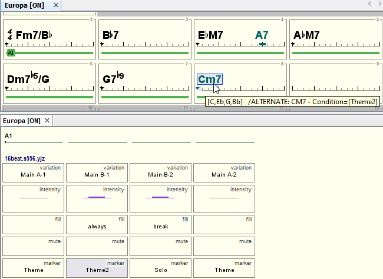

# Chord lead sheet

Use the **chord leadsheet editor** to:

* Add chord symbols, eg **Cm6, Ab7, F#9M#11, NC (no chord), ...**
* Add sections, eg **A, B, verse, chorus,** ...
* Move and edit chords to adjust rhythm accents, interpretation or harmony
* Add bar annotations (for lyrics etc.)

## Selecting and moving chord symbols

Click on a bar or a chord symbol to select it.  Use **ctrl-click** to select multiple bars or chord symbols.&#x20;

Use **shift-click** to extend the current selection.

**Drag** a chord symbol with the mouse to move it to a new location.&#x20;

By default chord symbols position are quantized to a sixteenth note (4 positions per beat). This can be adjusted via the right-click menu Quantization.

<figure><figcaption></figcaption></figure>

## Chord symbols input

Select a bar or a chord symbol, then type the first letter of the chord symbol (for ex. 'C'), the **Bar edit dialog** will appear automatically :

<figure><figcaption>
Bar edit dialog
</figcaption></figure>

When a bar is selected, the **Bar edit dialog** can also be showned by pressing ENTER, double-clicking a bar, or using the right-click menu Edit.

To **copy** a chord symbol just **drag it** while pressing the **control** key.


In order to **input a lead sheet from scratch**, the easiest way is to select the first bar then directly type in the chord symbols (bar edit dialog automatically appears when first letter is typed), press ENTER when done (it automatically selects the next bar), type in the chord symbols for the second bar, etc.


JJazzLab can recognize different forms of a given chord symbol. For example C-7, Cm7, Cmi7, Cmin7 are all equivalent.  You can add your own _chord aliases_ in the **Chord Symbols** tab of the Options/Preferences, as shown below:

<figure><figcaption>
Define your own chord symbol aliases
</figcaption></figure>

## Changing the size of the leadsheet

Select a bar then select **Set end bar** in the right-click menu (see below).


The size of the song depends on both the leadsheet _and_ the song structure.&#x20;

For example, if chord leadsheet only contains a single 12-bar section called A, and song structure is A-A-A, then song size is 3\*12=36 bars.


## Popup menus

Use the popup menu (**right-click** on windows/Linux, **ctrl-click** on Mac) to see commands available for the current selection: bars, chord symbols or sections.

## Interpretation

Select a chord symbol, edit it (double-click, press enter, or right-click menu), and select the **Interpretation** tab.

The **Interpretation** tab lets you decide how this chord symbol should be played:

* **Normal**
* **Accent**: add a rhythmic accent and randomly a crash cymbal. You can make the accent stronger, or make sure a crash cymbal is played or not played.
* **Hold**: add a rhythmic accent and hold notes until next chord symbol. If extended more instruments are hold.
* **Shot**: add a rhythmic accent with chord notes played briefly. If extended more instruments are shot.
* **Pedal bass**: bass line will only play the bass note (for ex. F for Fm7 or C for Fm7/C). This setting is on by default when you enter a slash chord.


Each rhythm generation engine may render these Interpretation parameters differently.


\
&#x20;The shape of the marker below the chord symbol depends on the interpretation mode:

&#x20;For example, in order to render:&#x20;

you could use the following interpretation parameters:&#x20;


See below the keyboard shortcuts to change the interpretation of selected chords.


### Harmony

Select a chord symbol, edit it and select the **Harmony** tab.

The **Harmony** tab lets you select the scale to be used when rendering the music for this chord symbol.

**Example** Suppose that the reference bass line for Eb7M contains a Ab (4th degree of the Eb major scale). If you select the Lydian mode (which has a sharp 11th degree) then the reference bass note Ab will be rendered as A for this chord symbol.

By default no scale is selected: each rhythm generation engine will decide the "best" scale to use.

### Substitute chord symbol

Select a chord symbol, edit it and select the **substitute** chord symbol tab.

This tab lets you define a **substitute** chord symbol which will be used when some conditions are met.&#x20;

**Substitute** chord symbols are useful when you need to introduce a slight variation in a part of a song.

The **substitute** chord symbol can be any chord symbol, with any interpretation or harmony, or no chord symbol at all (void chord). Chord symbols which have an **substitute** chord symbol defined are displayed with a different color (see image below).

_Example:_

In the Carlos Santana's "Europa" song, the 1st ending of the theme is a Cm7, but the 2nd one is a C major. To implement this in JJazzLab, one solution could be to duplicate section A1 to create section A2 with the different ending, then update the song structure accordingly. This is perfectly fine, but when changes are minor the **substitute** chord symbol can provide a simpler solution.

You can see below (and in the dialog snapshot above) that a C7M **substitute** chord has been created for Cm7. C7M will be used for all song parts (see the [song structure editor](song-structure.md)) where the marker is set to Theme2. On the image below it means the C7M will be used only for the 2nd song part.

There is another **substitute** chord symbol example in the 3rd bar: A7. If you listen to the original song you'll notice that they play a A7 on the last beat of the 3rd bar only during solos. So the A7 chord symbol defines its **substitute** chord symbol as the "void chord symbol" (same as no chord symbol) when marker is _not_ "Solo".

## Sections input

Typical sections are 'intro', 'verse', 'chorus', etc.

A Song section is the basic unit used by JJazzLab to define the song structure. There is always a section defined on the first bar.

To add a section select a bar which is not after the end then:

* press ENTER, or
* double-click, or
* right-click menu, Insert Section... or Edit...


A section name must be unique.


### Force a section at new line

You can force a section which is not on the first bar of a row to start on the next line. This can be useful when some sections have an odd number of bars.

Select a bar with a section defined or select the section itself, right-click menu "Force Section at New Line".

&#x20; This will result in the display below.&#x20;

## Bar annotations / lyrics

You can add annotations to any bar.&#x20;

<figure><figcaption></figcaption></figure>

When annotations are hidden, bar with annotations are marked with a post-it (tooltip shows the annotation text).

<figure><figcaption></figcaption></figure>

### Special # syntax for Easy Reader

Suppose the same bar is used in different song parts. The lyrics for this bar might change depending on the song part. You can prepend **#** to annotation lines so that the [Easy Reader](../tools/easy-reader.md) displays only the relevant line.

<figure><figcaption></figcaption></figure>

**Example**:  for the annotation above, Easy Reader will show "with... you" the first time, "and...you" the second time, and "take...you" whenever the current song part name is "chorus".

## Mouse shortcuts

| <mark style="background-color:blue;">**Selection**</mark> | <mark style="background-color:blue;">**Mouse**</mark> | <mark style="background-color:blue;">**Action**</mark> |
| --------------------------------------------------------- | ----------------------------------------------------- | ------------------------------------------------------ |
| bar, chord symbol, section                                | click                                                 | select                                                 |
| chord symbol                                              | double click                                          | edit using chord symbol editor                         |
| bar, section                                              | double click                                          | edit using bar editor                                  |
| bar, chord symbol, section                                | right-click                                           | popup menu                                             |
| chord symbol                                              | mouse-wheel                                           | transpose                                              |
| editor                                                    | ctrl mouse-wheel                                      | change X zoom factor                                   |

## Keyboard shortcuts


Many actions are also available via the context menu (right-click on Windows/Linux, ctrl-click on Mac), and when available the associated keyboard is displayed.


| Selection                  | Key             | Action                                    |
| -------------------------- | --------------- | ----------------------------------------- |
| chord Symbol               | enter           | edit with chord symbol editor             |
| bar, section               | enter           | edit with bar editor dialog               |
| bar                        | ctrl-E          | set end bar                               |
| bar                        | I               | insert bars                               |
| bar                        | delete          | clear bar contents                        |
| chord symbol, section      | delete          | remove                                    |
| chord symbol, section      | ctrl-left/right | move item one bar left/right              |
| bar                        | shift-delete    | remove                                    |
| chord symbol               | ctrl-up/down    | transpose                                 |
| chord symbol               | P               | change interpretation                     |
| chord symbol               | S               | stronger accent                           |
| chord symbol               | H               | crash cymbal/no crash                     |
| chord symbol               | X               | hold/shot more instruments                |
| chord symbol, section      | ctrl-A          | select all in section, then in lead sheet |
| bar, chord symbol, section | ctrl-C/X/V      | copy/cut/paste items                      |
| editor                     | ctrl-Z/Y        | undo/redo                                 |
| editor                     | ctrl-L          | Show/hide bar annotations                 |
| editor                     | alt-L           | Insert bar annotation                     |
| editor                     | ctrl-W          | close song                                |
