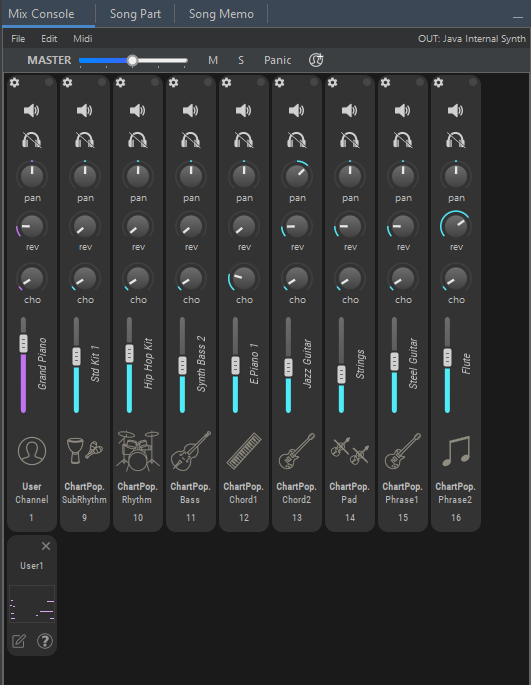
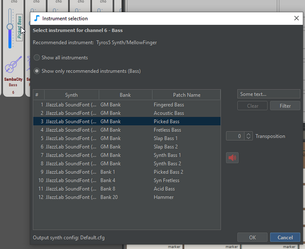
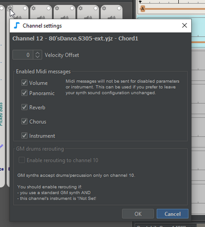
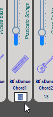
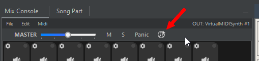
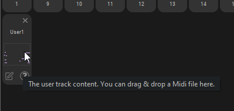
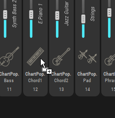
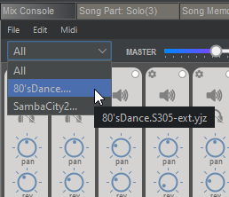

# Mix console

Use the **mix console** to:

* Change the instruments
* Adjust channel settings: volume, reverb, chorus, panoramic, transposition, velocity offset
* Mute or solo channels
* Add user tracks
* Load/save .mix file
* And more: change Midi channel, use special Midi commands, export to Midi file, etc.

JJazzLab uses the **mix console** information to send the relevant Midi messages to the [output synth](../sounds/output-synth.md). This is done each time you make a change in the mix console, or when you start the playback.


Midi has only 16 Midi channels**.** That's why usually a song can't have more than 2 rhythms.


## Mix console toolbar

* **Master volume**: this increase or lower the Midi volume messages
* **M**: Mute or Unmute all tracks
* **S**: Switch off all Solo tracks
* **Panic**: Send a Midi Panic message, switching all notes OFF
* **Add a User track**: see [User tracks](mix-console.md#user-tracks) below.

## Mix console menu bar

### Menu File

*   **Load/Save Default Rhythm Mix** &#x20;

    Change the current mix from a file. Consult [this page](../songs/song-and-mix-files.md) for more information about .mix files.
*   **Import Mix...** &#x20;

    Note that this will import settings only for the instruments which are common between the current mix and the imported mix.

### Menu Edit

*   **Reset channels** &#x20;

    Restore the original settings from the related rhythm.

### Menu Midi

*   **Enable/Disable all Midi parameters** &#x20;

    Use Disable all Midi parameters if you control the mix yourself directly on the output synth.
*   **Send GM/GM2/XG/GM mode ON message** &#x20;

    This lets you send special Midi initialization messages to turn your output synth in the desired mode.

## Change instrument

Click on the instrument name in the channel. Note that this is also where instrument transposition can be adjusted.

## Channel settings

Use the channel settings to:

*   **Add a Midi velocity offset to all notes played on this channel** &#x20;

    Note that this is slightly different from adjusting the volume.\

*   **Disable sending specific Midi messages** &#x20;

    Probably because you control the parameter yourself directly on the [output synth](../sounds/output-synth.md).\

*   **Enable a drums channel with a Midi channel different than 10**

    If you use a basic GM output synth, it can play drums **only on channel 10**. If drums/percussion are used on other channels in your mix,  you need to activate drums rerouting on these channels. Note that JJazzLab may activate this option for you if it detects, based on the current [output synth](../sounds/output-synth.md) information, potential issues. \
    \

## Midi channel

Each Midi channel can be changed manually, just click on the channel number.

## User tracks

A user track lets you add your own Midi content to your song: a melody, horn riffs, percussion, etc.

#### Add a User track

Add one or more user tracks using the Add user track button.

<figure><figcaption></figcaption></figure>

A User track has a specific graphic extension as shown below, which is used to rename or remove the user track, but most importantly is used to update its Midi content.

When track is created you can select an instrument to be played like for any track.


If you select a drums or percussion instrument _and_ your [Output synth](../sounds/output-synth.md) is a basic GM-compatible synth: [set the user track channel](mix-console.md#midi-channel) to 10, and if channel 10 is already used by another track, activate the _Drums rerouting to channel 10_ (see [Channel settings](mix-console.md#channel-settings)) in your User track.


#### Edit Midi content

To add Midi notes to a user track, you can either **drag & drop** a Midi file in the rectangle area, or use the **Edit via external Midi editor** button in the lower left corner.&#x20;

When using **Edit via external Midi editor** JJazzLab will first export the full backing track as a temporary Midi file, and then open it with your external Midi editor, so that you can add notes for your user track.


JJazzLab only import the notes which match the user track Midi channel. **Notes from other Midi channels are ignored.**

For example, in the image above, the user track channel is 1, so when you use your Midi editor/DAW to add user track notes, make sure they have the channel 1.


**Edit via external Midi editor** requires that you have set an external Midi editor in the **General** panel of the **Options/Preferences**. If you don't have one, we recommend **MidiEditor** for Windows, it's free, open-source and lightweight. &#x20;

## Export to Midi file with mouse drag & drop

You can export the full backing track to a Midi file by mouse-dragging from the empty area of the mix console. Note that this is the same as the menu File/Export to Midi file, except it's more convenient when you work with another software such as a DAW.

To export a single track, start the mouse-drag from a track icon.

## Multi-rhythm songs

When a song uses 2 or more rhythms, a popup is displayed in the upper left corner of the mix console to select the rhythm you want to display.

Note that some commands such as menu **Edit/Reset channels** will not be applied to the hidden rhythm(s).

## Mouse shortcuts

| Selection                    | Mouse              | Action                        |
| ---------------------------- | ------------------ | ----------------------------- |
| channel volume slider, knobs | double-click       | Input value with keyboard     |
| channel volume slider        | shift + mouse-drag | change volume of all channels |
