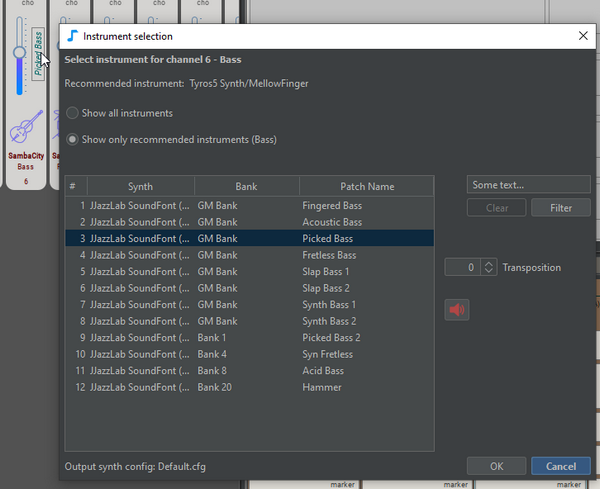
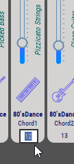
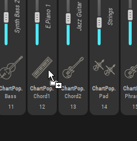

# ミックスコンソール

**ミックスコンソール** の使い方

* 楽器の変更
* チャンネル設定の調整：音量、リバーブ、コーラス、パン、移調、ベロシティオフセット
* チャンネルをミュートまたはソロにする
* ユーザートラックを追加する
* .mixファイルの読み込み/保存
* さらに：MIDIチャンネルの変更、特殊なMIDIコマンドの使用、MIDIファイルへのエクスポートなど。

JJazzLabは、**ミックスコンソール**の情報を使用して、関連するMIDIメッセージをシンセ出力に送信します。これは、ミックスコンソールで変更を加えるたびに、または再生を開始するたびに実行されます。


MIDIには16のMIDIチャンネルしかありません。そのため、通常1曲に2つ以上のリズムトラックを配置することはできません。


各ミックスコンソールのトラックには、トラックの音を表す下部の **overview component**があります。

## ミックスコンソールツールバー

* **Master volume**: MIDI音量を増減します。
* **M**: すべてのトラックでミュートまたはミュート解除します。
* **S**: ソロトラック以外すべてをオフにします。
* **Panic**: MIDIパニックメッセージを送信し、すべてのノートをOFFに切り替えます。
* **Add a User track**: 下の[ユーザートラック](mix-console.md#user-tracks)を参照してください。

## ミックスコンソールメニューバー

### File

*   **Load/Save Default Rhythm Mix** &#x20;

    現在のソングミックスを、デフォルトのリズムミックスファイルを読み込むことで更新します。
    現在のソングミックスをデフォルトのリズムミックスファイルとして保存することもできます。これにより、同じリズムを使用する曲を作成するたびに、デフォルトでこのファイルが再利用されます。 詳しいことはこちら[default rhythm mix files](../songs/song-and-mix-files.md#default-rhythm-mix)で。
*   **Import Mix...** &#x20;

    現在のミックスとインポートされたミックスで共通する楽器の設定のみがインポートされることに注意してください。

### 編集

*   **Reset channels** &#x20;

    各ミックスコンソールのチャンネル（楽器、音量、パン、エフェクト）をデフォルトのリズム設定に復元します。

### Midi

*   **すべてのMIDIパラメーターを有効化** &#x20;

    デフォルトでは、すべてのMIDIパラメータが有効になっています。
    シンセ出力上で直接ミックスを制御したい場合は「すべてのMIDIパラメーターを無効にする」を使用してください：このモードではJJazzLabは_MIDIノートメッセージ_のみを送信し、バンク/プログラムチェンジ、音量、パン、エフェクト関連のMIDIメッセージは送信しません.
*   **Send GM/GM2/XG/GM mode ON message** &#x20;

    これにより、シンセ出力を目的のモードに切り替える特別なMIDI初期化メッセージを送信できます。

## 楽器の変更

チャンネル内の楽器名をクリックしてください。なお、ここで楽器の移調も調整できます。

## チャンネル設定

チャンネル設定を使うと:

*   **このチャンネルで再生されるすべての音符にMIDIベロシティオフセットを追加します** &#x20;

    これは音量調整とは少し異なることに注意してください。 
*   **特定のMIDIメッセージの送信を無効にします** &#x20;

    おそらく、そのパラメータを自分で[シンセ出力](/broken/pages/-MQNBJUwiJ9pkXF9j5Ey)を直接操作しているからです 。 
*   **10以外のMIDIチャンネルでドラム・チャンネルを有効にします**

    基本的なGMシンセ出力を使用する場合、ドラムは**チャンネル10でのみ**再生可能です。ミックス内で他のチャンネルにドラム/パーカッションを使用する場合は、それらのチャンネルでドラム再ルーティングを有効にする必要があります。なお、JJazzLabは [シンセ出力](/broken/pages/-MQNBJUwiJ9pkXF9j5Ey) における現在の情報や潜在的な問題に基づいてこれを検知した場合、自動的にこのオプションを有効にする場合があります。 \
     

## MIDIチャンネル

各MIDIチャンネルは手動で変更できます。チャンネル番号をクリックするだけです。

## ユーザートラック

ユーザートラックを使用すると、楽曲に独自のMIDIコンテンツ（メロディ、ホーンリフ、パーカッションなど）を追加できます。


曲の一部だけリズムトラックをカスタマイズしたい場合（例：曲の2番のサビでスタイルのベースフレーズを簡略化したい場合）、 [カスタムフレーズリズムパラメータ](song-structure.md#rhythm-parameters)を使わなくてはなりません。


#### ユーザートラックの追加

ミキシングコンソールのツールバーにある「+」ボタンをクリックして、新しいユーザートラックを追加します。 これにより[ノートエディター](notes-editor.md) が開いて、ユーザートラックを編集します。

<figure><figcaption>
ユーザートラックボタンを追加
</figcaption></figure>

また、下図のようにトラック概要画面の右上隅にある「+」記号を使用して、リズムトラックを新しいユーザートラックとして複製することもできます。元のリズムトラックは自動的にミュートされます。

<figure><figcaption>
リズムトラックを新しいユーザートラックとして複製する
</figcaption></figure>


ユーザートラックにドラムまたはパーカッション楽器を選択し、かつシンセ出力が基本的なGM互換シンセの場合： [ユーザートラックチャンネルを設定](mix-console.md#midi-channel) を10にしますが、, チャンネル10が他のトラックで使用されている場合、ユーザートラック内でドラムトラックをチャンネル10へ再ルーティング (参照 [チャンネル設定](mix-console.md#channel-settings))します。


#### Edit a user track

Edit the user track by clicking on the upper left icon in the user track overview component, as shown below.&#x20;

This will open the [notes editor](notes-editor.md).

<figure><figcaption></figcaption></figure>

A user track has always the same length than your song.


If you edit a user track, then make the song shorter (e.g. by removing a song part), the user track will be trimmed to the new song size.


## Export to Midi file with mouse drag & drop

You can export the **full backing track** to a Midi file by mouse-dragging from the empty area of the mix console. Note that this is the same as the menu File/Export to Midi file, except it's more convenient when you work with another software such as a DAW.

To export a **single track**, start the mouse-drag from the track icon or track overview component.

## Multi-rhythm songs

When a song uses 2 or more rhythms, a popup is displayed in the upper left corner of the mix console to select the rhythm you want to display.

Note that some commands such as menu **Edit/Reset channels** will not be applied to the hidden rhythm(s).

## Mouse shortcuts

| Selection                    | Mouse              | Action                        |
| ---------------------------- | ------------------ | ----------------------------- |
| channel volume slider, knobs | double-click       | Input value with keyboard     |
| channel volume slider        | shift + mouse-drag | change volume of all channels |
