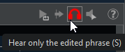
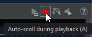
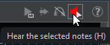

# ノートエディター

JJazzLabにはMIDIノートエディタが組み込まれており、[**ユーザートラック編集**](notes-editor.md#edit-a-user-track) や [**ソングパートのカスタムフレーズ編集**](notes-editor.md#edit-a-custom-phrase-for-a-song-part)で使用します。

<figure><figcaption>
メロディトラック
</figcaption></figure>

<figure><figcaption>
ドラムトラック
</figcaption></figure>

<figure><figcaption>
簡略化されたスコア
</figcaption></figure>


現時点では、スコアパネル（上記）は**簡略化された楽譜表記**を使用しています：音符の位置はエディタの音符と一致するように揃えられており、装飾は一切ありません。スコアパネルは編集できません。&#x20;


## ノートエディタを開く

### ユーザートラック編集

ノートエディターは、[ユーザートラックを追加](mix-console.md#adding-user-tracks)すると、自動的に開きます。 既存のユーザートラックについては、下記に示すようにトラック概要コンポーネント内の編集ボタンをクリックしてください。&#x20;

<figure><figcaption></figcaption></figure>

リズムトラックは、最初にユーザートラックとして複製した後で、ノートエディタで編集することもできます：

<figure><figcaption></figcaption></figure>

### ソングパートのカスタムフレーズ編集

ソングストラクチャーエディターで、カスタムフレーズリズムパラメータの左上ボタンをクリックしてください:

<figure><figcaption></figcaption></figure>

次に、カスタマイズしたいフレーズを選択し、「編集」を押してノートエディターを開きます。

<figure><figcaption></figcaption></figure>

## 移動とズーム

下図のように、上部のルーラー上で**Ctrlキー＋ドラッグ**するとエディタを移動できます:

<figure><figcaption></figcaption></figure>

メインアプリケーションの右下隅にあるズームスライダーを使用するか、水平方向のズームには**Ctrlキー＋マウスホイール**、垂直方向のズームには**Ctrlキー＋Shiftキー＋マウスホイール**を使用できます。&#x20;

**Ctrl+F** キーで幅に合わせて拡大表示します。

<figure><figcaption></figcaption></figure>

## 再生コントロール

以下の画像に示すツールバーボタンを使用するか、**Ctrl+Shift+スペース**を押して、編集したフレーズ、または設定されている場合は[再生ループゾーン](notes-editor.md#playback-loop-zone)を**ループ再生モード**で再生します。

<figure><figcaption>
再生開始ボタン
</figcaption></figure>

**Ctrl+スペース**を押して再生を開始 :

* 設定されている場合、[再生ループゾーン](notes-editor.md#playback-loop-zone) から
* 最初の選択された音符の小節から
* 音符が選択されていない場合、最初に見える小節から

その他のコントロール:

  <figure><figcaption>
編集したフレーズのみを聴く
</figcaption></figure>
  <figure><figcaption>
再生中に自動スクロールする
</figcaption></figure> 
  <figure><figcaption>
選択した音符を聴く
</figcaption></figure>

### 再生ループゾーン

再生ループゾーンは、上部の**ルーラー**上で**マウスドラッグ**により設定できます。ルーラー上で**Shiftキー＋クリック**するとループゾーンを拡張できます。ルーラー上で**クリック**するとループゾーンを解除できます。

<figure><figcaption></figcaption></figure>

ツールバーのボタン（上記参照）または **Ctrl+Shift+スペース** キーを押して、ループゾーンの再生を開始します。

## グリッドにスナップ

**Snap to grid**ボタン（または**G**キーを押す）を使用すると、音符の描画/移動/サイズ変更時にグリッドにスナップできます。グリッドのサイズはドロップダウンリスト(1/4=四分音符, 1/8=八分音符, ...)で設定可能です。 :

<figure><figcaption></figcaption></figure>


**Select tool**で音符の移動やサイズ変更を行う際、**alt**キーを押すと一時的に「グリッドにスナップ」設定を無効にできます.


既存の音符の位置を変更するには、[Quantize](notes-editor.md#quantize-notes)を使います。

## 編集ツール

ノートを編集するには3つのツールが使用できます：**選択（select)ツール**、**描画(draw)ツール**、**消去(erase)ツール**。最初の2つの編集ツールは[グリッドにスナップ](notes-editor.md#snap-to-grid)設定の影響を受けます。.

ツールは、ノートエディターのトップツールバーにあるボタンから選択するか、エディター内で右クリックすることで選択できます。:

<figure><figcaption></figcaption></figure>

**選択ツール**を使用して、音符の選択、移動、サイズ変更、コピー/切り取り（**Ctrl+C/X**）、削除（**Delete**キーを押す）を行います。&#x20;

**Ctrl+V** キーで音符を貼り付けますs.


音符を貼り付ける位置をコントロールする方法とは？

* 音符を選択している場合、最初に貼り付けた音符はその選択している音符に揃います
* 音符を選択していない場合、最初に貼り付けた音符はノートエディタの左側に揃えられます

新しく貼り付けたメモは自動的に選択されるため、必要に応じて適切な位置に移動できます。


**ドラッグ**で複数の音符を選択します。**Ctrlキーを押しながらドラッグ**すると音符を複製できます。**Ctrl+Shift+I**で音符の選択範囲を反転します。

<figure><figcaption></figcaption></figure>

**描画ツール**で音符を描き、**消去ツール**で音符を消去します。

<figure><figcaption></figcaption></figure>

## ノートベロシティの変更

音符の色はベロシティによって変化します。音符のベロシティを変更する方法はいくつかあり、以下に示します。

#### メインエディタパネルの使用

まず変更する音符を選択します。次に、ツールバーのベロシティスピナーを使用するか、**Altキー + マウスホイール** または **Altキー + Page Up/Down** を使用します。

<figure><figcaption></figcaption></figure>

#### ベロシティパネルの使用

音符を**クリック**または**マウスドラッグ**してベロシティを調整します。

<figure><figcaption></figcaption></figure>

## 音符のクォンタイズとヒューマナイズ

**Quantize**ボタンを使用するか、**Q**キーを押して、選択した音符の開始位置を現在のグリッドに移動します。音符が選択されていない場合、すべての音符がクオンタイズされます。

クォンタイズの反復を実行するには、**反復(Iterative)**チェックボックスを選択してください：音符が徐々にグリッド方向へ移動します。機械的なサウンドを避けるため、通常はこの方法が推奨されます。

<figure><figcaption></figcaption></figure>

すべての音符または選択した音符を**ヒューマナイズ(humanize)**することもできます。ヒューマナイズは、音符の開始位置とベロシティにわずかなランダムな変化を加えます。左側の**humanize**ボタンを使用するか、**Ctrl+H**を押してヒューマナイズダイアログを表示してください。

<figure><figcaption></figcaption></figure>

「Humanize」ボタンをクリックすると、ヒューマナイズパラメータを調整し、異なる結果を確認できます。

#### 例

このベースラインは非常に均一です：すべての音符が同じベロシティで、クオンタイズされています。これはあまりにも「ロボット的」に聞こえます。

<figure><figcaption></figcaption></figure>

以下に示すように、ヒューマナイズダイアログを使用してこれを改善できます。

<figure><figcaption></figcaption></figure>

## 音符のインポート

外部MIDIファイルをエディターにドラッグすることで音符をインポートできます。また、ミックスコンソールの個別トラックからもドラッグできます。

<figure><figcaption>
エディタでMIDIファイルをインポート
</figcaption></figure>


インポートしたMIDIファイルに複数のMIDIチャンネルからの音符が含まれている場合、JazzLabは**エディタのMIDIチャンネルと一致する音符のみをインポートします。**&#x20;

インポートされたMIDIファイルが単一チャンネルの音符のみを含む場合、JJazzLabは音符をインポートし、チャンネルをエディタのMIDIチャンネルに更新します。


## マウスショートカット

<table data-header-hidden><thead><tr><th width="253.33333333333331">選択</th><th>マウス</th><th>動作</th></tr></thead><tbody><tr><td>音符</td><td>ctrl + クリック </td><td>複数音符を選択</td></tr><tr><td>エディター</td><td>ドラッグ</td><td>複数音符を選択</td></tr><tr><td>音符</td><td>ドラッグ</td><td>移動/サイズ変更</td></tr><tr><td>音符</td><td>ctrl + ドラッグ</td><td>音符をコピー</td></tr><tr><td>音符</td><td>alt + ドラッグ</td><td>移動/グリッドスナップ設定を反転した状態でのサイズ変更</td></tr><tr><td>音符</td><td>alt + マウスホイール</td><td>ベロシティ変更</td></tr><tr><td>エディター</td><td>マウスホイール</td><td>エディター上下移動</td></tr><tr><td>エディター</td><td>shift + マウスホイール</td><td>エディター左右移動</td></tr><tr><td>エディター</td><td>ctrl + マウスホイール</td><td>水平方向ズームイン/アウト</td></tr><tr><td>エディター</td><td>ctrl-shift + マウスホイール</td><td>垂直方向ズームイン/アウト</td></tr><tr><td>エディター</td><td>ctrl + ドラッグ</td><td>エディター移動</td></tr><tr><td>ルーラー</td><td>ドラッグ</td><td>再生ループゾーンを設定</td></tr><tr><td>ルーラー</td><td>shift + クリック</td><td>再生ループゾーンを拡張</td></tr><tr><td>ルーラー</td><td>click</td><td>再生ループゾーンを削除</td></tr></tbody></table>

## キーボードショートカット

| 選択 | キーボード              | 動作                                                   |
| --------- | ---------------- | -------------------------------------------------------- |
| 音符      | alt-up/down      | ベロシティ変更                                          |
| 音符      | ctrl-C/X/V       | 音符のコピー/カット/貼り付け                                     |
| 音符      | delete           | 音符を削除                                             |
| 音符      | ctrl-shift-I     | 選択した音符を反転                                   |
| 音符      | ctrl-H           | ヒューマナイズダイアログを開く                                     |
| 音符      | Q                | 選択した音符 (もしくは選択なしで全音符) のクオンタイズ           |
| エディター| ctrl-F           | 音符に適応するようにズーム                                        |
| エディター| G                | グリッドにスナップ                                             |
| エディター| A                | 再生中の自動スクロール                              |
| エディター| S                | 編集中のフレーズのソロ                                   |
| エディター| H                | 選択した音符を聴く                                  |
| エディター| Home/End         | エディターを最初/終わりに移動                                 |
| エディター| ctrl-shift-スペース | ループゾーン（設定されている場合）またはフレーズ全体を再生する              |
| エディター| ctrl-スペース       | ループゾーン（設定されている場合）から再生、または最初に選択された音符から再生 |
| エディター| ctrl-Z/Y         | 元に戻す/やり直し                                                |
