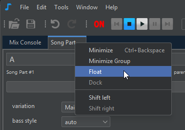
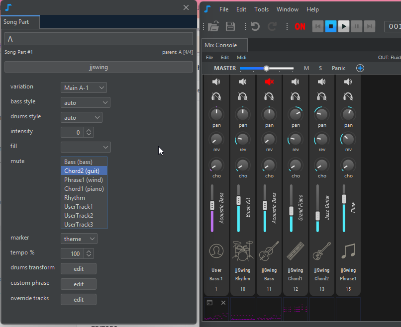

# Overview

<figure><figcaption>
Song structure editor lets you define how sections make the final song
</figcaption></figure>

### Use the **Chord LeadSheet Editor** to

* Add [chord symbols](chord-lead-sheet.md#chord-symbols), eg "Cm6", "Ab7"
* Add [sections](chord-lead-sheet.md#sections-input), eg "A", "B" in 3/4, "verse"
* Move and edit chord symbols to adjust rhythm accents, [interpretation](chord-lead-sheet.md#interpretation) or [harmony](chord-lead-sheet.md#harmony)
* Add [bar annotations](chord-lead-sheet.md#bar-annotations-lyrics) or lyrics (optional)

Visit the [chord lead sheet](chord-lead-sheet.md) page for more information.

### Use the **Song Structure Editor** to

* Define the order of sections using [song parts](song-structure.md#song-parts) , eg "AABA", "verse verse chorus verse", ...
* Select the [rhythms](song-structure.md#change-rhythm) (music styles) to be used in the song
* Introduce dynamics and variations using [rhythm parameters](song-structure.md#rhythm-parameters) on each song part

Visit the [song structure](song-structure.md) page for more information.

### Use the **Mix Console** to

* Set the instrument of each track
* Adjust track volume, panoramic, reverb, chorus, mute, transpose, etc.
* Add [user tracks](mix-console.md#user-tracks)

Visit the [mix console](mix-console.md) page for more information.

#### Note Editor

The [note editor ](overview.md#note-editor)is only used when you want to edit the notes of a [user track](mix-console.md#user-tracks) or of a [song part custom phrase](song-structure.md#rhythm-parameters).

<figure><figcaption>
Notes editor
</figcaption></figure>

### Undocking / redocking panels

Most of the panels can be undocked from the main JJazzLab window.

To undock a panel, select **Float** from the popup menu of the panel tab, as shown in the image below.

<figure><figcaption>
On Windows or Linux, the panel tab popup menu appears when you right-click on it
</figcaption></figure>

<figure><figcaption>
The floating panel can be moved and resized independently of the main window
</figcaption></figure>

To redock the floating panel in the main window, select **Dock** from the same tab popup menu.
