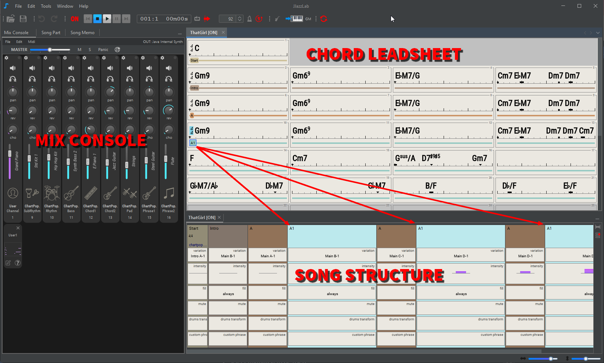

# Overview

<figure><figcaption>
chord leadsheet editor, song structure editor, mix console
</figcaption></figure>

<figure><figcaption>
Song part editor
</figcaption></figure>

<figure><figcaption>
Notes editor
</figcaption></figure>

Use the [**Chord LeadSheet Editor**](chord-lead-sheet.md) to:

* Add [chord symbols](chord-lead-sheet.md#chord-symbols), eg "Cm6", "Ab7"
* Add [sections](chord-lead-sheet.md#sections-input), eg "A", "B", "verse", "chorus", ...
* Add [bar annotations](chord-lead-sheet.md#bar-annotations-lyrics) / lyrics
* Move and edit chords to adjust rhythm accents, [interpretation](chord-lead-sheet.md#interpretation) or [harmony](chord-lead-sheet.md#harmony)

Use the [**Song Structure Editor**](song-structure.md) to:

* Define the order of sections using [song parts](song-structure.md#song-parts) , eg "AABA", "verse verse chorus verse", ...
* Edit the song part [rhythm](song-structure.md#change-rhythm) and [rhythm parameters](song-structure.md#rhythm-parameters) to introduce dynamics and variations
* Song parts can also be edited via the [**Song part editor**](song-structure.md#song-part-editor)

Use the [**Mix Console**](mix-console.md) to:

* Adjust the instrument of each track
* Adjust track settings, volume, panoramic, reverb, chorus, mute, transpose, etc.
* Add [user tracks](mix-console.md#user-tracks)
* [Export](mix-console.md#export-to-midi-file-with-mouse-drag-and-drop) the whole song or individual tracks as Midi files

Use the [**Notes editor**](notes-editor.md) to:

* Edit notes of a [user track](mix-console.md#user-tracks)
* Edit notes of a [song part custom phrase](song-structure.md#rhythm-parameters).
