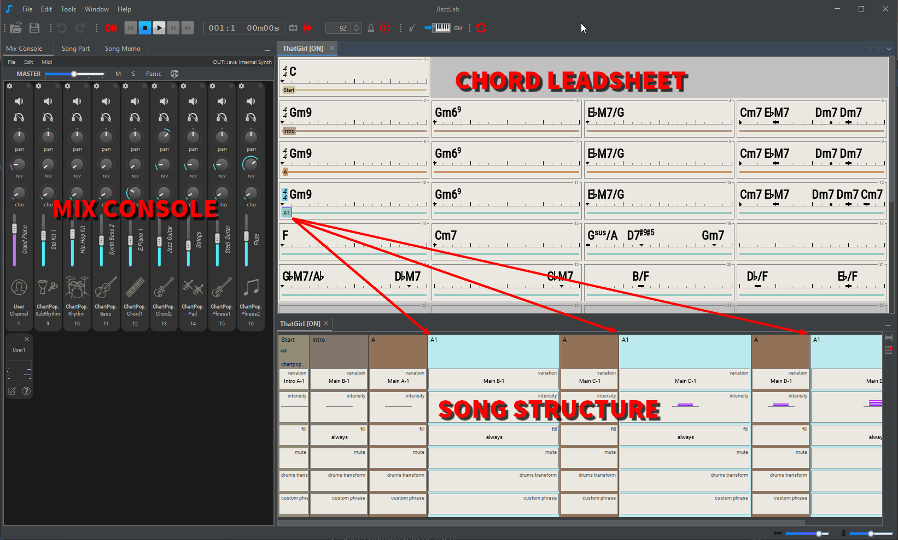
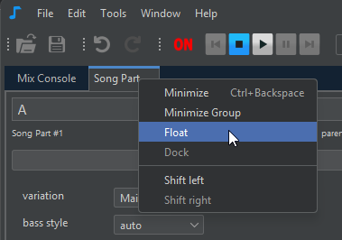
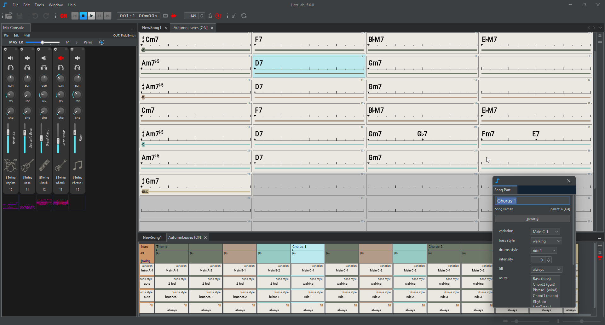

---
ソングを作成(または読み込み)し、以下のエディターを使って自分のニーズに合わせて調整します
---

# 概要

<figure><figcaption>
ソングストラクチャーエディターで、最終的に曲を構成する各セクション（イントロ、メロ、サビ等）を決定します。
</figcaption></figure>

### **コード譜エディター(Chord LeadSheet Editor)**の使い方

* [コード記号](chord-lead-sheet.md#chord-symbols)を書く、例 "Cm6", "Ab7"
* [セクション記号](chord-lead-sheet.md#sections-input)を書く、例 "A", "B" in 3/4, "verse"
* コード記号をずらしたり編集して、リズムのアクセントや、[表現解釈(interpretation)](chord-lead-sheet.md#interpretation)や、[ハーモニー](chord-lead-sheet.md#harmony)に合わせる
* [小節の注意書き](chord-lead-sheet.md#bar-annotations-lyrics)や歌詞 (optional)を書く

詳細は[コード譜](chord-lead-sheet.md)のページを参照してください。

### **ソングストラクチャーエディター(Song Structure Editor)**の使い方

* [ソングパート](song-structure.md#song-parts)を使ってセクションの順番を決める、例"AABA", "verse verse chorus verse", ...
* 曲中に使う[リズム](song-structure.md#change-rhythm) (音楽スタイル)を選択する。
* [リズムパラメーター](song-structure.md#rhythm-parameters)を使ってダイナミクスやバリエーションを各ソングパートに導入する。
詳細は[ソングストラクチャー](song-structure.md)のページを参照してください。

### **ミックスコンソール**の使い方

* 各トラックの楽器をセットする。
* トラックの音量、リバーブ、パン、コーラス、ミュート、移調等を調整する。
* [ユーザートラック](mix-console.md#user-tracks)を加える。

詳細は [ミックスコンソール](mix-console.md)のページを参照してください。

### ノートエディターの使い方

* [ユーザートラック](mix-console.md#user-tracks)を編集する。
* ソングパートの楽器のフレーズを[カスタマイズ](song-structure.md#custom-phrase)する。

詳細は [note editor ](overview.md#note-editor)のページを参照してください。

<figure><figcaption>
Note editor
</figcaption></figure>

### エディターの分離/結合

エディターを分離するには、タブのポップアップメニューから**Float**を選択します。&#x20;

下の画像は、[ソングパートエディタ](song-structure.md#song-part-editor)タブのポップアップメニューを示しています。

<figure><figcaption>
WindowsやLinuxでは、エディターの上で右クリックすると、タブのポップアップメニューが現れます。
</figcaption></figure>

<figure><figcaption>
分離したエディターはメインのウィンドウとは独自に移動させたりサイズ変更できます。
</figcaption></figure>

分離したエディターを結合するには、同じタブのポップアップメニューから**Dock**を選択します。

ウィンドウのメインメニューから**Reset Windows**を使うと全てのエディタ－が結合します。


コード譜とソングストラクチャーエディターは分離/結合できません。

