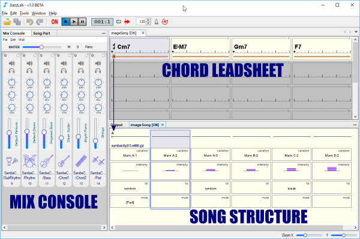

# Song editors

  [**コードリードシートエディター**](../chord-leadsheet-editor) の使用:

* コード記号の追加、例： "Cm6", "Ab7"
* セクションの追加、例： "A", "B", "verse", "chorus", ...
* コードを移動・編集してリズムのアクセント、解釈、またはハーモニーを調整する

[**ソングストラクチャーエディタ**](../song-structure-editor)の使用:

* セクションの順序を定義、例： "AABA", "ヴァース ヴァース コーラス ヴァース", ...
* 使用するリズムを選択 
* リズムパラメータを調整してダイナミクスを導入、例：バリエーション、強弱、フィル、楽器のミュート

各リズム楽器のミックスの調整は、[**Mix Console**](../mix-console) を使用：

* サウンドデバイスで使用する楽器を選択
* 音量調整、パン、リバーブ、コーラス 
* ミュート、ソロ、移調

