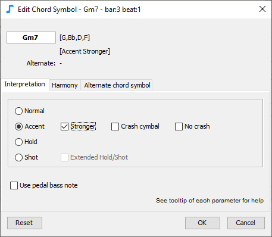
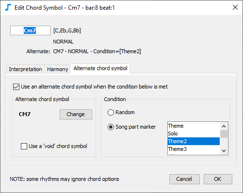
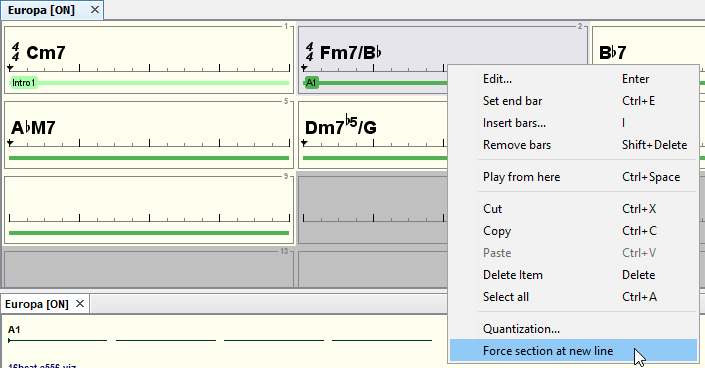
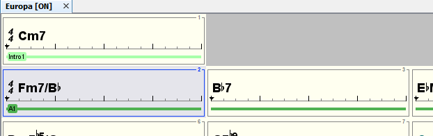

# Chord lead sheet

Use the **chord leadsheet editor** to:

* Add chord symbols, eg **Cm6, Ab7**
* Add sections, eg **A, B, verse, chorus,** ...
* Move and edit chords to adjust rhythm accents, interpretation or harmony

## Chord symbols

### Input

Select a bar or a chord symbol then:

* type the first letter of the chord symbol \('A' to 'G'\), or
* press ENTER, or
* double-click, or
* right-click menu, Edit

You can also select an existing chord symbol and move it while pressing the control button, it will create a new copy that can be edited.

To move a chord symbol just select it and move it with the mouse.

To change the size of the lead sheet, select a bar then right-click menu and select Set End Bar.

Use ctrl-click or shift-click for multiple selection.


In order to input a lead sheet from scratch, the easier way is to select the first bar, directly type in the chord symbols, press ENTER \(it will automatically select the next bar\), type in the chord symbols for the second bar, etc.


### Aliases

JJazzLab recognizes many aliases for each chord symbol. For example C7M can be written Cmaj7, Cma7, CM7, CMAJ7 etc.

You can add more aliases using the Chord Symbols panel in the Options/Preferences.

### Interpretation

Select a chord symbol, edit it \(double-click, press enter, or right-click menu\), and select the Interpretation tab.

The Interpretation tab lets you decide how this chord symbol should be played:

* **Normal**
* **Accent**: add a rhytmic accent and randomly a crash cymbal. You can make the accent stronger, or make sure a crash cymbal is played or not played.
* **Hold**: add a rhythmic accent and hold notes until next chord symbol. If extended more instruments are hold.
* **Shot**: add a rhythmic accent with chord notes played briefly. If extended more instruments are shot.
* **Pedal bass**: bass line will only play the bass note \(for ex. F for Fm7 or C for Fm7/C\). This setting is on by default when you enter a slash chord.


Each rhythm generation engine may render these Interpretation parameters differently.


  
 The shape of the marker below the chord symbol depends on the interpretation mode:

 For example, in order to render: 

you could use the following interpretation parameters: 


_S_ee below keyboard shortcuts to quickly change the interpretation of selected chords.


### Harmony

Select a chord symbol, edit it and select the Harmony tab.

The Harmony tab lets you select the scale to be used when rendering the music for this chord symbol.

**Example** Suppose that the reference bass line for Eb7M contains a Ab \(4th degree of the Eb major scale\). If you select the lydian mode \(which has a sharp 11th degree\) then the reference bass note Ab will be rendered as A for this chord symbol.

By default no scale is selected: each rhythm generation engine will decide the "best" scale to use.

### Substitute chord symbol

Select a chord symbol, edit it and select the **substitute** chord symbol tab.

This tab lets you define an **substitute** chord symbol which will be used when some conditions are met. The **substitute** chord symbol can be a completely different chord symbol, the same but with a different interpretation or harmony, or no chord symbol at all \(void chord\). This is useful when you need to introduce a slight variation during a song.

Chord symbols which have an **substitute** chord symbol defined are displayed with a different color \(see image below\).

_Example:_

In the Carlos Santana's "Europa" song, the 1st ending of the theme is a Cm7, but the 2nd one is a C major. To implement this in JJazzLab, one solution could be to duplicate section A1 to create section A2 with the different ending, then update the song structure accordingly. This is perfectly fine, but when changes are minor the **substitute** chord symbol can provide a simpler solution.

You can see below \(and in the dialog snapshot above\) that a C7M **substitute** chord has been created for Cm7. C7M will be used for all song parts \(see the [Song Structure Editor](../song-structure-editor)\) where the marker is set to Theme2. On the image below it means the C7M will be used on the 2nd occurrence of section A1.

There is another **substitute** chord symbol example in the 3rd bar: A7. If you listen to the original song you'll notice that they play a A7 on the last beat of the 3rd bar only during solos. So the A7 chord symbol defines its **substitute** chord symbol as the "void chord symbol" \(same as no chord symbol\) when marker is _not_ "Solo".

## Sections input

Typical sections are 'intro', 'verse', 'chorus', etc.

A Song section is the basic unit used by JJazzLab to define the song structure \(see the [Song Structure Editor](../song-structure-editor)\). There is always a section defined on the first bar.

To add a section select a bar which is not after the end then:

* press ENTER, or
* double-click, or
* right-click menu, Edit

The new section name must be different than the existing one.

### Force a section at new line

You can force a section which is not on the first bar of a row to start on the next line. This can be useful when some sections have an odd number of bars.

Select a bar with a section defined or select the section itself, right-click menu "Force Section at New Line".

  This will result in the display below. 

## Mouse shortcuts

Selection \| Mouse \| Action \|--------\|------\|------- Bar, Chord Symbol, Section       \| simple-click       \| select Chord Symbol       \| double-click       \| edit using the chord symbol editor dialog Bar, Section       \| double -click       \| edit using the bar editor dialog Bar, Chord Symbol, Section       \| right-click       \| open the popup menu Chord Symbol \| mouse wheel \| transpose chord symbol Chord Symbol \| shift mouse wheel       \| change chord type Editor \| ctrl mouse wheel \| change the X zoom factor

## Keyboard shortcuts


Many actions are also available via the context menu \(right-click on Windows/Linux, ctrl-click on Mac\), and when available the associated keyboard is displayed.


| Selection | Key | Action |
| :--- | :--- | :--- |
| Chord Symbol | enter | edit with chord symbol editor |
| Bar, Section | enter        | edit with bar editor dialog |
| Bar  | ctrl-E | set end bar |
|  | I | Insert bars |
|  |  |  |
|  |  |  |
|  |  |  |
|  |  |  |
|  |  |  |
|  |  |  |

   I       \| insert bars Bar       \| delete       \| clear bar contents Chord Symbol, Section       \| delete       \| remove Bar       \| shift-delete       \| remove Chord Symbol \| ctrl-up/down\| transpose Chord Symbol \| P \| change interpretation Chord Symbol \| S \| stronger accent Chord Symbol \| H \| crash cymbal/no crash Chord Symbol \| X \| hold/shot extended Chord Symbol, Section \| ctrl-A \| select similar items from the current section. Then from the chord leadsheet. Bar, Chord Symbol, Section        \| ctrl-C/X/V \| copy/cut/paste items Editor       \| ctrl-Z/Y       \| undo/redo Editor       \| ctrl-O       \| set current song active \(On/Off\) Editor       \| ctrl-W       \| close current song

