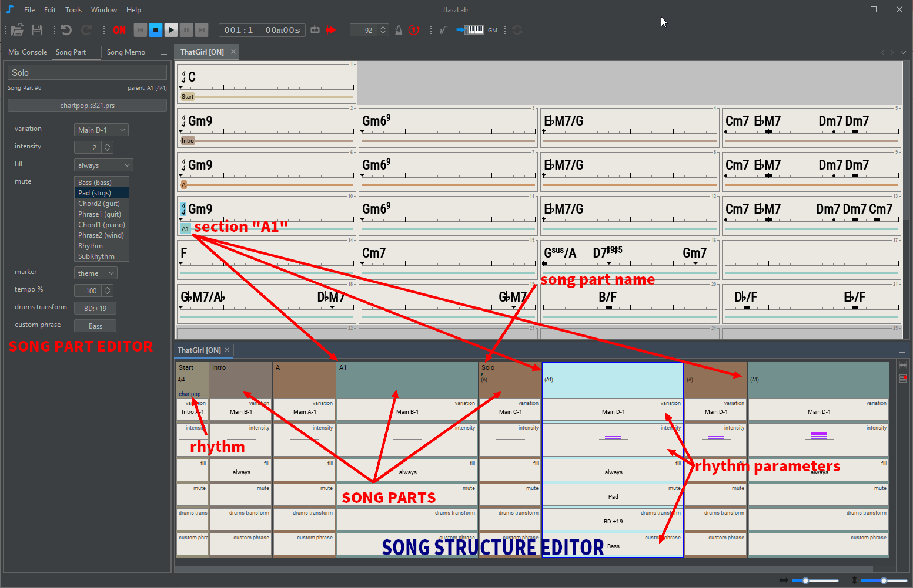
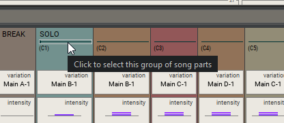
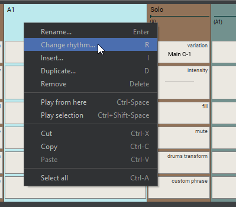
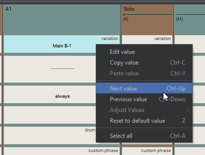
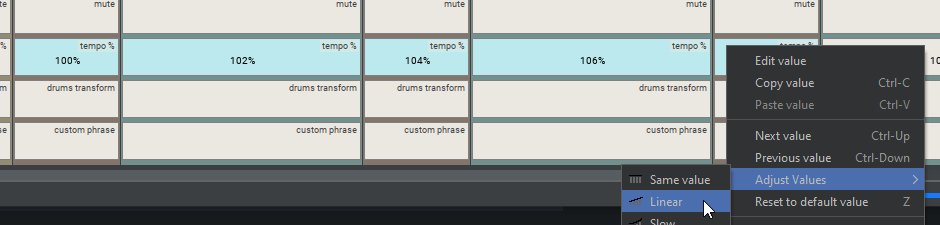
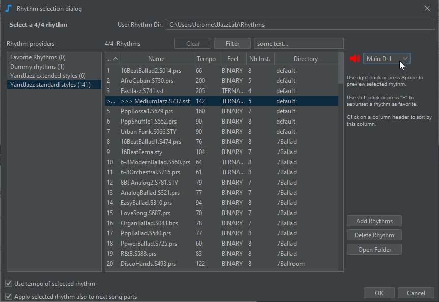
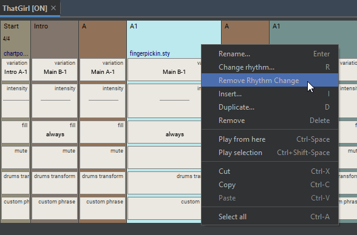
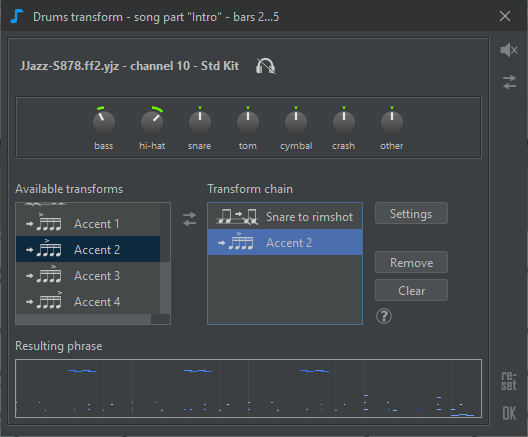
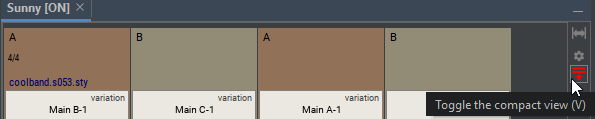

# Song structure

Use the **song structure editor** to:

* Define the order of sections as **song parts**, eg "AABA" or "verse verse chorus verse"
* Select which **rhythms** (music styles) to use and when
* Adjust the **rhythm parameters** of song parts to introduce dynamics, eg variation, intensity, drums fill, muted instrument, ...

## Song parts

A **song part** is linked to a parent **section** of the [chord lead sheet](chord-lead-sheet.md).&#x20;

**Song parts let you define in which order sections are played, and how**. For example you can have a chord lead sheet with only 2 sections _verse_ and _chorus_, but the song will play _verse verse chorus verse chorus_.

A song part has a name, a **rhythm** and a value for each of the [**rhythm parameters**](song-structure.md#rhythm-parameters). Rhythm parameters let you change how the rhythm is played for this song part.

By default the name of the song part is the name of the parent section. If the song part is renamed, the parent section is shown below the name.


If some contiguous song parts share the same name, then the name is displayed _only on the first song part and a line is shown_ on the contiguous song parts (see image below).

Clicking this line will select all the related song parts.


## Editing

To add a new song part:

* **drag a section** from the chord lead sheet into the song structure editor, or
* right-click menu **Insert**, or&#x20;
* copy an existing song part: drag it while pressing the ctrl key, use copy & paste, or right-click menu **Duplicate**

Song parts can be reordered by **dragging them using the mouse** (use ctrl+mouse drag to duplicatea song part). Copy/cut/paste commands work as well both on song parts and rhythm parameters.

Edition of song part **name**, **rhythm** and **parameters** can be done directly from the song structure editor using the [mouse](song-structure.md#mouse-shortcuts) or [keyboard shortcuts](song-structure.md#keyboard-shortcuts), or via the [song part editor](song-structure.md#song-part-editor).


To edit several song parts or rhythm parameters in one shot:&#x20;

* select multiple items with **ctrl+click** or **shift-click**&#x20;
* Do the edit (for example change the rhythm, or increase intensity)

Change is applied to all selected items.


Use the popup menu (**right-click** on windows/Linux, **ctrl-click** on Mac) to see commands available for the current selection (song part or rhythm parameter), as shown in the 2 images below.

For most of the rhythm parameters, **the easiest way** to edit the value is to **select it** and use the **mouse-wheel**.&#x20;

Some rhythm parameters have a custom edit dialog, which can be called as shown below.

<figure><figcaption>
A rhythm parameter with a custom editor
</figcaption></figure>


Copy & paste can be used to easily **duplicate rhythm parameter values**.&#x20;

Suppose you want to apply the drums transform value from one song part (e.g. ">Open hi-hat" in image above) to other song parts:&#x20;

* In the song structure editor, select the original rhythm parameter and Copy (ctrl-C)
* Select the same rhythm parameter in other song parts (use ctrl-click or shift-click for multiple selection) then Paste (ctrl-V)


When selecting several contiguous rhythm parameters, you can use the **Adjust values** submenu in the rhythm parameter popup menu to interpolate values between the first and the last selected values.  In the example below, we used it to gradually increase the tempo from 100% to 108%.

## Song part editor

Song part editor provides an additional way to edit the selected song part(s).&#x20;

Use the song part editor to edit rhythm parameters which need user to select (ctrl-click) one or more values from a list, such as the Mute parameter.

<figure><figcaption></figcaption></figure>

## Change rhythm (music style)

Each song part can have its own rhythm.&#x20;


Midi can only accommodate 16 channels, and many rhythms use 7 or 8 instruments. That's why it's difficult in practical to have a song with more than 2 rhythms.


To change the rhythm, select a song part and press **R,** or click the rhythm name to open the **rhythm selection dialog**.

When changing the rhythm, JJazzLab tries to adapt the values of the previous rhythm parameters to the new rhythm parameters.

If you want to remove a rhythm change in the middle of a song, select the song part and use **Remove Rhythm Change** from the song part popup menu.

## Rhythm parameters

Rhythm parameters let you adjust how a rhythm (music style) is played for a given song part. Rhythm parameters are a simple & powerful tool to **introduce variations in a backing track**, which make it more fun to play with.

JJazzLab lets the developer of a [rhythm engine](broken-reference) define custom rhythm parameters. However rhythm engines will often use a common set of standard parameters :

* **Variation**: a rhythm variation. [YamJJazz engine](../rhythm-engines/yamjjazz-rhythm-engine/) rhythms usually have 4 _Main_ variations, plus some _Intros_, _Endings_, and some _Fills_.
* **Intensity:**  a rhythm engine might simply increase/decrease the Midi velocity of the backing track notes depending on this parameter, but it could also generate more/less notes, etc.
* **Drums Fill**: defines when a drums fill (or break) should be played at the end of the song part (_never_, _always_, _randomly_, ...). The special _fade\_out_ value does not produce a drums fill, instead it gradually decreases the notes velocity until the end of the song part.
* **Mute**: mutes one of more instruments during this song part. To edit this parameter it's easier to use the [song part editor](song-structure.md#song-part-editor)**.**
* **Marker**: this parameter is useful only if you use substitute chord symbols, as explained [here](chord-lead-sheet.md#substitute-chord-symbol).
* **Tempo factor**: slows down or accelerates the tempo of the song part.
* **Drums transform**: changes some drums notes of the song part. \
  This is an **easy way to alter the drums track** to introduce some variation in your song. \
  \
  For example you can make the hi-hat louder, transform the closed hi-hat into ride cymbal, or just add percussions!

* **Custom phrase**: lets you customize one or more instrument phrases of the song part.\
  &#x20;\
  &#xNAN;_&#x45;xample: you want to change the bass phrase at the end of the second verse_\
  &#x20;\
  Edit the Custom phrase rhythm parameter of the corresponding song part, then edit the Bass track. The default bass phrase will appear in the [notes editor](notes-editor.md) and you'll be able to change it. \
  \
  If you want this customized bass phrase to also be used in the last verse of the song, just [copy the rhythm parameter value](song-structure.md#editing) and paste it in the last song part.

.png>)

### Compact / full view

By default only a subset of the rhythm parameters are shown, this is the **compact view**.&#x20;

Click on the button below or press 'V' to switch between compact and full view.

The **compact view settings** button, just above the compact view button, lets you choose which rhythm parameters are visible in the compact view. These settings are saved with the song.

<figure><figcaption></figcaption></figure>

## Mouse shortcuts

<table data-header-hidden><thead><tr><th width="253.33333333333331">Selection</th><th>Mouse</th><th>Action</th></tr></thead><tbody><tr><td>Selection</td><td>Mouse</td><td>Action</td></tr><tr><td>song part, rhythm param.</td><td>click</td><td>select</td></tr><tr><td>song part</td><td>double click</td><td>edit song part name</td></tr><tr><td>song part name</td><td>click</td><td>edit </td></tr><tr><td>rhythm</td><td>click</td><td>select a rhythm</td></tr><tr><td>editor, song part, rhythm param.</td><td>right-click</td><td>open popup menu</td></tr><tr><td>rhythm parameter</td><td>double-click</td><td>edit value</td></tr><tr><td>rhythm parameter</td><td>mouse wheel</td><td>change value</td></tr><tr><td>rhythm parameters</td><td>shift+mouse wheel</td><td>make values identical then change value</td></tr><tr><td>editor</td><td>ctrl mouse wheel</td><td>change X zoom factor</td></tr></tbody></table>

## Keyboard shortcuts


Many actions are also available via the context menu (right-click on Windows/Linux, ctrl-click on Mac), and when available the associated shortcut is displayed.


| Selection                | Key          | Action                 |
| ------------------------ | ------------ | ---------------------- |
| song part, rhythm param. | enter        | edit song part name    |
| song part, rhythm param. | R            | select rhythm          |
| song part, rhythm param. | I            | insert song part       |
| song part, rhythm param. | ctrl-I       | append song part       |
| song part, rhythm param. | D            | duplicate song part(s) |
| song part                | delete       | delete song part(s)    |
| rhythm parameter         | ctrl-up/down | next/previous value    |
| rhythm parameter         | Z            | reset param. value     |
| song part                | ctrl-C/X/V   | copy/cut/paste         |
| editor                   | ctrl-Z/Y     | undo/redo              |
| editor                   | ctrl-F       | zoom to fit width      |
| editor                   | V            | compact or full view   |
