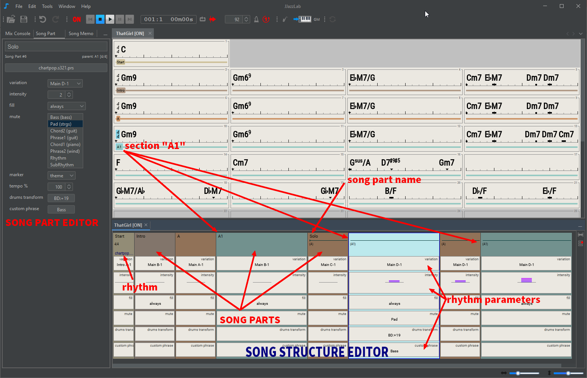
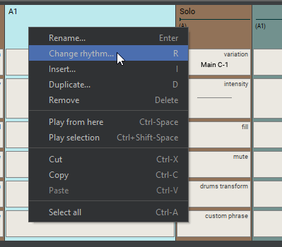
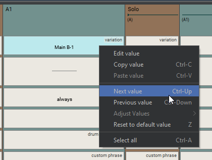
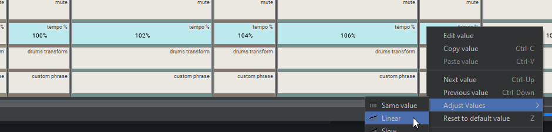
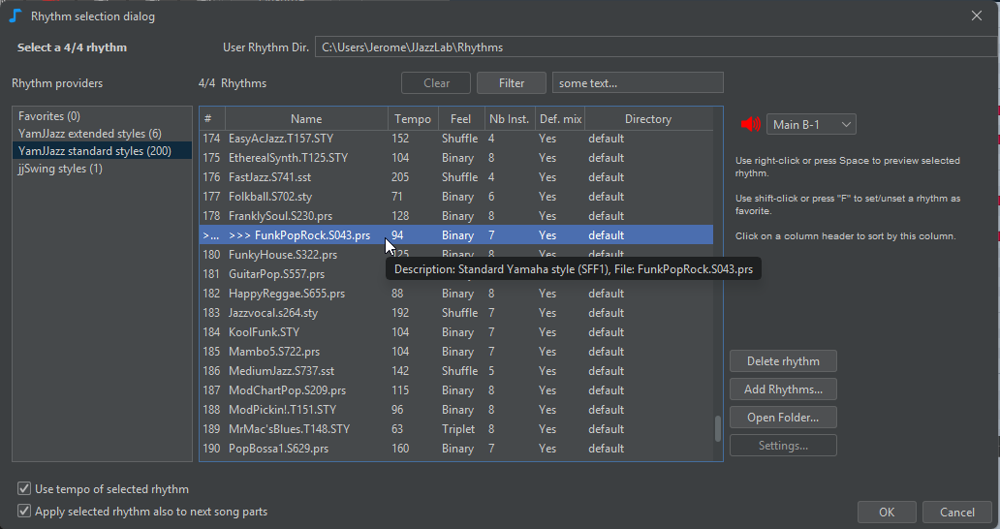
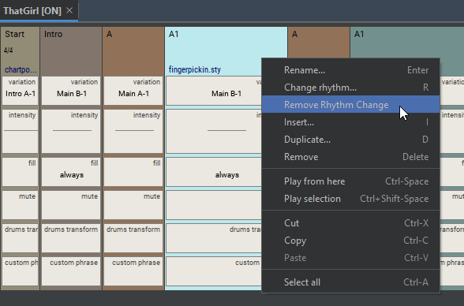
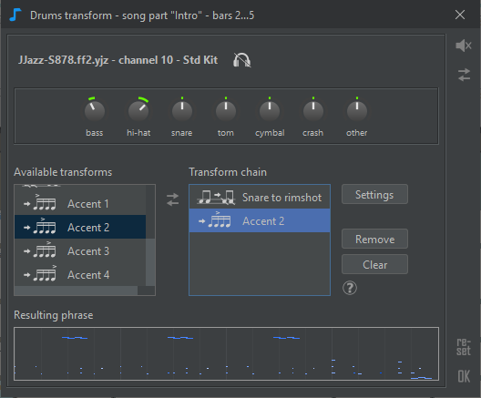
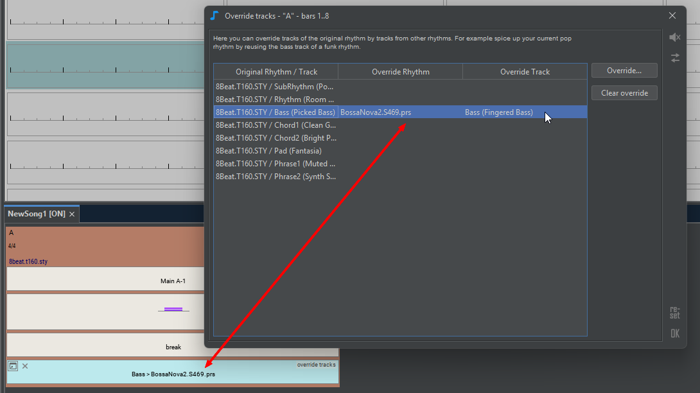
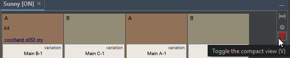
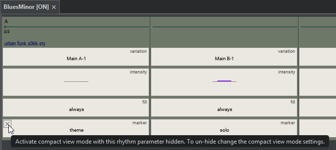

# ソングストラクチャー

**ソングストラクチャーエディター**を使用するのは:

* セクションの順序を**ソング構成**として定義する。例：「AABA」または「ヴァース　ヴァース コーラス ヴァース」
* 使用する**リズム**（音楽スタイル）とそのタイミングを選択する
* 楽曲のパートごとに**リズムパラメータ**を調整し、ダイナミクス（例：変化、強弱、ドラムフィル、ミュート楽器など）を取り入れる。

## ソングパート

**ソングパート**は、[コードリードシート](chord-lead-sheet.md)の親**セクション**としてリンクされています。&#x20;

**ソングパートでは、セクションの演奏順序と方法を定義できます。例えば、_ヴァース_と_コーラス_ の2セクションのみのコードリードシートでも、曲は _ヴァース ヴァース コーラス ヴァース コーラス_ の順で再生します。

ソングパートには、**リズム**の名前、および各[**リズムパラメータ**](song-structure.md#rhythm-parameters)の値が設定されます。リズムパラメータを使用すると、ソングパートでリズムをどのように演奏するかを変更できます。

デフォルトでは、ソングパートの名前は親セクションの名前となります。ソングパートの名前を変更した場合、親セクションの名前がその名前の下に表示されます。


連続する複数のソングパートが同じ名前を共有する場合、その名前は _最初のソングパートにのみ表示_ され、連続するソングパートには _線が表示_ されます（下図参照）。

この行をクリックすると、関連するすべてのソングパートを選択します。


## 編集

新しいソングパートを追加するには：

* コードリードシートから**セクションをドラッグ**してソングストラクチャーエディタに配置するか、
* 右クリックメニューの**挿入**、または&#x20;
* 既にあるソングパートをコピーする：Ctrlキーを押しながらドラッグ、コピー＆ペースト、または右クリックメニューの**Duplicate**を使用

**マウスでドラッグ**することでソングパートの順序を変更できます（Ctrlキーを押しながらドラッグするとソングパートを複製できます）。コピー/切り取り/貼り付けコマンドも、ソングパートとリズムパラメータの両方で機能します。

ソングパートの**名前**、**リズム**、**パラメータ**の編集は、[マウス](song-structure.md#mouse-shortcuts)または[キーボードショートカット](song-structure.md#keyboard-shortcuts)を使用してソングストラクチャーエディターから直接行うか、[ソングパートエディタ](song-structure.md#song-part-editor)を介して行うことができます.


複数のソングパートやリズムパラメータを一括で編集するには：&#x20;

* **Ctrlキー＋クリック** または **Shiftキー＋クリック** で複数の項目を選択&#x20;
* 編集を行う（例：リズムを変更する、強度を上げるなど）

変更は選択したすべての項目に適用されます。


現在の選択範囲（ソングパートまたはリズムパラメータ）に対して利用可能なコマンドを表示するには、ポップアップメニュー（Windows/Linuxでは**右クリック**、Macでは**Ctrlキー＋クリック**）を使用してください。以下の2つの画像のように表示されます。

ほとんどのリズムパラメータでは、値を編集する**最も簡単な方法**は、**それを選択**し、**マウスホイール**を使用することです。&#x20;

一部のリズムパラメータにはカスタム編集ダイアログが用意されており、以下に示すように呼び出すことができます。

<figure><figcaption>
カスタムエディターでのリズムパラメータ
</figcaption></figure>


コピー＆ペーストを使用すると、**リズムパラメータの値を簡単にコピー**できます。&#x20;

あるソングパート（例：上記画像の「>オープンハイハット」）のドラム変換値を他のソングパートに適用したい場合：&#x20;

* ソングストラクチャーエディタで、元のリズムパラメータを選択し、コピー（Ctrl+C）
* 他のソングパートで同じリズムパラメーターを選択（複数選択にはCtrl+クリックまたはShift+クリックを使用）し、貼り付け（Ctrl+V）


複数の連続したリズムパラメータを選択した際、リズムパラメータのポップアップメニューにある、値を調整する***Adjust values**サブメニューを使用すると、最初に選択した値と最後に選択した値の間で値を補間できます。以下の例では、テンポを100%から108%まで徐々に増加させるためにこの機能を使用しました。

## ソングパートエディター

ソングパートエディターは、選択したソングパートを編集する追加の方法を提供します。&#x20;

ソングパートエディターを使用してリズムパラメーター（例：ミュートパラメータ）を編集しますが、そのパラメーターはユーザーがリストから1つ以上の値を選択（Ctrlキー＋クリック）する必要があります。
<figure><figcaption></figcaption></figure>

## リズムの変更 (音楽スタイル)

各ソングパートごとに独自のリズムを設定できます。&#x20;


Midi can only accommodate 16 channels, and many rhythms use 7 or 8 instruments. That's why it's difficult in practical to have a song with more than 2 rhythms.


To change the rhythm, select a song part and press **R,** or click the rhythm name to open the **rhythm selection dialog**.

When changing the rhythm, JJazzLab tries to adapt the values of the previous rhythm parameters to the new rhythm parameters.

If you want to remove a rhythm change in the middle of a song, select the song part and use **Remove Rhythm Change** from the song part popup menu.

## Rhythm parameters

Rhythm parameters let you adjust how a rhythm (music style) is played for a given song part.&#x20;


Rhythm parameters are a simple & powerful tool to **introduce variations in a backing track**, which make it more fun to play with.


JJazzLab lets the developer of a [rhythm engine](/broken/pages/-MQSAs6SfPTmre5f3rhY) define custom rhythm parameters. However rhythm engines will often use a common set of standard parameters as described below.

### Variation

A rhythm parameter to indicate which rhythm (style) variation must be used. The [YamJJazz engine](../rhythm-engines/yamjjazz-rhythm-engine/) rhythms usually have 4 _Main_ variations, plus some _Intros_, _Endings_, and _Fills_.

### Intensity

This parameter defines the intensity of the generated backing track.&#x20;

A rhythm engine might simply increase/decrease the Midi velocity of the backing track notes depending on this parameter, but it could also generate more/less notes, etc.

### Drums Fill

This parameter defines when a drums fill (or break) should be played at the end of the song part (_never_, _always_, _randomly_, ...).&#x20;

The special _fade\_out_ value does not produce a drums fill, instead it gradually decreases the notes velocity until the end of the song part.

### Mute

This parameter is used to mute one of more instruments during this song part. To edit this parameter it's easier to use the [song part editor](song-structure.md#song-part-editor)**.**

### **Marker**

This parameter is useful only if you use substitute chord symbols, as explained [here](chord-lead-sheet.md#substitute-chord-symbol).

### Tempo factor

Use this parameter to slow down or accelerate the tempo of the song part.

### **Drums transform**

This parameter lets you change some drums notes for the song part.&#x20;

This is an **easy way to alter the drums track** to introduce some variations in your song.&#x20;

For example you can make the hi-hat louder, transform the closed hi-hat into ride cymbal, or just add percussions!

### **Custom phrase**

This parameter lets you customize one or more instrument phrases of the song part.\
&#x20;\
&#xNAN;_&#x45;xample: you want to change the bass phrase at the end of the second verse_\
&#x20;\
Edit the Custom phrase rhythm parameter of the corresponding song part, then edit the Bass track. The default bass phrase will appear in the [notes editor](notes-editor.md) and you'll be able to change it. \
\
If you want this customized bass phrase to also be used in the last verse of the song, just [copy the rhythm parameter value](song-structure.md#editing) and paste it in the last song part.

.png>)

### Track overrides

This parameter lets you use one or more tracks from other rhythms.

_Example: your song uses a 8-beat pop rhythm. You want to spice up the chorus song part and use **Track overrides** to replace the 8-beat original bass line by the bass line from a bossa-nova rhythm._

<figure><figcaption></figcaption></figure>

Other usage examples:

* You like a jazz Yamaha style except the bass line which does not sound good. Use the Track overrides parameter to replace the bass line by [jjSwing](../rhythm-engines/jjswing-rhythm-engine.md)'s realistic walking bass.&#x20;
* The override rhythm can be the same than the original rhythm. For example this lets you override the piano part by the bass part from the same rhythm, so that the bass line is doubled piano+bass on a given song part.&#x20;

### Compact / full view

By default only a subset of the rhythm parameters are visible, this is the **compact view**.&#x20;

Click on the button below or press 'V' to switch between compact and full view.

The **compact view settings** button, just above the compact view button, lets you choose which rhythm parameters are visible in the compact view. These settings are saved with the song.

<figure><figcaption>
Compact view settings
</figcaption></figure>

As a shortcut, you can directly hide a rhythm parameter (i.e. make it non visible in the compact view) by clicking on the X button in the upper left corner, as shown below.

<figure><figcaption></figcaption></figure>

## Mouse shortcuts

<table data-header-hidden><thead><tr><th width="253.33333333333331">Selection</th><th>Mouse</th><th>Action</th></tr></thead><tbody><tr><td>Selection</td><td>Mouse</td><td>Action</td></tr><tr><td>song part, rhythm param.</td><td>click</td><td>select</td></tr><tr><td>song part</td><td>double click</td><td>edit song part name</td></tr><tr><td>song part name</td><td>click</td><td>edit </td></tr><tr><td>rhythm</td><td>click</td><td>select a rhythm</td></tr><tr><td>editor, song part, rhythm param.</td><td>right-click</td><td>open popup menu</td></tr><tr><td>rhythm parameter</td><td>double-click</td><td>edit value</td></tr><tr><td>rhythm parameter</td><td>mouse wheel</td><td>change value</td></tr><tr><td>rhythm parameters</td><td>shift+mouse wheel</td><td>make values identical then change value</td></tr><tr><td>editor</td><td>ctrl mouse wheel</td><td>change X zoom factor</td></tr></tbody></table>

## Keyboard shortcuts


Many actions are also available via the context menu (right-click on Windows/Linux, ctrl-click on Mac), and when available the associated shortcut is displayed.


| Selection                | Key                    | Action                   |
| ------------------------ | ---------------------- | ------------------------ |
| song part, rhythm param. | enter                  | edit song part name      |
| song part, rhythm param. | R                      | select rhythm            |
| song part, rhythm param. | I                      | insert song part         |
| song part, rhythm param. | ctrl-I                 | append song part         |
| song part, rhythm param. | D                      | duplicate song part(s)   |
| song part                | delete                 | delete song part(s)      |
| rhythm parameter         | ctrl-up/down           | next/previous value      |
| rhythm parameter         | Z                      | reset param. value       |
| song part                | ctrl-C/X/V             | copy/cut/paste           |
| editor                   | ctrl-Z/Y               | undo/redo                |
| editor                   | ctrl-F                 | zoom to fit width        |
| editor                   | V                      | compact or full view     |
| editor                   | ctrl mouse-wheel       | zoom in/out horizontally |
| editort                  | ctrl+shift mouse-wheel | zoom in/out vertically   |
