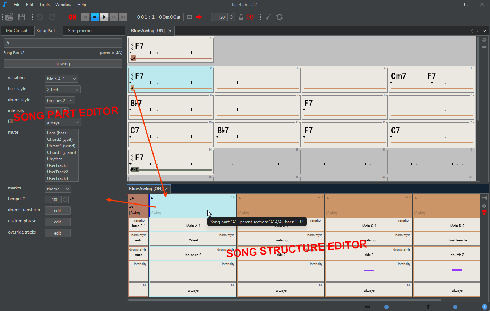

# Song structure

Utilisez le **song structure editor** pour :

* Définir l'ordre des sections sous forme de **song parts**, par ex. "AABA" ou "verse verse chorus verse"
* Sélectionner les **rhythms** (styles musicaux) à utiliser et à quel moment
* Ajuster les **rhythm parameters** des song parts pour introduire des dynamiques, par ex. variation, intensité, drums fill, instrument en sourdine, ...

## Song parts

Un **song part** est lié à une **section** parente du [lead sheet](chord-lead-sheet.md).

<figure><figcaption></figcaption></figure>

**Les song parts permettent de définir dans quel ordre les sections sont jouées, et comment.**&#x20;

Un song part possède un nom, un **rhythm** et une valeur pour chacun des [**rhythm parameters**](song-structure.md#rhythm-parameters). Les rhythm parameters permettent de modifier la façon dont le rhythm est joué pour ce song part.

Dans l'image ci-dessus, les song parts définissent l'ordre de sections suivant : **Intro, A, A, B, A**. Tous les song parts utilisent le même rhythm (MediumJazz.S737.sst). Notez que les 3e et derniers song parts utiliseront une variation de rhythm différente (Main B-1) avec un drums break sur la dernière mesure.

Par défaut, le nom du song part est le nom de la section parente. Si le song part est renommé, la section parente est affichée sous le nom entre crochets (voir les 2e et 3e song parts ci-dessus).


Si certains song parts contigus partagent le même nom, le nom n'est affiché _que sur le premier song part et une ligne est affichée_ sur les song parts contigus (voir image ci-dessous).

Cliquer sur cette ligne sélectionnera tous les song parts associés.


## Édition

Pour ajouter un nouveau song part :

* **faites glisser une section** du chord lead sheet vers le song structure editor, ou
* menu contextuel clic droit **Insert**, ou
* copiez un song part existant : faites-le glisser tout en maintenant la touche ctrl, utilisez copier & coller, ou menu contextuel clic droit **Duplicate**

Les song parts peuvent être réordonnés en **les faisant glisser avec la souris** (utilisez ctrl + glisser pour dupliquer un song part). Les commandes copier/couper/coller fonctionnent également sur les song parts et les rhythm parameters.

L'édition du **nom**, du **rhythm** et des **paramètres** du song part peut être effectuée directement depuis le song structure editor à l'aide de la [souris](song-structure.md#mouse-shortcuts) ou des [raccourcis clavier](song-structure.md#keyboard-shortcuts), ou via le [song part editor](song-structure.md#song-part-editor).


Pour modifier plusieurs song parts ou rhythm parameters en une seule opération :

* sélectionnez plusieurs éléments avec **ctrl+clic** ou **shift-clic**
* Effectuez la modification (par exemple changer le rhythm, ou augmenter l'intensité)

La modification est appliquée à tous les éléments sélectionnés.


Utilisez le menu contextuel (**clic droit** sur Windows/Linux, **ctrl-clic** sur Mac) pour voir les commandes disponibles pour la sélection courante (song part ou rhythm parameter), comme indiqué dans les 2 images ci-dessous.

Pour la plupart des rhythm parameters, **le moyen le plus simple** de modifier la valeur est de **le sélectionner** et d'utiliser la **molette de la souris**.

Certains rhythm parameters disposent d'une boîte de dialogue d'édition personnalisée, qui peut être appelée comme indiqué ci-dessous.

<figure><figcaption>
Un rhythm parameter avec un éditeur personnalisé
</figcaption></figure>


Le copier-coller peut être utilisé pour facilement **dupliquer les valeurs de rhythm parameters**.

Supposons que vous souhaitiez appliquer la valeur drums transform d'un song part (par ex. ">Open hi-hat" dans l'image ci-dessus) à d'autres song parts :

* Dans le song structure editor, sélectionnez le rhythm parameter original et copiez (ctrl-C)
* Sélectionnez le même rhythm parameter dans d'autres song parts (utilisez ctrl-clic ou shift-clic pour une sélection multiple) puis collez (ctrl-V)


Lorsque vous sélectionnez plusieurs rhythm parameters contigus, vous pouvez utiliser le sous-menu **Adjust values** dans le menu contextuel du rhythm parameter pour interpoler les valeurs entre la première et la dernière valeur sélectionnée. Dans l'exemple ci-dessous, nous l'avons utilisé pour augmenter progressivement le tempo de 100% à 108%.

## Song part editor

Le **Song part editor**, à côté de l'onglet Mix Console, offre **une autre façon** de modifier le ou les song parts sélectionnés.

En général, la façon la plus efficace de modifier un song part et ses rhythm parameters est d'utiliser la souris (et la molette de la souris) directement dans le song structure editor, comme expliqué dans le chapitre précédent.&#x20;

Cependant, le **song part editor** est plus pratique pour modifier le rhythm parameter **mute**, où il faut sélectionner/désélectionner plusieurs valeurs dans une liste (ctrl-clic).

Notez que les modifications apportées au song part editor **s'appliquent à tous les song parts sélectionnés**.

<figure><figcaption></figcaption></figure>

## Changer de rhythm (style musical)

Chaque song part peut avoir son propre rhythm.


Le Midi ne peut accueillir que 16 canaux (1 canal par instrument), et de nombreux rhythms utilisent 7 ou 8 instruments. Ainsi, pour avoir un song avec plus de 2 rhythms, il faut choisir des rhythms avec peu d'instruments.


Lorsqu'un song part est créé, JJazzLab sélectionne le dernier rhythm utilisé dans le song pour cette signature rythmique, ou sélectionne le **rhythm par défaut** pour cette signature rythmique.


Vous pouvez définir le **rhythm par défaut** pour chaque signature rythmique dans l'onglet **Rhythms** des **Options/Preferences**.


Pour changer le rhythm, sélectionnez un song part et appuyez sur **R**, ou cliquez sur le nom du rhythm pour ouvrir la **boîte de dialogue de sélection du rhythm**.

Lors du changement de rhythm, JJazzLab essaie d'adapter les valeurs des rhythm parameters précédents aux nouveaux rhythm parameters.

Si vous souhaitez supprimer un changement de rhythm au milieu d'un song, sélectionnez le song part et utilisez **Remove Rhythm Change** dans le menu contextuel du song part.

## Rhythm parameters

Les **rhythm parameters** permettent d'ajuster la façon dont un rhythm (style musical) est joué pour un song part donné.


Les rhythm parameters sont un outil simple et puissant pour **introduire des variations dans une piste d'accompagnement**, ce qui la rend plus agréable à utiliser.


Dans l'image ci-dessous, vous pouvez voir deux **song parts** utilisant le même rhythm [jjSwing](../rhythm-engines/jjswing-rhythm-engine.md) mais avec des **rhythm parameters** très différents — en conséquence, ils sonneront très différemment.&#x20;

Cet exemple est un peu extrême ; en général, ajuster quelques paramètres suffit pour éviter une piste d'accompagnement ennuyeuse. Notez que vous pouvez masquer les rhythm parameters que vous n'utilisez pas en ajustant les paramètres de la [vue compacte](song-structure.md#compact-full-view).

<figure><figcaption></figcaption></figure>

Les rhythm parameters les plus courants sont décrits ci-dessous.&#x20;


Un [rhythm engine](/broken/pages/-MQSAs6SfPTmre5f3rhY) peut définir ses propres rhythm parameters personnalisés. Par exemple, [jjSwing](../rhythm-engines/jjswing-rhythm-engine.md) définit [Bass style](../rhythm-engines/jjswing-rhythm-engine.md#bass-style) et [Drums style](../rhythm-engines/jjswing-rhythm-engine.md#drums-style).


### Variation

Un rhythm parameter indiquant quelle variation du rhythm (style) doit être utilisée. Les rhythms du [moteur YamJJazz](../rhythm-engines/yamjjazz-rhythm-engine/) ont généralement 4 variations _Main_, plus quelques _Intros_, _Endings_ et _Fills_.

### Intensity

Ce paramètre définit l'intensité de la piste d'accompagnement générée.

Un rhythm engine peut simplement augmenter/diminuer la vélocité Midi des notes de la piste d'accompagnement en fonction de ce paramètre, mais il pourrait aussi générer plus/moins de notes, etc.

### Drums Fill

Ce paramètre définit quand un **drums fill** (ou **break**) doit être joué à la fin du song part (_**never**_, _**always**_, _**randomly**_, ...).

La valeur spéciale _**fade\_out**_ ne produit pas de drums fill ; à la place, elle diminue progressivement la vélocité des notes jusqu'à la fin du song part.

### Mute

Ce paramètre est utilisé pour **couper le son d'un ou plusieurs instruments** pendant ce song part. Pour modifier ce paramètre, il est plus facile d'utiliser le [song part editor](song-structure.md#song-part-editor)**.**

### Marker

Ce paramètre n'est utile que si vous utilisez des substitute chord symbols, comme expliqué [ici](chord-lead-sheet.md#substitute-chord-symbol).

### Tempo factor

Utilisez ce paramètre pour ralentir ou accélérer le tempo du song part en pourcentage (50% à 200%) du tempo du song. Le nombre entre crochets est le tempo résultant.

<figure><figcaption>
Exemple de tempo factor avec un tempo de song=142
</figcaption></figure>

### Drums transform

Ce paramètre permet de modifier certaines notes de batterie pour le song part.

C'est un **moyen simple de modifier la piste de batterie** pour introduire des variations dans votre song.

Par exemple, vous pouvez rendre le charleston plus fort, transformer les notes de charleston fermé en cymbale ride, ou simplement ajouter des percussions !

### Custom phrase

Ce paramètre vous permet de personnaliser une ou plusieurs phrases d'instrument d'un song part.\
\
**Exemple** : vous souhaitez modifier la phrase de basse du rhythm à la fin du deuxième verse.\
\
Modifiez le rhythm parameter Custom phrase du song part correspondant, puis modifiez la piste de basse. La phrase de basse par défaut apparaîtra dans le [notes editor](notes-editor.md) et vous pourrez la modifier.\
\
Si vous souhaitez que cette phrase de basse personnalisée soit également utilisée dans le dernier verse du song, il suffit de [copier la valeur du rhythm parameter](song-structure.md#editing) et de la coller dans le dernier song part.

.png>)

### Track overrides

Ce paramètre vous permet d'utiliser une ou plusieurs pistes d'autres rhythms.

_Exemple : votre song utilise un rhythm pop à 8 temps. Vous souhaitez enrichir le song part du chorus et utilisez **Track overrides** pour remplacer la ligne de basse 8-beat originale par la ligne de basse d'un rhythm bossa-nova._

<figure><figcaption></figcaption></figure>

Autres exemples d'utilisation :

* Vous aimez un style Yamaha jazz sauf la ligne de basse qui ne sonne pas bien. Utilisez le paramètre Track overrides pour remplacer la ligne de basse par la walking bass réaliste de [jjSwing](../rhythm-engines/jjswing-rhythm-engine.md).
* Le rhythm de remplacement peut être le même que le rhythm original. Par exemple, cela vous permet de remplacer la partie piano par la partie basse du même rhythm, de sorte que la ligne de basse est doublée piano+basse sur un song part donné.

### Vue compacte / vue complète

Par défaut, seul un sous-ensemble des rhythm parameters est visible, c'est la **vue compacte**.

Cliquez sur le bouton ci-dessous ou appuyez sur 'V' pour basculer entre la vue compacte et la vue complète.

Le bouton **compact view settings**, juste au-dessus du bouton vue compacte, vous permet de choisir les rhythm parameters visibles dans la vue compacte. Ces paramètres sont enregistrés avec le song.

<figure><figcaption>
Paramètres de la vue compacte
</figcaption></figure>

En raccourci, vous pouvez directement masquer un rhythm parameter (c'est-à-dire le rendre non visible dans la vue compacte) en cliquant sur le bouton X dans le coin supérieur gauche, comme indiqué ci-dessous.

<figure><figcaption></figcaption></figure>

## Raccourcis souris

<table data-header-hidden><thead><tr><th width="253.33333333333331">Sélection</th><th>Souris</th><th>Action</th></tr></thead><tbody><tr><td>Sélection</td><td>Souris</td><td>Action</td></tr><tr><td>song part, rhythm param.</td><td>clic</td><td>sélectionner</td></tr><tr><td>song part</td><td>double-clic</td><td>modifier le nom du song part</td></tr><tr><td>nom du song part</td><td>clic</td><td>modifier</td></tr><tr><td>rhythm</td><td>clic</td><td>sélectionner un rhythm</td></tr><tr><td>éditeur, song part, rhythm param.</td><td>clic droit</td><td>ouvrir le menu contextuel</td></tr><tr><td>rhythm parameter</td><td>double-clic</td><td>modifier la valeur</td></tr><tr><td>rhythm parameter</td><td>molette de la souris</td><td>changer la valeur</td></tr><tr><td>éditeur</td><td>shift + molette de la souris</td><td>faire défiler horizontalement</td></tr><tr><td>éditeur</td><td>alt + molette de la souris</td><td>faire défiler verticalement</td></tr><tr><td>éditeur</td><td>ctrl + molette de la souris</td><td>zoom horizontal</td></tr><tr><td>éditeur</td><td>ctrl-shift + molette de la souris</td><td>zoom vertical</td></tr></tbody></table>

## Raccourcis clavier


De nombreuses actions sont également disponibles via le menu contextuel (clic droit sur Windows/Linux, ctrl-clic sur Mac), et lorsqu'il est disponible, le raccourci associé s'affiche.


| Sélection                | Touche        | Action                          |
| ------------------------ | ------------- | ------------------------------- |
| song part, rhythm param. | entrée        | modifier le nom du song part    |
| song part, rhythm param. | R             | sélectionner le rhythm          |
| song part, rhythm param. | I             | insérer un song part            |
| song part, rhythm param. | ctrl-I        | ajouter un song part            |
| song part, rhythm param. | D             | dupliquer le(s) song part(s)    |
| song part                | suppr         | supprimer le(s) song part(s)    |
| rhythm parameter         | ctrl-haut/bas | valeur suivante/précédente      |
| rhythm parameter         | Z             | réinitialiser la valeur         |
| song part                | ctrl-C/X/V    | copier/couper/coller            |
| éditeur                  | ctrl-Z/Y      | annuler/rétablir                |
| éditeur                  | ctrl-F        | zoom pour ajuster la largeur    |
| éditeur                  | V             | vue compacte ou vue complète    |
