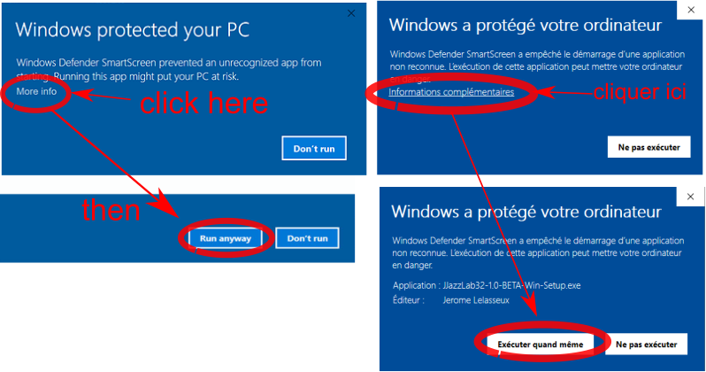

# Installation

## Windows instructions

Download and run the setup program. 


If you don't have admin. rights on your computer, choose **Install for me only** during setup


We recommend to use JJazzLab with the [JJazzLab SoundFont](configuration/jjazzlab-soundfont/).


If you get a **Windows Smart Screen** alert

 

Windows Smart Screen blocks the program NOT because it is a malware \(it is NOT!\), but just because JJazzLab is new, so Windows security servers don't have enough statistics to evaluate its "security reputation".

Once enough users will have successfully downloaded and installed it, Windows Smart Screen will not block the program anymore.

You can find more explanations in this [good article](https://www.digitalcitizen.life/what-smartscreen-filter-how-does-it-work).


## Linux instructions

Unzip the package. 

Start JJazzLab using **bin/jjazzlab** in the installation directory.

We recommend to use JJazzLab with the [JJazzLab SoundFont](configuration/jjazzlab-soundfont/).

## MacOS instructions

Unzip the package and open it to start JJazzLab. 


If you get a **security alert**

Using the **Finder**, select the JJazzLab package, **ctrl-click menu**, **Open**, this will give you the choice to open the application in spite of the security alert.


We recommend to use JJazzLab with the [JJazzLab SoundFont](configuration/jjazzlab-soundfont/).


There is a known bug on MacOS: sometimes, after the computer wakes up from sleep mode, the audio can lag 2 or 3 seconds behind. This is due to a JDK problem, JJazzLab can't do anything.


