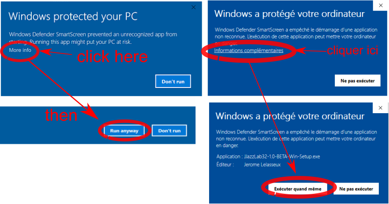

# インストール


!!! **THIS PAGE IS OUT OF DATE, IT SHOULD BE UPDATED FOR JJAZLAB 4 !!!**


## Windowsでの説明

セットアッププログラムをダウンロードして起動してください。&#x20;


管理者権限がない場合は、 **Install for me only** をセットアップ中に選んでください。


JJazzLabは、[JJazzLab サウンドフォント](broken-reference)の使用を推奨します。

:arrow\_right:インストールの段階的な手順が必要なら、[ビデオチュートリアル](video-tutorials.md)をご覧ください。


もし、 **Windows Smart Screen** 警告が出たら

&#x20;

Windows Smart Screenがプログラムをブロックするのは、JJazzLabがマルウェアだからではなく（マルウェアではありません！）、JJazzLabが新しいプログラムであるために、Windowsのセキュリティサーバーがその「セキュリティの評判」を評価するのに十分な統計情報を持っていないからです。

十分な数のユーザーがJJazzLabのダウンロードとインストールに成功すれば、Windows Smart Screenはプログラムをブロックしなくなります。

より詳しい説明はこちらの [良くできた記事](https://www.digitalcitizen.life/what-smartscreen-filter-how-does-it-work)をご覧ください。


## Linux での説明

パッケージを解凍してください。&#x20;

インストールディレクトリにある **bin/jjazzlab** を使ってJJazzLabを起動します。

JJazzLabは、[JJazzLab サウンドフォント](broken-reference)の使用を推奨します。


ArchまたはManjaro Linuxをお使いの場合は、JJazzLabのインストールパッケージが用意されています : [https://aur.archlinux.org/packages/jjazzlab-x-bin/](https://aur.archlinux.org/packages/jjazzlab-x-bin/)    （ありがとう、jypma！）&#x20;


## MacOS での説明

パッケージを解凍し、開けてJJazzLabを起動してください。


もし、**security alert**が出たら

その場合、**Finder** を使ってJJazzLabパッケージを選択し、**ctrl+** **メニュークリック**, **開く**で、セキュリティアラートが出ていてもアプリケーションを開くことができるようになります。


JJazzLabは、[JJazzLab サウンドフォント](broken-reference)の使用を推奨します。


MacOSには既知のバグがあります。コンピュータがスリープモードから起動した後に、オーディオが2～3秒遅れて再生されることがあります。これはJDKの問題によるもので、JJazzLabでは何もできません。

