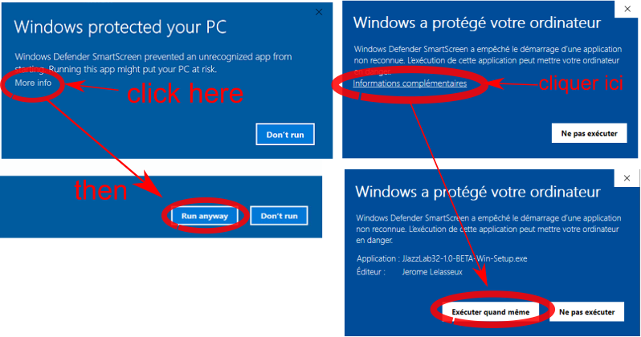

# インストール方法

## Windows

セットアッププログラムを[https://www.jjazzlab.org/en/download](https://www.jjazzlab.org/en/download)でダウンロードして起動してください。必要なものは全て含まれています。



もし、 **Windows Smart Screen** 警告が出たら

&#x20;

Windows Smart Screenがプログラムをブロックするのは、JJazzLabがマルウェアだからではなく（マルウェアではありません！）、JJazzLabが新しいプログラムであるために、Windowsのセキュリティサーバーがその「セキュリティの評判」を評価するのに十分な統計情報を持っていないからです。

十分な数のユーザーがJJazzLabのダウンロードとインストールに成功すれば、Windows Smart Screenはプログラムをブロックしなくなります。

より詳しい説明はこちらの [優良記事](https://www.digitalcitizen.life/what-smartscreen-filter-how-does-it-work)をご覧ください。



管理者権限がない場合は、 **Install for me only** をセットアップ中に選んでください。


## MacOS
最初にFluidSynthを手動でインストールする必要があります。

#### 1/ [FluidSynth](https://github.com/FluidSynth/fluidsynth/wiki/Download)のインストール (2.2.&#x30;以降**、 ただしバグがある2.4.4は避けるように**)

とてもお勧めなのは、[Homebrew](https://brew.sh/): `brew install fluidsynth`でのインストールです。

#### 2/ JJazzLabパッケージのダウンロードとインストール

_Apple Mx プロセッサーのMacコンピューター:_

.pkgファイルを[https://www.jjazzlab.org/en/download](https://www.jjazzlab.org/en/download) でダウンロードし、開いてください。


もし、**security alert**が出たら

.pkgファイルを強制的に開くには、お使いのコンピュータの**システム設定/プライバシーとセキュリティ**に移動し、JJazzLabパッケージに対応する**Open anyway**ボタンまでスクロールダウンしてください。ここ [**Apple online doc**](https://support.apple.com/en-us/102445)に説明があります。


_Intel x64 プロセッサーのMacコンピューター:_

.pkgファイルは古いMacOSバージョンでは必ずしもサポートされないため、.zipファイルをお勧めします。基本的な解決策ではありますが、多くのMacOSバージョンと互換性があります。

* .zipファイルを[https://www.jjazzlab.org/en/download](https://www.jjazzlab.org/en/download)でダウンロードし、解凍してください(Finderでファイルを開く)
* `bin/jjazzlab`でファイル実行し、JJazzLabを起動してください。


JJazzLabが起動しない場合、以下の通り 、`bin/jjazzlab`と`jdk/bin/java`の行い、**読み取り**と**実行権限** ('`xr`')が付与されていることを**ファイル確認**してください。<br>

JJazzLabが起動しない場合、以下の通りbin/jjazzlabとjdk/bin/javaファイルに読み取りと実行権限('`xr`')が付与されていることを確認してください。
ファイルの権限を修正するには: `chmod a+rx bin/jjazzlab jdk/bin/java`


## Linux


FluidSynthが"パチパチ"とノイズを発生する場合、Linuxがオーディオアプリケーション用に最適化されていることを確認してください: [https://jackaudio.org/faq/linux\_rt\_config.html](https://jackaudio.org/faq/linux_rt_config.html)


### deb/rpm パッケージを使う

JJazzLabパッケージは、特定のフォーマット(.deb, .rpm, ...)でのみ提供されます 。&#x20;

お使いのディストリビューションに対応するパッケージを[https://www.jjazzlab.org/en/download](https://www.jjazzlab.org/en/download)でダウンロードして、対応するパッケージマネージャーで開いてください。(下に例) :

```bash
sudo apt-get install ./jjazzlab_4.0.2-1_amd64.deb
```

```sh
sudo gdebi install ./jjazzlab-4.0.2-0.x86_64.deb
```

```bash
sudo zypper install ./jjazzlab-4.0.2-0.x86_64.rpm
```


JJazzLabパッケージは、適切なFluidSynthパッケージへの依存関係を宣言します。したがって、システムにまだインストールされていない場合、パッケージマネージャーが自動的にインストールするはずです。


### tar.xz パッケージを使う&#x20;

`.tar.xz`パッケージは配布しているどんなLinux(x64)でも動作するはずです。

1. &#x20;FluidSynth (**>=2.2.&#x30;以降、 ただしバグがある2.4.4は避けるように**)を手動でインストールする: [https://github.com/FluidSynth/fluidsynth/wiki/Download](https://github.com/FluidSynth/fluidsynth/wiki/Download)
2. [https://www.jjazzlab.org/en/download](https://www.jjazzlab.org/en/download)でダウンロードし、JJazzLab .tar.xzファイルを解凍する。
   `tar -xf JJazzLab-4.0.2-linux-x64.tar.xz`
3. **要確認** **解凍した全てのファイル** に **読み取り権限** ('`r`')があり、`bin/jjazzlab`と`jdk/bin/java`に**実行権限** ('`x`')があること。以下の通り:  \
   読み取り+実行権限を付与するには: `chmod a+rx bin/jjazzlab jdk/bin/java`
4. `bin/jjazzlab`を実行する

#### 特別な事例: `libfluidsynth.so.3`が標準的でないディレクトリにある

Linuxでは、JJazzLabは共有ライブラリ`libfluidsynth.so.3`（または`libfluidsynth.so`）を介してFluidSynthを使用します。このファイルは標準ディレクトリのいずれかに存在することが想定されています。
`/usr/lib/x86_64-linux-gnu, /usr/lib, /usr/lib64, /usr/local/lib, /lib`

FluidSynth (**>=2.2.&#x30;以降、ただしバグがある2.4.4は避けるように**) がうまくインストールに成功したにもかかわらず、JJazzLabがFluidSynthを読み込めない場合、`libfluidsynth.so.3`が標準以外のディレクトリにインストールされている可能性があります。ファイルの場所（例：`/tmp/lib/libfluidsynth.so.3`）を確認したら、JJazzLabにその場所を指定できます。

* JJazzLabのインストールディレクトリで、ファイル`etc/jjazzlab.conf`を編集してください。
* `default_options`変数の末尾に `-J-Dfluidsynthlib.path=/tmp/lib/libfluidsynth.so.3` を追加してください。
* JJazzLabを起動します。


JJazzLabは独自のJavaランタイムエンジンを組み込んでいます。Javaを一切扱う必要はありません。別のJRE/JDKを使用しようとすると、確実に問題が発生します。


### flatpakを使う


このFlatpakパッケージはJJazzLab公式パッケージでは**ありません**。JJazzLabユーザーの方からご提供いただいているものです。そのため、**サポートは提供しておりません**。問題が発生した場合は、このページで提案されている他のパッケージをお試しください。


[https://flathub.org/apps/org.jjazzlab.JJazzLab](https://flathub.org/apps/org.jjazzlab.JJazzLab)
