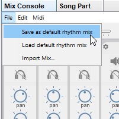

# Morceau et fichiers de mixage

Lorsque vous enregistrez un morceau appelé **mySong**, JJazzLab enregistre en fait 2 fichiers différents:

* **mySong.sng**: contient tout sauf les informations de mixage
* **mySong.mix**: contient uniquement les informations de mixage, c’est-à-dire la configuration des instruments utilisés.

Pourquoi utiliser 2 fichiers différents ?

Parce que les informations de mixage sont spécifiques à votre [synthé de sortie](/broken/pages/-MQNBJUwiJ9pkXF9j5Ey) L’intégration des données de mixage dans le fichier. sng rendrait les fichiers .sng non portables entre utilisateurs, car les utilisateurs ont des synthés de sortie différents.

Lorsque vous ouvrez mySong.sng, JJazzLab ouvre également mySong.mix dans le même répertoire. Si mySong.mix n’existe pas alors JJazzLab crée le mix en utilisant le [mix rythmique par défaut](https://app.gitbook.com/o/-MPpDkwuYsgP-XBvRKRP/s/Ec5HKJ3MdnOjrFIODarT/~/changes/19/morceaux/song-and-mix-files#default-rhythm-mix).

## Mixage rythmique par défaut

Chaque rythme JJazzLab a un mix par défaut intégré. Ce mélange par défaut intégré ne peut utiliser que des **instruments GM** pour une portabilité maximale.

Vous pouvez remplacer le mix du rythme en enregistrant un **fichier de mixage rythmique par défaut**. Contrairement au mix intégré, **ce mixage rythmique peut utiliser n’importe quel instrument**.

Par défaut, ce fichier est stocké dans le **répertoire rythmique de l’utilisateur** défini dans **Options/Rhythmes**. Mais le répertoire peut être modifié dans **Options/Général**.

## Ordre de recherche des fichiers de mixage

En combinant les 2 paragraphes ci-dessus, voici comment JJazzLab recherche des informations de mixage lorsque vous chargez **myDir/mySong.sng** et ce morceau utilise le rythme **16BeatRock** :

1. utilise **myDir/mySong.mix** si présent 
2. utilise **defaultRhythmMixDir/16BeatRock.mix** si présent 
3. utilise le mixage par défaut intégré **16BeatRock** (instruments GM uniquement)

Les étapes 2. et 3. sont également utilisées lorsque vous ajoutez un nouveau rythme dans un morceau.
