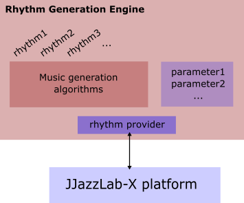

# Vue d’ensemble des moteurs de rythme

Les **rythmes** sont rendus disponibles par des **moteurs rythmiques**.

Grâce à son architecture open-source et enfichable, JJazzLab peut héberger de nombreux moteurs rythmiques différents. Si vous êtes un développeur, vous pouvez construire le vôtre assez facilement!

Un moteur rythmique a **un ou plusieurs fournisseurs de rythmes** qui proposent une liste des rythmes pris en charge et les **paramètres rythmiques supportés**. Vous pouvez voir la liste de tous les **fournisseurs de rythmes** disponibles dans la **boîte de dialogue de sélection du rythme**.

JJazzLab comprend actuellement un moteur rythmique, [YamJJazz](yamjjazz-rhythm-engine/), basé sur les styles Yamaha. Ses **paramètres rythmiques** sont Variation, Intensité et Fill (d’autres paramètres tels que Muet ou Tempo sont génériques et fonctionnent avec n’importe quel rythme).

## Futurs moteurs rythmiques 

Voici quelques exemples de ce qui pourrait être développé en utilisant l’infrastructure JJazzLab-X.

* Un moteur orienté jazz basé sur l’IA avec un seul rythme polyvalent qui s’adapte à différents contextes, comme un vrai groupe (tempo lent ou rapide, walking bass ou non, etc.).
* Un moteur de batterie similaire au batteur virtuel Logic Pro X
* Un moteur capable d’adapter la piste d’accompagnement à une mélodie donnée
* Un "méta-moteur" qui vous permet de combiner des pistes individuelles de différents rythmes (par exemple, combiner une ligne de basse hip-hop avec une batterie latine)
* Un moteur capable de lire les fichiers de style à partir de Band-In-A-Box ou d’autres claviers arrangeurs tels que Korg ou Ketron
* etc.
