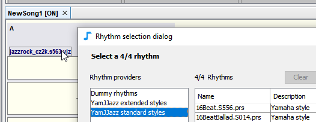

# YamJJazz rhythm engine

JJazzLab intègre le moteur de génération de rhythm **YamJJazz**. Ce moteur lit les [styles Yamaha](yamaha-styles.md) et introduit un nouveau format de [style Yamaha étendu](extended-yamaha-styles.md) qui ajoute plus de variations aux fichiers de style Yamaha existants.

Vous pouvez voir ci-dessous les 2 **fournisseurs de rhythm** YamJJazz disponibles dans la boîte de dialogue de sélection du rhythm.

