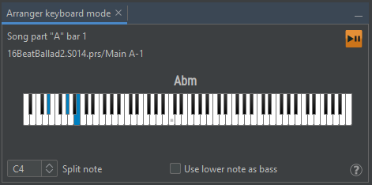

# Mode clavier Arrangeur

Si vous avez un clavier Midi connecté via Midi IN, vous pouvez l'utiliser comme un (pseudo) clavier arrangeur : JJazzLab reconnaîtra les chord symbols joués et mettra à jour la piste d'accompagnement en conséquence.


**Ce mode est uniquement à des fins éducatives.**

Il y aura un délai entre votre changement d'accord et le changement de musique. C'est normal car JJazzLab n'est pas conçu pour fonctionner comme un clavier arrangeur temps réel.


Connectez d'abord votre clavier Midi à un périphérique Midi IN (voir le panneau **Midi** de **Options/Preferences**).

Créez ou ouvrez un song, puis sélectionnez une song part. La song part sera utilisée par JJazzLab pour savoir quel rhythm et quels rhythm parameters doivent être utilisés pendant la session en mode arrangeur.

Affichez la fenêtre **Arranger** (menu Window) et appuyez sur son bouton **Play** : la musique devrait maintenant suivre les accords que vous jouez sur votre clavier.

Seules les notes reçues en dessous de la note de split sont utilisées pour la reconnaissance des chord symbols.


Pendant que vous jouez, vous pouvez modifier les rhythm parameters de la song part active (ex. changer la variation).

