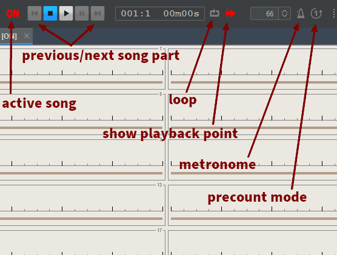

# Commands

You can control the playback of the backing track using the toolbar below.

### Keyboard shortcuts


The shortcuts are given for Windows and Linux. Some of them might need to be adapted for Mac.


|                                                 |                                                     |
| ----------------------------------------------- | --------------------------------------------------- |
| <mark style="background-color:blue;">Key</mark> | <mark style="background-color:blue;">Command</mark> |
| space                                           | Start, or Pause/Resume                              |
| shift-space                                     | Stop                                                |
| ctrl-space                                      | Start from currently selected bar/song part         |
| ctrl-shift-space                                | Play only currently selected bars/song parts        |
| F1                                              | Jump playback to previous song part                 |
| F2                                              | Jump playback to next song part                     |
| J or -                                          | Decrease tempo                                      |
| K or +                                          | Increase tempo                                      |
| L                                               | Toggle loop mode                                    |
|                                                 |                                                     |

