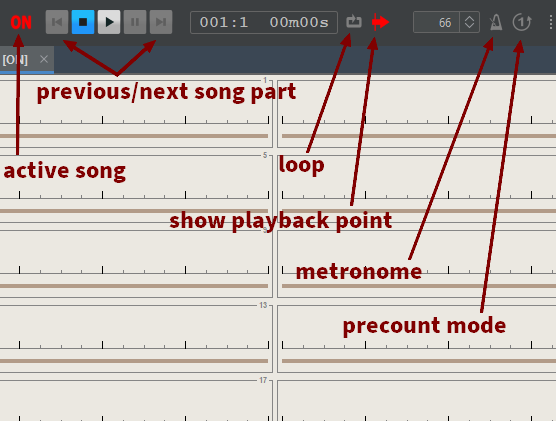
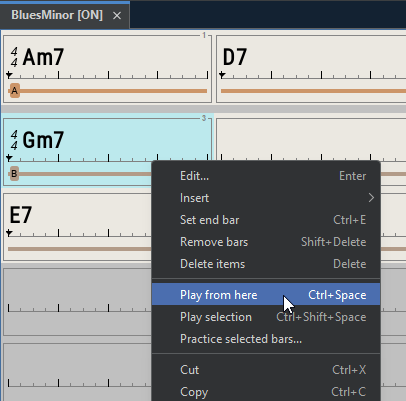
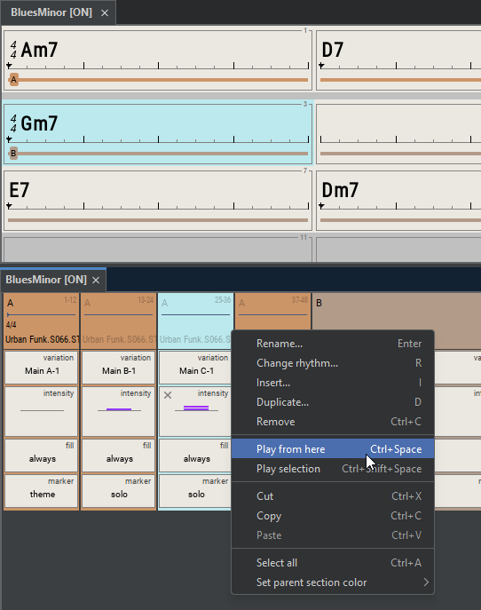
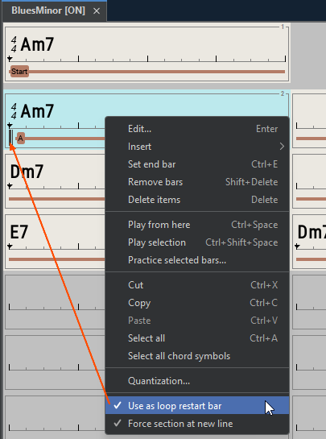
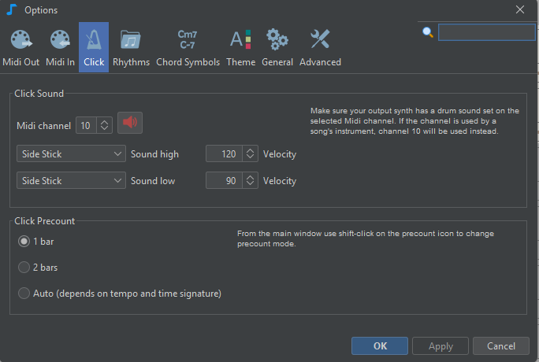

# Controls

You can control the playback of the song using the toolbar buttons (image below), [keyboard shortcuts](midi-remote-commands.md), bar or song part's [popup menu](commands.md#popup-menu-controls), or [MIDI remote commands](midi-remote-commands.md).

### Keyboard shortcuts


The shortcuts are given for Windows and Linux. Some of them might need to be adapted for Mac.


|                                                 |                                                     |
| ----------------------------------------------- | --------------------------------------------------- |
| <mark style="background-color:blue;">Key</mark> | <mark style="background-color:blue;">Command</mark> |
| space                                           | Start / Pause / Resume                              |
| shift-space                                     | Stop                                                |
| ctrl-space                                      | Start from the selected bar or song part            |
| ctrl-shift-space                                | Play only selected bars or song parts               |
| F1                                              | Jump playback to previous song part                 |
| F2                                              | Jump playback to next song part                     |
| F3                                              | Jump playback to song start (restart)               |
| J or -                                          | Decrease tempo                                      |
| K or +                                          | Increase tempo                                      |
| L                                               | Toggle loop mode                                    |

### Popup menu controls

This lets you start playback from the selected lead sheet bar or song part (or use ctrl-space).

You can also play only the current selected bars or/and song parts (use ctrl-shift-space), possibly looped if [loop mode](commands.md#loop-mode) is active.

<figure><figcaption>
Play from selected bar
</figcaption></figure>

<figure><figcaption>
Play from selected song part
</figcaption></figure>

### Loop mode

When loop mode is activated, the playback restarts when playback reaches the end (the end of the song, or the end of the selection if **Play selection** was used).

You can define a **loop restart bar** which is different from the first song bar:

<figure><figcaption></figcaption></figure>

Not that the loop restart bar is ignored when using **Play selection**.

### Click settings

The **metronome** and **precount mode** can be configured via the **Click** panel in the **Options menu**.

<figure><figcaption></figcaption></figure>

**Precount mode** can also be directly changed from the toolbar button using **shift-click**.

<figure><figcaption></figcaption></figure>

###

